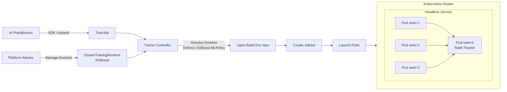
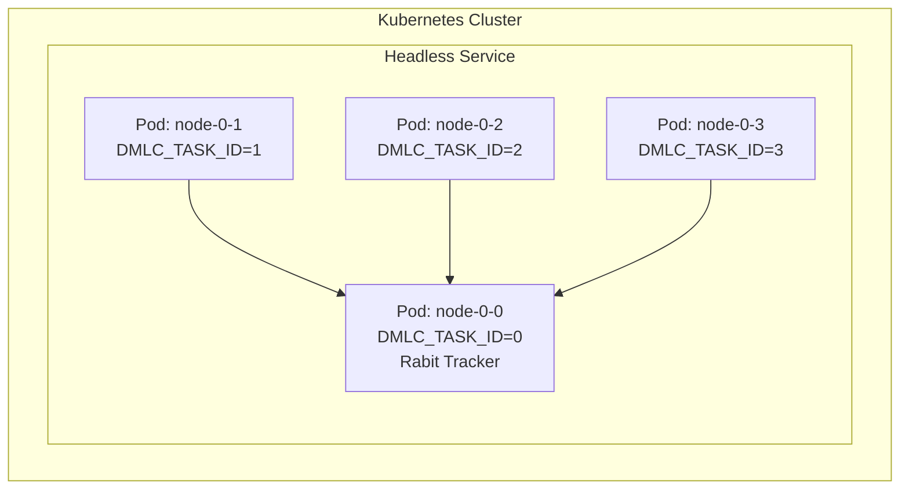

# KEP-2598mn: XGBoost Runtime for Kubeflow Trainer V2

<div align="center">

**Status:** Draft | **Created:** 2026-01-22 |

</div>

---

## Table of Contents

- [Summary](#summary)
- [Motivation](#motivation)
- [Goals](#goals)
- [Non-Goals](#non-goals)
- [Proposal](#proposal)
- [User Stories](#user-stories)
- [Design Details](#design-details)
- [API](#api)
- [Implementation](#implementation)
- [Test Plan](#test-plan)
- [Future Work](#future-work)
- [Implementation History](#implementation-history)

---

## Summary

This KEP proposes adding an **XGBoost Runtime** to Kubeflow Trainer V2 to support distributed XGBoost training on Kubernetes using the Rabit-based coordination model.

---

## Motivation

XGBoost supports distributed training through **Rabit**, which requires coordinating worker processes via environment variables. This proposal leverages Trainer V2's Runtime API to express XGBoost's distributed semantics declaratively, eliminating manual configuration for users.

---

## Goals

| Goal | Description |
|:-----|:------------|
| Multi-node Training | Enable distributed XGBoost training using Rabit coordination |
| MLPolicy Integration | Introduce `XGBoostMLPolicySource` to the existing MLPolicy API |
| SDK Support | Integrate with Trainer V2 Python SDK |
| CPU First | Support CPU-based distributed training initially |

---

## Non-Goals

| Non-Goal | Rationale |
|:---------|:----------|
| Framework CRD | Trainer V2 uses generic TrainJob |
| MPI Support | Modern XGBoost uses Rabit |
| GPU/NCCL | Deferred to future iteration |
| Elastic Training | Out of scope |

---

## Proposal



The XGBoost runtime plugin:
1. Adds `XGBoost *XGBoostMLPolicySource` to the existing `MLPolicySource` struct
2. Injects Rabit environment variables automatically
3. Configures rank-0 pod as the Rabit tracker

---

## User Stories

### Story 1: Platform Admin
> As a Platform Admin, I want to define a reusable XGBoost runtime so teams can launch training jobs without Kubernetes expertise.

### Story 2: AI Practitioner
> As an AI Practitioner, I want to submit distributed XGBoost jobs via the Python SDK.

<details>
<summary><b>Python SDK Example</b></summary>

```python
from kubeflow.trainer import TrainerClient, CustomTrainer

def xgboost_train(num_rounds: int = 100, max_depth: int = 6):
    pass

client = TrainerClient()
job_id = client.train(
    trainer=CustomTrainer(func=xgboost_train, func_args={"num_rounds": "100"}, num_nodes=4),
    runtime=next(r for r in client.list_runtimes() if r.name == "xgboost-distributed"),
)
```

</details>

---

## Design Details

### XGBoostMLPolicySource

Add to existing `MLPolicySource` in `pkg/apis/trainer/v1alpha1/trainingruntime_types.go`:

```go
type MLPolicySource struct {
    Torch   *TorchMLPolicySource   `json:"torch,omitempty"`
    MPI     *MPIMLPolicySource     `json:"mpi,omitempty"`
    XGBoost *XGBoostMLPolicySource `json:"xgboost,omitempty"`  // NEW
}

// XGBoostMLPolicySource represents an XGBoost runtime configuration.
// Currently empty - presence activates the XGBoost plugin with defaults.
// Future fields (see Future Work section):
//   - TrackerPort *int32 - Override default Rabit tracker port (9091)
//   - TrackerTimeout *int32 - Connection timeout in seconds
type XGBoostMLPolicySource struct {}
```

> [!IMPORTANT]
> Update the validation rule on `MLPolicy` struct (around line 175):
> ```go
> // +kubebuilder:validation:XValidation:rule="[has(self.torch), has(self.mpi), has(self.xgboost)].filter(x, x).size() <= 1", message="Only one ML policy can be configured"
> ```

---

### Environment Variables

The plugin injects XGBoost's native Rabit environment variables:

| Variable | Description | Example Value |
|:---------|:------------|:--------------|
| `DMLC_TRACKER_URI` | Address of rank-0 pod (Rabit tracker) | `myjob-node-0-0.myjob` |
| `DMLC_TRACKER_PORT` | Tracker port | `9091` |
| `DMLC_TASK_ID` | Worker rank | `0`, `1`, `2`... |
| `DMLC_NUM_WORKER` | Total worker count | `4` |

---

### Rabit Tracker Coordination



Workers discover the tracker via headless service DNS:
```
<trainjob-name>-node-0-0.<trainjob-name>
```

---

## API

### ClusterTrainingRuntime

```yaml
apiVersion: trainer.kubeflow.org/v2alpha1
kind: ClusterTrainingRuntime
metadata:
  name: xgboost-distributed
spec:
  mlPolicy:
    numNodes: 4
    xgboost: {}
  template:
    spec:
      replicatedJobs:
        - name: node
          template:
            spec:
              template:
                metadata:
                  labels:
                    trainer.kubeflow.org/trainjob-ancestor-step: trainer
                spec:
                  restartPolicy: OnFailure
                  containers:
                    - name: trainer
                      image: ghcr.io/kubeflow/xgboost:latest
                      command: ["python", "train.py"]
```

### TrainJob

```yaml
apiVersion: trainer.kubeflow.org/v2alpha1
kind: TrainJob
metadata:
  name: example-xgboost
spec:
  runtimeRef:
    name: xgboost-distributed
  trainer:
    image: ghcr.io/kubeflow/xgboost:latest
    command: ["python", "train.py"]
    numNodes: 4
```

---

## Implementation

### Files Overview

```
pkg/
├── apis/trainer/v1alpha1/
│   └── trainingruntime_types.go  [MODIFY] Add XGBoostMLPolicySource
├── constants/
│   └── constants.go              [MODIFY] Add XGBoost constants
└── runtime/framework/plugins/
    ├── registry.go               [MODIFY] Register plugin
    ├── plainml/plainml.go        [MODIFY] Update fallback check
    └── xgboost/                   [CREATE]
        ├── xgboost.go
        └── xgboost_test.go
```

---

### Files to Create

<details>
<summary><b>pkg/runtime/framework/plugins/xgboost/xgboost.go</b></summary>

```go
package xgboost

import (
    "context"
    "fmt"

    corev1ac "k8s.io/client-go/applyconfigurations/core/v1"
    "k8s.io/utils/ptr"
    "sigs.k8s.io/controller-runtime/pkg/client"

    trainer "github.com/kubeflow/trainer/v2/pkg/apis/trainer/v1alpha1"
    "github.com/kubeflow/trainer/v2/pkg/apply"
    "github.com/kubeflow/trainer/v2/pkg/constants"
    "github.com/kubeflow/trainer/v2/pkg/runtime"
    "github.com/kubeflow/trainer/v2/pkg/runtime/framework"
)

// XGBoost implements the EnforceMLPolicyPlugin interface for XGBoost distributed training.
// Scope: Injects Rabit environment variables into trainer containers.
type XGBoost struct{}

// Compile-time check: XGBoost must implement EnforceMLPolicyPlugin
var _ framework.EnforceMLPolicyPlugin = (*XGBoost)(nil)

const Name = "XGBoost"

// New creates a new XGBoost plugin instance.
// Called by the plugin registry during controller startup.
func New(context.Context, client.Client, client.FieldIndexer) (framework.Plugin, error) {
    return &XGBoost{}, nil
}

func (x *XGBoost) Name() string {
    return Name
}

// EnforceMLPolicy injects XGBoost/Rabit environment variables into the trainer container.
// This is called during the Build phase of the Trainer Pipeline Framework.
//
// Scope:
//   - Skip if XGBoost MLPolicy is not configured
//   - Override numNodes from TrainJob if specified
//   - Inject DMLC_* environment variables for Rabit coordination
func (x *XGBoost) EnforceMLPolicy(info *runtime.Info, trainJob *trainer.TrainJob) error {
    // Guard: Only process if XGBoost policy is explicitly configured
    if info == nil || info.RuntimePolicy.MLPolicySource == nil || info.RuntimePolicy.MLPolicySource.XGBoost == nil {
        return nil
    }

    // Step 1: Allow TrainJob to override numNodes from the runtime
    trainerPS := info.FindPodSetByAncestor(constants.AncestorTrainer)
    if trainerPS != nil && trainerPS.Count != nil && trainJob.Spec.Trainer != nil && trainJob.Spec.Trainer.NumNodes != nil {
        *trainerPS.Count = *trainJob.Spec.Trainer.NumNodes
    }

    // Step 2: Find the trainer container to inject environment variables
    var trainerContainer *runtime.Container
    if trainJob.Spec.Trainer != nil {
        trainerContainer = info.FindContainerByPodSetAncestorContainerName(constants.AncestorTrainer, constants.Node)
        if trainerContainer != nil {
            // Merge user-specified envs from TrainJob
            apply.UpsertEnvVars(&trainerContainer.Env, apply.EnvVars(trainJob.Spec.Trainer.Env...)...)
        }
    }

    // Step 3: Inject Rabit coordination environment variables
    if trainerContainer != nil {
        numWorkers := ptr.Deref(ptr.Deref(trainerPS, runtime.PodSet{}).Count, 1)

        apply.UpsertEnvVars(&trainerContainer.Env,
            // DMLC_NUM_WORKER: Total number of workers in the distributed job
            *corev1ac.EnvVar().
                WithName(constants.XGBoostEnvNumWorker).
                WithValue(fmt.Sprintf("%d", numWorkers)),
            // DMLC_TASK_ID: Unique worker rank (0, 1, 2, ...) derived from Job completion index
            *corev1ac.EnvVar().
                WithName(constants.XGBoostEnvTaskID).
                WithValueFrom(corev1ac.EnvVarSource().
                    WithFieldRef(corev1ac.ObjectFieldSelector().
                        WithFieldPath(constants.JobCompletionIndexFieldPath))),
            // DMLC_TRACKER_URI: DNS address of rank-0 pod running the Rabit tracker
            *corev1ac.EnvVar().
                WithName(constants.XGBoostEnvTrackerURI).
                WithValue(fmt.Sprintf("%s-%s-0-0.%s", trainJob.Name, constants.Node, trainJob.Name)),
            // DMLC_TRACKER_PORT: Port for Rabit tracker communication
            *corev1ac.EnvVar().
                WithName(constants.XGBoostEnvTrackerPort).
                WithValue(fmt.Sprintf("%d", constants.XGBoostDefaultTrackerPort)),
        )
    }

    return nil
}
```

</details>

---

### Files to Modify

<details>
<summary><b>pkg/constants/constants.go</b></summary>

```go
// =============================================================================
// XGBoost/Rabit Constants
// Scope: Environment variable names for XGBoost distributed training via Rabit
// Reference: https://xgboost.readthedocs.io/en/stable/tutorials/dask.html
// =============================================================================

const (
    // XGBoostEnvTrackerURI is the Rabit tracker address (rank-0 pod)
    // Format: <trainjob>-node-0-0.<trainjob>
    XGBoostEnvTrackerURI string = "DMLC_TRACKER_URI"

    // XGBoostEnvTrackerPort is the Rabit tracker port
    XGBoostEnvTrackerPort string = "DMLC_TRACKER_PORT"

    // XGBoostEnvTaskID is the worker rank (0, 1, 2, ...)
    // Derived from Kubernetes Job completion index
    XGBoostEnvTaskID string = "DMLC_TASK_ID"

    // XGBoostEnvNumWorker is the total worker count
    XGBoostEnvNumWorker string = "DMLC_NUM_WORKER"

    // XGBoostDefaultTrackerPort is the default Rabit tracker port
    // TODO: Make configurable via XGBoostMLPolicySource in future iteration
    XGBoostDefaultTrackerPort int32 = 9091
)

// XGBoostReservedEnvNames prevents users from overriding these in TrainJob.spec.trainer.env
var XGBoostReservedEnvNames = sets.New(XGBoostEnvTrackerURI, XGBoostEnvTrackerPort, XGBoostEnvTaskID, XGBoostEnvNumWorker)
```

</details>

<details>
<summary><b>pkg/runtime/framework/plugins/registry.go</b></summary>

```go
import (
    // Add XGBoost plugin import
    "github.com/kubeflow/trainer/v2/pkg/runtime/framework/plugins/xgboost"
)

func NewRegistry() Registry {
    return Registry{
        // ... existing entries (coscheduling, volcano, mpi, plainml, torch, jobset) ...
        
        // Register XGBoost plugin - activates when mlPolicy.xgboost is set
        xgboost.Name: xgboost.New,
    }
}
```

</details>

<details>
<summary><b>pkg/runtime/framework/plugins/plainml/plainml.go</b></summary>

```go
// PlainML is the fallback plugin when no specific MLPolicy is configured.
// Scope: Skip processing if any framework-specific policy is set.
// Update: Added XGBoost check to prevent PlainML from running when XGBoost is active.
if info == nil ||
    (info.RuntimePolicy.MLPolicySource != nil &&
     (info.RuntimePolicy.MLPolicySource.Torch != nil ||
      info.RuntimePolicy.MLPolicySource.MPI != nil ||
      info.RuntimePolicy.MLPolicySource.XGBoost != nil)) {  // <-- Add XGBoost check
    return nil
}
```

</details>


---

## Test Plan

The testing strategy focuses on validating functionality and integration of the XGBoost TrainingRuntime mechanism.

### Environment

Run workloads in a lightweight Kubernetes cluster in **CI actions** (e.g., using `kind` or `minikube`).

### Workloads

Execute simple distributed XGBoost training examples such as:
- **Classification**: Iris or similar small dataset
- **Regression**: Boston housing or synthetic data

### Validation Goals

| Goal | Description |
|:-----|:------------|
| JobSet Creation | Ensure correct creation of JobSet resources with proper pod count |
| Environment Variables | Verify `DMLC_*` variables are correctly injected in all pods |
| Rabit Coordination | Confirm all workers successfully connect to rank-0 tracker |
| Job Completion | Validate training completes successfully across all nodes |
| Runtime Compatibility | Test compatibility with `ClusterTrainingRuntime` configurations |

### Working Examples

Provide runnable notebook examples demonstrating how to create and run XGBoost training jobs:
- `examples/xgboost/distributed-training.ipynb` - Basic distributed training
- These notebooks serve as both test cases and user documentation

### Unit Tests

| Test File | Scope |
|:----------|:------|
| `pkg/runtime/framework/plugins/xgboost/xgboost_test.go` | Validate environment variable injection |
| | Test `numNodes` override from TrainJob |
| | Verify tracker URI format generation |
| | Ensure reserved env validation works |

### E2E Tests

| Test File | Scope |
|:----------|:------|
| `test/e2e/xgboost_test.go` | Full distributed training workflow |
| | JobSet creation and pod scheduling |
| | Training completion verification |

---

## Future Work

| Feature | Description |
|:--------|:------------|
| GPU Support | Enable GPU-based training with NCCL backend |
| Configurable Tracker | Add port/timeout fields to `XGBoostMLPolicySource` |
| Observability | Metrics and logging integration |

<details>
<summary><b>Future Enhancement: Configurable XGBoostMLPolicySource</b></summary>

```go
// XGBoostMLPolicySource represents an XGBoost runtime configuration.
// Future iteration - add configuration options for advanced use cases.
type XGBoostMLPolicySource struct {
    // TrackerPort overrides the default Rabit tracker port.
    // Defaults to 9091.
    // +kubebuilder:default=9091
    // +optional
    TrackerPort *int32 `json:"trackerPort,omitempty"`

    // TrackerTimeout is the connection timeout in seconds for workers
    // to connect to the Rabit tracker.
    // Defaults to 300 (5 minutes).
    // +kubebuilder:default=300
    // +optional
    TrackerTimeout *int32 `json:"trackerTimeout,omitempty"`

    // NumWorkerPerNode specifies processes per node for multi-GPU setups.
    // Defaults to 1.
    // +kubebuilder:default=1
    // +optional
    NumWorkerPerNode *int32 `json:"numWorkerPerNode,omitempty"`
}
```

**Usage example with future fields:**
```yaml
spec:
  mlPolicy:
    numNodes: 4
    xgboost:
      trackerPort: 9099
      trackerTimeout: 600
      numWorkerPerNode: 2
```

</details>

---

## Implementation History

| Date | Change |
|:-----|:-------|
| 2026-01-22 | Initial KEP draft |

---

<div align="center">

**[Back to Top](#kep-xxxx-xgboost-runtime-for-kubeflow-trainer-v2)**

</div>
