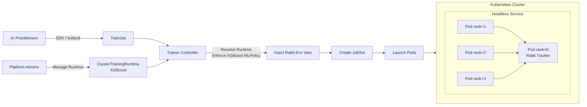
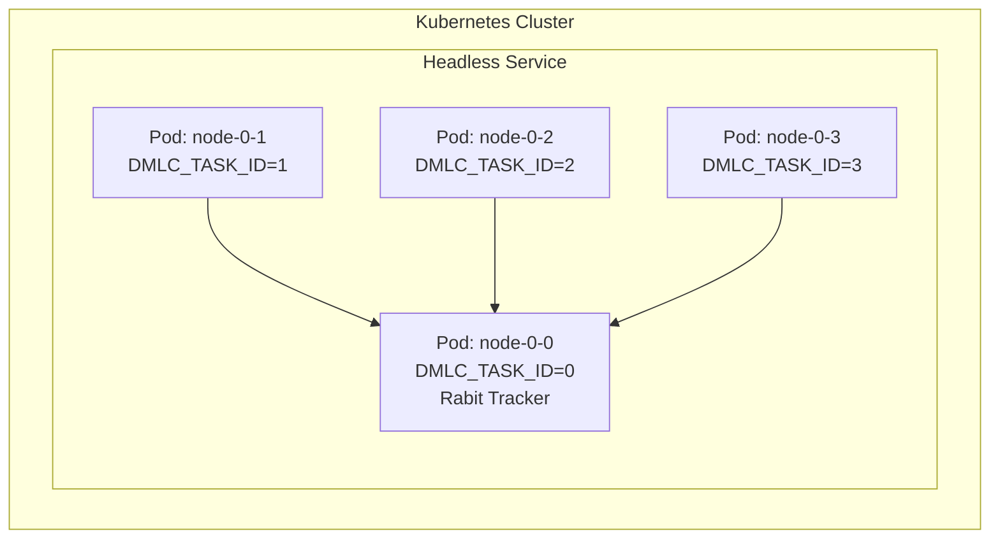

# KEP-2598: XGBoost Runtime for Kubeflow Trainer V2

<!-- 
Stage: Alpha
Status: Implementable
-->

---

## Table of Contents

- [Summary](#summary)
- [Motivation](#motivation)
- [Goals](#goals)
- [Non-Goals](#non-goals)
- [Proposal](#proposal)
- [User Stories](#user-stories)
- [Design Details](#design-details)
- [API](#api)
- [Implementation](#implementation)
- [Test Plan](#test-plan)
- [Future Work](#future-work)
- [Implementation History](#implementation-history)

---

## Summary

This KEP proposes adding an **XGBoost Runtime** to Kubeflow Trainer V2 to support distributed XGBoost training on Kubernetes using the Rabit-based coordination model.

---

## Motivation

XGBoost supports distributed training through **Rabit**, which requires coordinating worker processes via environment variables. This proposal leverages Trainer V2's Runtime API to express XGBoost's distributed semantics declaratively, eliminating manual configuration for users.

---

## Goals

| Goal | Description |
|:-----|:------------|
| Multi-node Training | Enable distributed XGBoost training using Rabit coordination |
| MLPolicy Integration | Introduce `XGBoostMLPolicySource` to the existing MLPolicy API |
| SDK Support | Integrate with Trainer V2 Python SDK |
| Device Agnostic | Support both CPU and GPU workloads (GPU via `device="cuda"` param) |

---

## Non-Goals

| Non-Goal | Rationale |
|:---------|:----------|
| Framework CRD | Trainer V2 uses generic TrainJob |
| MPI Support | Modern XGBoost uses Rabit |
| Elastic Training | Out of scope |
| Multi-GPU per Node | Initial version supports 1 worker per node; multi-GPU per node deferred |

---

## Proposal



The XGBoost runtime plugin:
1. Adds `XGBoost *XGBoostMLPolicySource` to the existing `MLPolicySource` struct
2. Injects Rabit environment variables automatically
3. Injects env vars so user code on rank-0 can start the Rabit tracker

---

## User Stories

### Story 1: Platform Admin
> As a Platform Admin, I want to define a reusable XGBoost runtime so teams can launch training jobs without Kubernetes expertise.

### Story 2: AI Practitioner
> As an AI Practitioner, I want to submit distributed XGBoost jobs via the Python SDK.

<details>
<summary><b>Python SDK Example</b></summary>

```python
from kubeflow.trainer import TrainerClient, CustomTrainer

def xgboost_train(num_rounds: int = 100, max_depth: int = 6):
    """
    Distributed XGBoost training function.
    
    DMLC_* env vars are injected by the Trainer V2 XGBoost plugin.
    Rank 0 must start the Rabit tracker before workers can connect.
    """
    import os
    import xgboost as xgb
    from sklearn.datasets import make_classification
    from sklearn.model_selection import train_test_split

    # Read injected environment variables
    rank = int(os.environ["DMLC_TASK_ID"])
    world_size = int(os.environ["DMLC_NUM_WORKER"])
    tracker_uri = os.environ["DMLC_TRACKER_URI"]
    tracker_port = int(os.environ["DMLC_TRACKER_PORT"])

    # Rank 0 starts the Rabit tracker (required for coordination)
    if rank == 0:
        tracker = xgb.RabitTracker(host_ip="0.0.0.0", n_workers=world_size, port=tracker_port)
        tracker.start(world_size)
        print(f"Tracker started on {tracker_uri}:{tracker_port}")

    # All workers initialize Rabit and connect to tracker
    xgb.rabit.init()
    print(f"Worker {rank}/{world_size} connected to tracker")

    # Load data (in practice, each worker loads a shard)
    X, y = make_classification(n_samples=10000, n_features=20, random_state=42 + rank)
    X_train, X_valid, y_train, y_valid = train_test_split(X, y, test_size=0.2)
    dtrain = xgb.DMatrix(X_train, label=y_train)
    dvalid = xgb.DMatrix(X_valid, label=y_valid)

    # Training params (for GPU: add device="cuda")
    params = {"objective": "binary:logistic", "max_depth": max_depth, "eta": 0.1}

    # Distributed training - Rabit synchronizes gradients
    model = xgb.train(params, dtrain, num_boost_round=num_rounds, evals=[(dvalid, "val")])

    # Finalize Rabit and save model from rank 0
    xgb.rabit.finalize()
    if rank == 0:
        model.save_model("/workspace/model/xgboost_model.json")


# Submit the training job
client = TrainerClient()
job_id = client.train(
    trainer=CustomTrainer(func=xgboost_train, func_args={"num_rounds": 100, "max_depth": 6}, num_nodes=4),
    runtime=next(r for r in client.list_runtimes() if r.name == "xgboost-distributed"),
)
```

> **Key Points:**
> - All ranks run the same Python script (`python train.py`)
> - Rank 0 must start `xgb.RabitTracker()` before other workers connect
> - Environment variables are injected by the plugin; tracker startup is user responsibility
> - For GPU training, add `device="cuda"` to params

</details>

---

## Design Details

### XGBoostMLPolicySource

Add to existing `MLPolicySource` in `pkg/apis/trainer/v1alpha1/trainingruntime_types.go`:

```go
type MLPolicySource struct {
    Torch   *TorchMLPolicySource   `json:"torch,omitempty"`
    MPI     *MPIMLPolicySource     `json:"mpi,omitempty"`
    XGBoost *XGBoostMLPolicySource `json:"xgboost,omitempty"`  // NEW
}

// XGBoostMLPolicySource represents an XGBoost runtime configuration.
// Currently empty - presence activates the XGBoost plugin with defaults.
// Future fields (see Future Work section):
//   - TrackerPort *int32 - Override default Rabit tracker port (9091)
//   - TrackerTimeout *int32 - Connection timeout in seconds
type XGBoostMLPolicySource struct {}
```

> [!IMPORTANT]
> Update the existing validation rule on `MLPolicy` struct (line 175 in `trainingruntime_types.go`):
> ```go
> // +kubebuilder:validation:XValidation:rule="!(has(self.torch) && has(self.mpi)) && !(has(self.torch) && has(self.xgboost)) && !(has(self.mpi) && has(self.xgboost))", message="Only one of the policy can be configured"
> ```

---

### Environment Variables

The plugin injects XGBoost's native Rabit environment variables:

| Variable | Description | Example Value |
|:---------|:------------|:--------------|
| `DMLC_TRACKER_URI` | Address of rank-0 pod (Rabit tracker) | `myjob-node-0-0.myjob` |
| `DMLC_TRACKER_PORT` | Tracker port | `9091` |
| `DMLC_TASK_ID` | Worker rank | `0`, `1`, `2`... |
| `DMLC_NUM_WORKER` | Total worker count | `4` |

**How `DMLC_NUM_WORKER` is calculated:**
- Set to `numNodes` from TrainJob (or ClusterTrainingRuntime if not overridden)
- 1 worker per pod (XGBoost can use multiple GPUs/CPUs within a single process)

---

### Parallelism Model

XGBoost has two levels of parallelism:

| Level | Mechanism | Controlled By |
|:------|:----------|:--------------|
| **Intra-node** | Multi-threading within a single process | `nthread` param in XGBoost |
| **Inter-node** | Distributed coordination across pods | Rabit (this KEP) |

**CPU Training:**
- Each pod runs 1 XGBoost worker process
- XGBoost uses all available CPU cores automatically (or set `nthread` to limit)
- Example: 4 pods × 8 cores each = 4 Rabit workers, each using 8 threads

**GPU Training:**
- Set `device="cuda"` in XGBoost params
- A single XGBoost process can utilize multiple GPUs on a node
- Request GPUs via `resourcesPerNode.limits["nvidia.com/gpu"]`

```python
# CPU: uses all cores, or limit with nthread
params = {"nthread": 8, "tree_method": "hist"}

# GPU: single process uses all available GPUs on the node
params = {"device": "cuda", "tree_method": "hist"}
```

> **Note:** Unlike PyTorch (which requires one process per GPU), XGBoost's single-process architecture can use multiple GPUs directly. Therefore, `numWorkerPerNode` is not needed for multi-GPU setups—simply request multiple GPUs per pod.

---

### Rabit Tracker Coordination



Workers discover the tracker via headless service DNS:
```
<trainjob-name>-node-0-0.<trainjob-name>
```

---

## API

### ClusterTrainingRuntime

```yaml
apiVersion: trainer.kubeflow.org/v2alpha1
kind: ClusterTrainingRuntime
metadata:
  name: xgboost-distributed
spec:
  mlPolicy:
    numNodes: 4
    xgboost: {}
  template:
    spec:
      replicatedJobs:
        - name: node
          template:
            spec:
              template:
                metadata:
                  labels:
                    trainer.kubeflow.org/trainjob-ancestor-step: trainer
                spec:
                  restartPolicy: OnFailure
                  containers:
                    - name: node
                      image: ghcr.io/kubeflow/xgboost:latest
                      command: ["python", "train.py"]
```

### TrainJob

```yaml
apiVersion: trainer.kubeflow.org/v2alpha1
kind: TrainJob
metadata:
  name: example-xgboost
spec:
  runtimeRef:
    name: xgboost-distributed
  trainer:
    image: ghcr.io/kubeflow/xgboost:latest
    command: ["python", "train.py"]
    numNodes: 4
```

---

## Implementation

### Files Overview

```
pkg/
├── apis/trainer/v1alpha1/
│   └── trainingruntime_types.go  [MODIFY] Add XGBoostMLPolicySource
├── constants/
│   └── constants.go              [MODIFY] Add XGBoost constants
└── runtime/framework/plugins/
    ├── registry.go               [MODIFY] Register plugin
    ├── plainml/plainml.go        [MODIFY] Update fallback check
    └── xgboost/                   [CREATE]
        ├── xgboost.go
        └── xgboost_test.go
```

---

### Plugin Implementation (Pseudo-code)

The XGBoost plugin will implement the `EnforceMLPolicyPlugin` interface:

```
XGBoost Plugin:
├── Implements: framework.EnforceMLPolicyPlugin
├── Implements: framework.CustomValidationPlugin (for reserved env validation)
│
├── EnforceMLPolicy(info, trainJob):
│   ├── Guard: Return early if XGBoost policy not configured
│   ├── Override numNodes from TrainJob if specified
│   ├── Find trainer container by ancestor label
│   └── Inject DMLC_* environment variables:
│       ├── DMLC_NUM_WORKER = numNodes
│       ├── DMLC_TASK_ID = Job completion index (downward API)
│       ├── DMLC_TRACKER_URI = <trainjob>-node-0-0.<trainjob>
│       └── DMLC_TRACKER_PORT = 9091 (default)
│
└── Validate(info, oldObj, newObj):
    └── Reject if user sets reserved DMLC_* env vars in TrainJob.spec.trainer.env
```

> **Note:** The plugin must validate that users don't manually set reserved `DMLC_*` environment variables, similar to how the Torch plugin validates `PET_*` variables.

---

### Files to Modify

| File | Changes |
|:-----|:--------|
| `pkg/apis/trainer/v1alpha1/trainingruntime_types.go` | Add `XGBoostMLPolicySource` struct and field to `MLPolicySource` |
| `pkg/constants/constants.go` | Add `DMLC_*` constants and `XGBoostReservedEnvNames` set |
| `pkg/runtime/framework/plugins/registry.go` | Register XGBoost plugin |
| `pkg/runtime/framework/plugins/plainml/plainml.go` | Add XGBoost to fallback exclusion check |

---

### Container Image

The `ghcr.io/kubeflow/xgboost:latest` image should:

| Requirement | Details |
|:------------|:--------|
| Base | Python 3.9+ with XGBoost installed |
| XGBoost Version | 2.0+ (supports `xgb.collective` API) |
| CPU/GPU | Single image supports both; GPU via `device="cuda"` param at runtime |
| Dependencies | `scikit-learn` for data utilities (optional) |

**Dockerfile example:**
```dockerfile
FROM python:3.11-slim
RUN pip install xgboost>=2.0 scikit-learn
# For GPU support, use nvidia/cuda base and install xgboost[cuda]
WORKDIR /workspace
```

> **Note:** GPU workloads require the user to set `device="cuda"` in their XGBoost params and request GPU resources via `resourcesPerNode.limits["nvidia.com/gpu"]`.


---

## Test Plan

The testing strategy focuses on validating functionality and integration of the XGBoost TrainingRuntime mechanism.

### Environment

Run workloads in a lightweight Kubernetes cluster in **CI actions** (e.g., using `kind` or `minikube`).

### Workloads

Execute simple distributed XGBoost training examples such as:
- **Classification**: Iris or similar small dataset
- **Regression**: Boston housing or synthetic data

### Validation Goals

| Goal | Description |
|:-----|:------------|
| JobSet Creation | Ensure correct creation of JobSet resources with proper pod count |
| Environment Variables | Verify `DMLC_*` variables are correctly injected in all pods |
| Rabit Coordination | Confirm all workers successfully connect to rank-0 tracker |
| Job Completion | Validate training completes successfully across all nodes |
| Runtime Compatibility | Test compatibility with `ClusterTrainingRuntime` configurations |

### Working Examples

Provide runnable notebook examples demonstrating how to create and run XGBoost training jobs:
- `examples/xgboost/distributed-training.ipynb` - Basic distributed training
- These notebooks serve as both test cases and user documentation

### Unit Tests

| Test File | Scope |
|:----------|:------|
| `pkg/runtime/framework/plugins/xgboost/xgboost_test.go` | Validate environment variable injection |
| | Test `numNodes` override from TrainJob |
| | Verify tracker URI format generation |
| | Ensure reserved env validation works |

### E2E Tests

| Test File | Scope |
|:----------|:------|
| `test/e2e/xgboost_test.go` | Full distributed training workflow |
| | JobSet creation and pod scheduling |
| | Training completion verification |

---

## Future Work

| Feature | Description |
|:--------|:------------|
| GPU Support | Enable GPU-based training with NCCL backend |
| Configurable Tracker | Add port/timeout fields to `XGBoostMLPolicySource` |
| Observability | Metrics and logging integration |

<details>
<summary><b>Future Enhancement: Configurable XGBoostMLPolicySource</b></summary>

```go
// XGBoostMLPolicySource represents an XGBoost runtime configuration.
// Future iteration - add configuration options for advanced use cases.
type XGBoostMLPolicySource struct {
    // TrackerPort overrides the default Rabit tracker port.
    // Defaults to 9091.
    // +kubebuilder:default=9091
    // +optional
    TrackerPort *int32 `json:"trackerPort,omitempty"`

    // TrackerTimeout is the connection timeout in seconds for workers
    // to connect to the Rabit tracker.
    // Defaults to 300 (5 minutes).
    // +kubebuilder:default=300
    // +optional
    TrackerTimeout *int32 `json:"trackerTimeout,omitempty"`

    // NumWorkerPerNode specifies processes per node for multi-GPU setups.
    // Defaults to 1.
    // +kubebuilder:default=1
    // +optional
    NumWorkerPerNode *int32 `json:"numWorkerPerNode,omitempty"`
}
```

**Usage example with future fields:**
```yaml
spec:
  mlPolicy:
    numNodes: 4
    xgboost:
      trackerPort: 9099
      trackerTimeout: 600
      numWorkerPerNode: 2
```

</details>

---

## Implementation History

| Date | Change |
|:-----|:-------|
| 2026-01-22 | Initial KEP draft |

---

<div align="center">

**[Back to Top](#kep-xxxx-xgboost-runtime-for-kubeflow-trainer-v2)**

</div>
