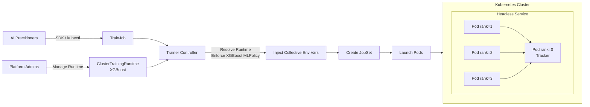
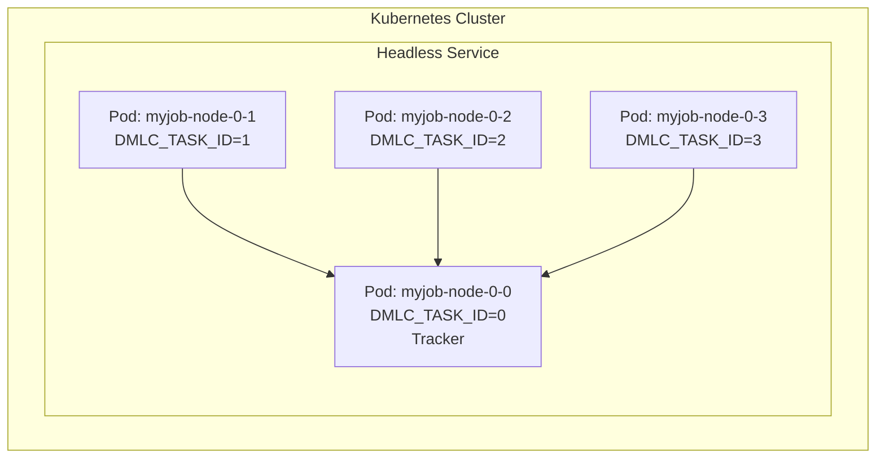

# KEP-2598: XGBoost Runtime for Kubeflow Trainer V2


## Table of Contents

- [Summary](#summary)
- [Motivation](#motivation)
- [Goals](#goals)
- [Non-Goals](#non-goals)
- [Proposal](#proposal)
- [User Stories](#user-stories)
- [Design Details](#design-details)
- [API](#api)
- [Implementation](#implementation)
- [Test Plan](#test-plan)
- [Future Work](#future-work)
- [Implementation History](#implementation-history)

---

## Summary

This KEP proposes adding an **XGBoost Runtime** to Kubeflow Trainer V2 to support distributed XGBoost training on Kubernetes using the Rabit-based coordination model.

---

## Motivation

XGBoost supports distributed training through **Rabit**, which requires coordinating worker processes via environment variables. This proposal leverages Trainer V2's Runtime API to express XGBoost's distributed semantics declaratively, eliminating manual configuration for users.

---

## Goals

| Goal | Description |
|:-----|:------------|
| Multi-node Training | Enable distributed XGBoost training using Rabit coordination |
| MLPolicy Integration | Introduce `XGBoostMLPolicySource` to the existing MLPolicy API |
| SDK Support | Integrate with Trainer V2 Python SDK |
| Device Agnostic | Support both CPU and GPU workloads (GPU via `device="cuda"` param) |

---

## Non-Goals

| Non-Goal | Rationale |
|:---------|:----------|
| Framework CRD | Trainer V2 uses generic TrainJob |
| MPI Support | Modern XGBoost uses Rabit/Collective |
| Elastic Training | Out of scope |

---

## Proposal



The XGBoost runtime plugin:
1. Adds `XGBoost *XGBoostMLPolicySource` to the existing `MLPolicySource` struct
2. Injects collective/Rabit environment variables automatically
3. Injects env vars so user code on rank-0 can start the tracker

---

## User Stories

### Story 1: Platform Admin
> As a Platform Admin, I want to define a reusable XGBoost runtime so teams can launch training jobs without Kubernetes expertise.

### Story 2: AI Practitioner
> As an AI Practitioner, I want to submit distributed XGBoost jobs via the Python SDK.

<details>
<summary><b>Python SDK Example</b></summary>

```python
from kubeflow.trainer import TrainerClient, CustomTrainer

def xgboost_train(num_rounds: int = 100, max_depth: int = 6):
    """
    Distributed XGBoost training function using the modern collective API.

    DMLC_* env vars are injected by the Trainer V2 XGBoost plugin.
    Rank 0 must start the tracker before workers can connect.

    Note: XGBoost 2.0+ uses xgb.collective instead of the deprecated xgb.rabit.
    """
    import os
    import xgboost as xgb
    from xgboost import collective as coll
    from xgboost.tracker import RabitTracker
    from sklearn.datasets import make_classification
    from sklearn.model_selection import train_test_split

    # Read injected environment variables
    rank = int(os.environ["DMLC_TASK_ID"])
    world_size = int(os.environ["DMLC_NUM_WORKER"])
    tracker_uri = os.environ["DMLC_TRACKER_URI"]
    tracker_port = int(os.environ["DMLC_TRACKER_PORT"])

    # Rank 0 starts the tracker (required for coordination)
    tracker = None
    if rank == 0:
        tracker = RabitTracker(host_ip="0.0.0.0", n_workers=world_size, port=tracker_port)
        tracker.start()
        print(f"Tracker started on {tracker_uri}:{tracker_port}")

    # All workers initialize the collective communicator
    with coll.CommunicatorContext(
        dmlc_tracker_uri=tracker_uri,
        dmlc_tracker_port=tracker_port,
        dmlc_task_id=str(rank),
    ):
        print(f"Worker {coll.get_rank()}/{coll.get_world_size()} connected")

        # Load data (in practice, each worker loads a shard)
        # NOTE: DMatrix construction MUST be inside the communicator context
        # because it involves synchronization for data shape and quantization.
        X, y = make_classification(n_samples=10000, n_features=20, random_state=42 + rank)
        X_train, X_valid, y_train, y_valid = train_test_split(X, y, test_size=0.2)
        dtrain = xgb.DMatrix(X_train, label=y_train)
        dvalid = xgb.DMatrix(X_valid, label=y_valid)

        # Training params (for GPU: add device="cuda")
        params = {"objective": "binary:logistic", "max_depth": max_depth, "eta": 0.1}

        # Distributed training - collective operations synchronize gradients
        model = xgb.train(params, dtrain, num_boost_round=num_rounds, evals=[(dvalid, "val")])

        # Save model from rank 0
        if coll.get_rank() == 0:
            model.save_model("/workspace/model/xgboost_model.json")

    # Wait for tracker to finish (rank 0 only)
    if tracker is not None:
        tracker.wait_for()


# Submit the training job
client = TrainerClient()
job_id = client.train(
    trainer=CustomTrainer(func=xgboost_train, func_args={"num_rounds": 100, "max_depth": 6}, num_nodes=4),
    runtime=next(r for r in client.list_runtimes() if r.name == "xgboost-distributed"),
)
```

> **Key Points:**
> - All ranks run the same Python script (`python train.py`)
> - Uses modern `xgb.collective` API (XGBoost 2.0+); `xgb.rabit` is deprecated
> - Rank 0 starts `RabitTracker()` before other workers connect
> - `DMatrix` construction **must** be inside the communicator context (requires synchronization)
> - Environment variables are injected by the plugin; tracker startup is user responsibility
> - For GPU training, add `device="cuda"` to params

> [!CAUTION]
> **DMatrix must be constructed inside the collective context.** The construction involves synchronization for data shape and quantization across workers. Constructing DMatrix outside the context may appear to work with regular/dense data, but the behavior is undefined and quantization results will be invalid.

</details>

---

## Design Details

### XGBoostMLPolicySource

Add to existing `MLPolicySource` in `pkg/apis/trainer/v1alpha1/trainingruntime_types.go`:

```go
type MLPolicySource struct {
    Torch   *TorchMLPolicySource   `json:"torch,omitempty"`
    MPI     *MPIMLPolicySource     `json:"mpi,omitempty"`
    XGBoost *XGBoostMLPolicySource `json:"xgboost,omitempty"`  // NEW
}

// XGBoostMLPolicySource represents an XGBoost runtime configuration.
// The number of workers per node is automatically derived from container GPU resources:
//   - GPU training: 1 worker per GPU (from resourcesPerNode)
//   - CPU training: 1 worker per node
// DMLC_NUM_WORKER = numNodes × workersPerNode (where workersPerNode = GPU count or 1)
type XGBoostMLPolicySource struct {
    // Empty for initial implementation.
    // Future: TrackerPort, TrackerTimeout can be added here.
}
```

> [!IMPORTANT]
> Update the existing validation rule on `MLPolicy` struct (line 175 in `trainingruntime_types.go`):
> ```go
> // +kubebuilder:validation:XValidation:rule="!(has(self.torch) && has(self.mpi)) && !(has(self.torch) && has(self.xgboost)) && !(has(self.mpi) && has(self.xgboost))", message="Only one of the policy can be configured"
> ```

---

### Environment Variables

The plugin injects XGBoost's native collective/Rabit environment variables:

| Variable | Description | Example Value |
|:---------|:------------|:--------------|
| `DMLC_TRACKER_URI` | Address of rank-0 pod (tracker host) | `myjob-node-0-0.myjob` |
| `DMLC_TRACKER_PORT` | Tracker port | `9091` |
| `DMLC_TASK_ID` | Worker rank | `0`, `1`, `2`... |
| `DMLC_NUM_WORKER` | Total worker count | `8` |

**How `DMLC_NUM_WORKER` is calculated:**
```
DMLC_NUM_WORKER = numNodes × workersPerNode

where workersPerNode:
  - GPU training: number of GPUs per node (from container limits)
  - CPU training: 1
```

- **CPU Training:** Typically 1 worker per node (XGBoost uses multi-threading within a process)
- **GPU Training:** 1 worker per GPU (XGBoost 2.0+ uses one GPU per worker process)

---

### Parallelism Model

XGBoost has two levels of parallelism:

| Level | Mechanism | Controlled By |
|:------|:----------|:--------------|
| **Intra-worker** | Multi-threading within a single process | `nthread` param in XGBoost |
| **Inter-worker** | Distributed coordination across workers | Collective/Rabit (this KEP) |

> [!IMPORTANT]
> **XGBoost 2.0+ Architecture:** The deprecated `n_gpus` parameter was removed. Modern XGBoost uses **one worker process per GPU**. This means `DMLC_NUM_WORKER = numNodes × workersPerNode` (where `workersPerNode` is derived from GPU count or defaults to 1).

#### CPU Training

- Each pod runs **1 XGBoost worker process**
- XGBoost uses all available CPU cores automatically (or set `nthread` to limit)
- Example: 4 pods × 8 cores each = 4 workers, each using 8 threads

```yaml
# CPU training: 4 nodes, 1 worker per node
spec:
  mlPolicy:
    numNodes: 4
    xgboost: {}
```

#### GPU Training

- Set `device="cuda"` in XGBoost params
- **One worker per GPU** (XGBoost 2.0+ removed the deprecated `n_gpus` parameter)
- `numWorkersPerNode` is **auto-derived** from container GPU resources when not set

```yaml
# GPU training: 2 nodes × 4 GPUs each = 8 workers total
spec:
  mlPolicy:
    numNodes: 2
    xgboost: {}  # numWorkersPerNode auto-derived from container resources
  template:
    spec:
      replicatedJobs:
        - name: node
          template:
            spec:
              template:
                spec:
                  containers:
                    - name: node
                      resources:
                        limits:
                          nvidia.com/gpu: 4  # Auto-derives numWorkersPerNode=4
```

| Configuration | numNodes | numWorkersPerNode | DMLC_NUM_WORKER |
|:--------------|:---------|:------------------|:----------------|
| 4 nodes, CPU-only | 4 | 1 | 4 |
| 2 nodes, 4 GPUs each | 2 | 4 | 8 |
| 1 node, 8 GPUs | 1 | 8 | 8 |

```python
# CPU training
params = {"nthread": 8, "tree_method": "hist"}

# GPU training
params = {"device": "cuda", "tree_method": "hist"}
```

---

### Tracker Coordination



**Pod Naming Convention:**
- Pattern: `<trainjob-name>-<replicatedjob-name>-<job-index>-<pod-index>`
- For XGBoost: `<job-index>` is always `0` (single ReplicatedJob)
- `<pod-index>` corresponds to `DMLC_TASK_ID` (0, 1, 2, 3...)
- Tracker runs on the first pod: `<trainjob-name>-node-0-0`

**Example (numNodes=4):**
```
DMLC_NUM_WORKER=4

myjob-node-0-0  DMLC_TASK_ID=0  (Tracker)
myjob-node-0-1  DMLC_TASK_ID=1
myjob-node-0-2  DMLC_TASK_ID=2
myjob-node-0-3  DMLC_TASK_ID=3
```

Workers discover the tracker via headless service DNS:
```
<trainjob-name>-node-0-0.<trainjob-name>
```

---

## API

### ClusterTrainingRuntime

```yaml
apiVersion: trainer.kubeflow.org/v2alpha1
kind: ClusterTrainingRuntime
metadata:
  name: xgboost-distributed
spec:
  mlPolicy:
    numNodes: 1  # Default, can be overridden by TrainJob
    xgboost: {}
  template:
    spec:
      replicatedJobs:
        - name: node
          template:
            spec:
              template:
                metadata:
                  labels:
                    trainer.kubeflow.org/trainjob-ancestor-step: trainer
                spec:
                  restartPolicy: OnFailure
                  containers:
                    - name: node
                      image: ghcr.io/kubeflow/xgboost:latest
```

### TrainJob

**CPU Training (4 nodes, 1 worker per node):**
```yaml
apiVersion: trainer.kubeflow.org/v2alpha1
kind: TrainJob
metadata:
  name: example-xgboost-cpu
spec:
  runtimeRef:
    name: xgboost-distributed
  trainer:
    image: ghcr.io/kubeflow/xgboost:latest
    command: ["python", "train.py"]
    numNodes: 4
```

**GPU Training (multi-node, multi-GPU):**
```yaml
apiVersion: trainer.kubeflow.org/v2alpha1
kind: TrainJob
metadata:
  name: example-xgboost-gpu
spec:
  runtimeRef:
    name: xgboost-distributed
  trainer:
    image: ghcr.io/kubeflow/xgboost-gpu:latest
    command: ["python", "train.py"]
    numNodes: 2                    # Number of nodes
    resourcesPerNode:
      limits:
        nvidia.com/gpu: 4          # 4 GPUs per node → auto-derives numWorkersPerNode=4
# Total workers = 2 nodes × 4 GPUs = 8 (auto-calculated)
# Note: numWorkersPerNode is automatically derived from GPU resources
```

---

## Implementation

### Files Overview

```
pkg/
├── apis/trainer/v1alpha1/
│   └── trainingruntime_types.go  [MODIFY] Add XGBoostMLPolicySource
├── constants/
│   └── constants.go              [MODIFY] Add XGBoost constants
└── runtime/framework/plugins/
    ├── registry.go               [MODIFY] Register plugin
    ├── plainml/plainml.go        [MODIFY] Update fallback check
    └── xgboost/                   [CREATE]
        ├── xgboost.go
        └── xgboost_test.go
```

---

### Plugin Implementation (Pseudo-code)

The XGBoost plugin will implement the `EnforceMLPolicyPlugin` interface:

```
XGBoost Plugin:
├── Implements: framework.EnforceMLPolicyPlugin
├── Implements: framework.CustomValidationPlugin
│
├── EnforceMLPolicy(info, trainJob):
│   ├── Guard: Return early if XGBoost policy not configured
│   ├── Override numNodes from TrainJob if specified
│   │
│   ├── Derive numWorkersPerNode:
│   │   ├── If explicitly set → use that value
│   │   └── Else → numWorkersPerNode = max(1, gpuCount)
│   │
│   ├── Calculate: totalWorkers = numNodes × numWorkersPerNode
│   │
│   └── Inject DMLC_* environment variables:
│       ├── DMLC_NUM_WORKER = totalWorkers
│       ├── DMLC_TASK_ID = JOB_COMPLETION_INDEX (pod index from JobSet)
│       ├── DMLC_TRACKER_URI = <trainjob>-node-0-0.<trainjob>
│       └── DMLC_TRACKER_PORT = 9091
│
└── Validate(info, oldObj, newObj):
    └── Reject if user sets reserved DMLC_* env vars
```

> **Note:** The plugin must validate that users don't manually set reserved `DMLC_*` environment variables.

---

### Files to Modify

| File | Changes |
|:-----|:--------|
| `pkg/apis/trainer/v1alpha1/trainingruntime_types.go` | Add `XGBoostMLPolicySource` struct and field to `MLPolicySource` |
| `pkg/constants/constants.go` | Add `DMLC_*` constants and `XGBoostReservedEnvNames` set |
| `pkg/runtime/framework/plugins/registry.go` | Register XGBoost plugin |
| `pkg/runtime/framework/plugins/plainml/plainml.go` | Add XGBoost to fallback exclusion check |

---

### Container Image

The `ghcr.io/kubeflow/xgboost-runtime` image should:

| Requirement | Details |
|:------------|:--------|
| Base | Python 3.9+ with XGBoost installed |
| XGBoost Version | 2.0+ (uses `xgb.collective` API; `xgb.rabit` is deprecated) |
| CPU/GPU | Single image supports both; GPU via `device="cuda"` param at runtime |

**Dockerfile example:**
```dockerfile
FROM nvidia/cuda:12.4.0-runtime-ubuntu22.04
RUN apt update && apt install -y python3 python3-pip && \
    pip install xgboost>=2.0
WORKDIR /workspace
```

> **Note:** GPU workloads require the user to set `device="cuda"` in their XGBoost params and request GPU resources via `resourcesPerNode.limits["nvidia.com/gpu"]`.


---

## Test Plan

The testing strategy focuses on validating functionality and integration of the XGBoost TrainingRuntime mechanism.

### Environment

Run workloads in a lightweight Kubernetes cluster in **CI actions** (e.g., using `kind` or `minikube`).

### Workloads

Execute simple distributed XGBoost training examples such as:
- **Classification**: Iris or similar small dataset
- **Regression**: Boston housing or synthetic data

### Validation Goals

| Goal | Description |
|:-----|:------------|
| JobSet Creation | Ensure correct creation of JobSet resources with proper pod count |
| Environment Variables | Verify `DMLC_*` variables are correctly injected in all pods |
| Rabit Coordination | Confirm all workers successfully connect to rank-0 tracker |
| Job Completion | Validate training completes successfully across all nodes |
| Runtime Compatibility | Test compatibility with `ClusterTrainingRuntime` configurations |

### Working Examples

Provide runnable notebook examples demonstrating how to create and run XGBoost training jobs:
- `examples/xgboost/distributed-training.ipynb` - Basic distributed training
- These notebooks serve as both test cases and user documentation

### Unit Tests

| Test File | Scope |
|:----------|:------|
| `pkg/runtime/framework/plugins/xgboost/xgboost_test.go` | Validate environment variable injection |
| | Test `numNodes` override from TrainJob |
| | Test `numWorkersPerNode` for multi-GPU scenarios |
| | Verify `DMLC_NUM_WORKER = numNodes × numWorkersPerNode` |
| | Verify tracker URI format generation |
| | Ensure reserved env validation works |

### E2E Tests

| Test File | Scope |
|:----------|:------|
| `test/e2e/xgboost_test.go` | Full distributed training workflow |
| | JobSet creation and pod scheduling |
| | Training completion verification |

---

## Future Work

| Feature | Description |
|:--------|:------------|
| Configurable Tracker | Add port/timeout fields to `XGBoostMLPolicySource` |
| Observability | Metrics and logging integration |
| Federated Learning | Support for XGBoost's federated learning mode |

<details>
<summary><b>Future Enhancement: Configurable XGBoostMLPolicySource</b></summary>

```go
// XGBoostMLPolicySource represents an XGBoost runtime configuration.
// Future iteration - add tracker configuration options for advanced use cases.
type XGBoostMLPolicySource struct {
    // NumWorkersPerNode specifies the number of worker processes per node.
    // Already implemented - see Design Details section.
    NumWorkersPerNode *int32 `json:"numWorkersPerNode,omitempty"`

    // TrackerPort overrides the default Rabit tracker port.
    // Defaults to 9091.
    // +kubebuilder:default=9091
    // +optional
    TrackerPort *int32 `json:"trackerPort,omitempty"`

    // TrackerTimeout is the connection timeout in seconds for workers
    // to connect to the tracker.
    // Defaults to 300 (5 minutes).
    // +kubebuilder:default=300
    // +optional
    TrackerTimeout *int32 `json:"trackerTimeout,omitempty"`
}
```

**Usage example with future fields:**
```yaml
spec:
  mlPolicy:
    numNodes: 2
    xgboost:
      numWorkersPerNode: 4    # 4 GPUs per node
      trackerPort: 9099       # Custom port (future)
      trackerTimeout: 600     # 10 minute timeout (future)
```

</details>

---

## Implementation History
- Initial draft: January 22nd 2026
- Review changes addressed: January 27th 2026
---
