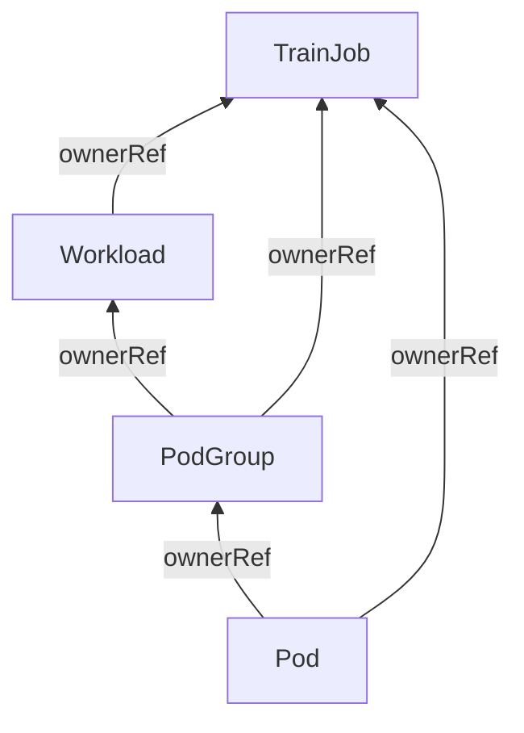

# KEP-3015: Workload Aware Scheduling for TrainJob

## Summary

This document proposes integrating the Kubernetes Workload API into Kubeflow Trainer to enable
native workload aware scheduling for TrainJobs. The Workload API, introduced in Kubernetes v1.35 (alpha)
and targeting v1.37 (beta), provides multiple features to enhance AI workload scheduling orchestration
including gang-scheduling: [KEP-4671](https://github.com/kubernetes/enhancements/tree/master/keps/sig-scheduling/4671-gang-scheduling),
topology-aware scheduling: [KEP-5732](https://github.com/kubernetes/enhancements/tree/master/keps/sig-scheduling/5732-topology-aware-workload-scheduling),
DRA: [KEP-5729](https://github.com/kubernetes/enhancements/tree/master/keps/sig-scheduling/5729-resourceclaim-support-for-workloads),
and other features through the Workload and PodGroup resources.

This integration will be implemented as a new `PodGroupPolicy` plugin following the existing Trainer
Pipeline Framework pattern.

## Motivation

In the initial implementation, we plan to support gang-scheduling to ensure that all Pods of a
TrainJob are scheduled together, preventing resource deadlock and idle GPU time. Currently,
Kubeflow Trainer supports gang scheduling through external solutions:

- **Coscheduling plugin**: Requires installing the Kubernetes scheduler-plugins project
- **Volcano scheduler**: Requires deploying the Volcano scheduling system

The Kubernetes community has recognized gang scheduling as a fundamental requirement and introduced
native support through the Workload API. This API is becoming the standard way to express gang
scheduling in Kubernetes, with integration planned for:

- **Job controller**: [KEP-4671](https://github.com/kubernetes/enhancements/tree/master/keps/sig-scheduling/4671-gang-scheduling): Automatic Workload/PodGroup creation for parallel jobs
- **JobSet**: [KEP-969](https://github.com/kubernetes-sigs/jobset/pull/1068): Gang scheduling support for job groups

### Goals

1. Implement a Workload plugin following the Trainer Pipeline Framework pattern to support gang scheduling via the native Kubernetes Workload API
1. Support automatic creation of Workload and PodGroup objects with proper lifecycle management tied to TrainJob
1. Ensure gang-scheduling works with MPI plugin
1. Support for TrainJob initializers
1. Maintain backward compatibility with existing Coscheduling and Volcano plugins

### Non-Goals

1. Replace existing Coscheduling or Volcano plugins - this is an additional scheduling option
1. Support all Workload API features immediately - focus on core gang scheduling first
1. Support Kubernetes versions < 1.35 - Workload API requires v1.35+
1. Delegate Workload creation to JobSet - the TrainJob controller (as the highest-level controller)
   must create the Workload object

## Proposal

### User Stories

#### Story 1

As a platform engineer, I want to configure ClusterTrainingRuntime to use native Kubernetes
gang-scheduling without installing external scheduler plugins.

The ClusterTrainingRuntime and TrainJob may look as follows:

```yaml
apiVersion: trainer.kubeflow.org/v1alpha1
kind: ClusterTrainingRuntime
metadata:
  name: torch-distributed
spec:
  mlPolicy:
    numNodes: 1
    torch: {}
  podGroupPolicy:
    workload: {}
  template:
    spec:
      replicatedJobs:
        - name: node
          template:
            spec:
              template:
                metadata:
                  labels:
                    trainer.kubeflow.org/trainjob-ancestor-step: trainer
                spec:
                  containers:
                    - name: node
                      image: pytorch/pytorch:2.9.1-cuda12.8-cudnn9-runtime
---
apiVersion: trainer.kubeflow.org/v1alpha1
kind: TrainJob
metadata:
  name: my-job
spec:
  runtimeRef:
    name: torch-distributed
  trainer:
    image: docker.io/torch-run
    numNodes: 100
    resourcesPerNode:
      requests:
        nvidia.com/gpu: 4
```

When this plugin is enabled, the TrainJob controller will create the following resources:

```yaml
apiVersion: scheduling.k8s.io/v1alpha2
kind: Workload
metadata:
  name: my-job
  ownerReferences:
    - apiVersion: trainer.kubeflow.org/v1alpha1
      kind: TrainJob
      name: my-job
      controller: true
spec:
  controllerRef:
    apiVersion: trainer.kubeflow.org/v1alpha1
    kind: TrainJob
    name: my-job
  podGroupTemplates:
    - name: trainer
      schedulingPolicy:
        gang:
          minCount: 100 # Equal to trainJob.spec.trainer.numNodes or mlPolicy.numNodes
```

The PodGroup will be created automatically by the TrainJob controller

```yaml
apiVersion: scheduling.k8s.io/v1alpha1
kind: PodGroup
metadata:
  name: my-job-trainer-<hash>
  ownerReferences:
    - apiVersion: scheduling.k8s.io/v1alpha2
      kind: Workload
      name: <trainjob-name>
    - apiVersion: trainer.kubeflow.org/v1alpha1
      kind: TrainJob
      name: my-job
      controller: true
spec:
  podGroupTemplateRef:
    workloadName: my-job
    podGroupTemplateName: trainer
  schedulingPolicy:
    gang:
      minCount: 100
```

And the Pod specs will be updated with the scheduling group:

```yaml
spec:
  schedulingGroup:
    podGroupName: my-job-trainer-<hash>
```

#### Story 2

As a platform engineer, I want to configure MPI-based distributed training with gang scheduling using
the Workload API to ensure all MPI nodes are scheduled together.

The ClusterTrainingRuntime and TrainJob may look as follows:

```yaml
apiVersion: trainer.kubeflow.org/v1alpha1
kind: ClusterTrainingRuntime
metadata:
  name: deepspeed-distributed
  labels:
    trainer.kubeflow.org/framework: deepspeed
spec:
  mlPolicy:
    numNodes: 1
    mpi:
      numProcPerNode: 4
      mpiImplementation: OpenMPI
  template:
    spec:
      network:
        publishNotReadyAddresses: true
      successPolicy:
        operator: All
        targetReplicatedJobs:
          - launcher
      replicatedJobs:
        - name: launcher
          template:
            metadata:
              labels:
                trainer.kubeflow.org/trainjob-ancestor-step: trainer
            spec:
              template:
                spec:
                  containers:
                    - name: node
                      image: ghcr.io/kubeflow/trainer/deepspeed-runtime
                      securityContext:
                        runAsUser: 1000
        - name: node
          template:
            spec:
              template:
                spec:
                  containers:
                    - name: node
                      image: ghcr.io/kubeflow/trainer/deepspeed-runtime
                      securityContext:
                        runAsUser: 1000
                      command:
                        - /usr/sbin/sshd
                      args:
                        - -De
                        - -f
                        - /home/mpiuser/.sshd_config
                      readinessProbe:
                        tcpSocket:
                          port: 2222
                        initialDelaySeconds: 5
---
apiVersion: trainer.kubeflow.org/v1alpha1
kind: TrainJob
metadata:
  name: my-job
spec:
  runtimeRef:
    name: deepspeed-distributed
  trainer:
    numNodes: 50
    resourcesPerNode:
      requests:
        nvidia.com/gpu: 4
```

When this plugin is enabled, the TrainJob controller will create the Workload with one PodGroup
for launcher+node.

```yaml
apiVersion: scheduling.k8s.io/v1alpha2
kind: Workload
metadata:
  name: my-job
  ownerReferences:
    - apiVersion: trainer.kubeflow.org/v1alpha1
      kind: TrainJob
      name: my-job
      controller: true
spec:
  controllerRef:
    apiVersion: trainer.kubeflow.org/v1alpha1
    kind: TrainJob
    name: my-job
  podGroupTemplates:
    - name: trainer
      schedulingPolicy:
        gang:
          minCount: 50 # Equal to trainJob.spec.trainer.numNodes
```

The corresponding PodGroups will be created:

```yaml
apiVersion: scheduling.k8s.io/v1alpha1
kind: PodGroup
metadata:
  name: my-job-trainer-<hash>
  ownerReferences:
    - apiVersion: scheduling.k8s.io/v1alpha2
      kind: Workload
      name: my-job
    - apiVersion: trainer.kubeflow.org/v1alpha1
      kind: TrainJob
      name: my-job
      controller: true
spec:
  podGroupTemplateRef:
    workloadName: my-job
    podGroupTemplateName: trainer
  schedulingPolicy:
    gang:
      minCount: 50
```

And the Pod specs will be updated with the scheduling group:

```yaml
spec:
  schedulingGroup:
    podGroupName: my-job-trainer-<hash>
```

#### Story 3

As a platform engineer, I want to configure LLM fine-tuning with dataset/model initializers and
gang scheduling. The initializers and trainer should have separate PodGroups to ensure proper
scheduling coordination.

The ClusterTrainingRuntime with Workload API enabled and TrainJob may look as follows:

```yaml
apiVersion: trainer.kubeflow.org/v1alpha1
kind: ClusterTrainingRuntime
metadata:
  name: torchtune-qwen2.5-1.5b
  labels:
    trainer.kubeflow.org/framework: torchtune
spec:
  mlPolicy:
    numNodes: 1
    torch: {}
  podGroupPolicy:
    workload: {}
  template:
    spec:
      volumeClaimPolicies:
        - templates:
            - metadata:
                name: initializer
              spec:
                accessModes: ["ReadWriteOnce"]
                resources:
                  requests:
                    storage: 20Gi
      replicatedJobs:
        - name: dataset-initializer
          template:
            metadata:
              labels:
                trainer.kubeflow.org/trainjob-ancestor-step: dataset-initializer
            spec:
              template:
                spec:
                  containers:
                    - name: dataset-initializer
                      image: ghcr.io/kubeflow/trainer/dataset-initializer
                      env:
                        - name: STORAGE_URI
                          value: hf://tatsu-lab/alpaca
                      volumeMounts:
                        - mountPath: /workspace
                          name: initializer
        - name: model-initializer
          template:
            metadata:
              labels:
                trainer.kubeflow.org/trainjob-ancestor-step: model-initializer
            spec:
              template:
                spec:
                  containers:
                    - name: model-initializer
                      image: ghcr.io/kubeflow/trainer/model-initializer
                      env:
                        - name: STORAGE_URI
                          value: hf://Qwen/Qwen2.5-1.5B-Instruct
                      volumeMounts:
                        - name: initializer
                          mountPath: /workspace
        - name: node
          dependsOn:
            - name: dataset-initializer
              status: Complete
            - name: model-initializer
              status: Complete
          template:
            metadata:
              labels:
                trainer.kubeflow.org/trainjob-ancestor-step: trainer
            spec:
              template:
                spec:
                  containers:
                    - name: node
                      image: ghcr.io/kubeflow/trainer/torchtune-trainer
                      command:
                        - tune
                        - run
                        - full_finetune_distributed
                        - --config
                        - qwen2_5/1.5B_full
                        - dataset.source=parquet
                        - dataset.data_dir=/workspace/dataset/data
                        - output_dir=/workspace/output
                        - tokenizer.path=/workspace/model/vocab.json
                        - tokenizer.merges_file=/workspace/model/merges.txt
                        - checkpointer.checkpoint_dir=/workspace/model
                      resources:
                        limits:
                          nvidia.com/gpu: 2
                      volumeMounts:
                        - mountPath: /workspace
                          name: initializer
---
apiVersion: trainer.kubeflow.org/v1alpha1
kind: TrainJob
metadata:
  name: my-job
spec:
  runtimeRef:
    name: torchtune-qwen2.5-1.5b
```

When this plugin is enabled, the TrainJob controller will create the Workload with two PodGroup
templates - one for initializer and one for the trainer. The initializer PodGroup does not require
gang-scheduling to enable lazy-loading:

```yaml
apiVersion: scheduling.k8s.io/v1alpha2
kind: Workload
metadata:
  name: my-job
  ownerReferences:
    - apiVersion: trainer.kubeflow.org/v1alpha1
      kind: TrainJob
      name: my-job
      controller: true
spec:
  controllerRef:
    apiVersion: trainer.kubeflow.org/v1alpha1
    kind: TrainJob
    name: my-job
  podGroupTemplates:
    - name: initializer
      schedulingPolicy:
        basic: {}
    - name: trainer
      schedulingPolicy:
        gang:
          minCount: 8 # Equal to trainJob.spec.trainer.numNodes
```

The corresponding PodGroups will be created:

```yaml
apiVersion: scheduling.k8s.io/v1alpha1
kind: PodGroup
metadata:
  name: my-job-initializer-<hash>
  ownerReferences:
    - apiVersion: scheduling.k8s.io/v1alpha2
      kind: Workload
      name: my-job
    - apiVersion: trainer.kubeflow.org/v1alpha1
      kind: TrainJob
      name: my-job
      controller: true
spec:
  podGroupTemplateRef:
    workloadName: my-job
    podGroupTemplateName: initializer
  schedulingPolicy:
    basic: {}
---
apiVersion: scheduling.k8s.io/v1alpha1
kind: PodGroup
metadata:
  name: my-job-trainer-<hash>
  ownerReferences:
    - apiVersion: scheduling.k8s.io/v1alpha2
      kind: Workload
      name: my-job
    - apiVersion: trainer.kubeflow.org/v1alpha1
      kind: TrainJob
      name: my-job
      controller: true
spec:
  podGroupTemplateRef:
    workloadName: my-job
    podGroupTemplateName: trainer
  schedulingPolicy:
    gang:
      minCount: 8
```

Each Pod will be associated with its respective PodGroup:

```yaml
# Initializer Pods (dataset-initializer, model-initializer)
spec:
  schedulingGroup:
    podGroupName: my-job-initializer-<hash>
---
# Trainer Pod
spec:
  schedulingGroup:
    podGroupName: my-job-trainer-<hash>
```

## Design Details

### Kubernetes Workload API Overview

The Workload API introduces two new resource types:

- **Workload**: A static template defining scheduling policies and `PodGroupTemplates`.
- **PodGroup**: Runtime instances representing actual pod groups with status tracking.

The key design principle is that **the highest-level controller creates the Workload object**.
Since TrainJob is the top-level resource in Kubeflow Trainer, the TrainJob controller must create
the Workload object, not JobSet.

### Workload Scheduling API

We extend `PodGroupPolicySource` to include a Workload option:

```go
// PodGroupPolicySource configures the gang-scheduling plugin.
// Only one of its members may be specified.
type PodGroupPolicySource struct {
    // Coscheduling plugin from the Kubernetes scheduler-plugins for gang-scheduling.
    Coscheduling *CoschedulingPodGroupPolicySource `json:"coscheduling,omitempty"`

    // Volcano plugin from the Volcano scheduler for gang-scheduling.
    Volcano *VolcanoPodGroupPolicySource `json:"volcano,omitempty"`

    // Workload plugin using native Kubernetes Workload API for gang-scheduling
    // Requires Kubernetes v1.35+ with GenericWorkload feature gates enabled.
    Workload *WorkloadPodGroupPolicySource `json:"workload,omitempty"`
}

// WorkloadPodGroupPolicySource configures scheduling behavior using Kubernetes Workload API.
type WorkloadPodGroupPolicySource struct {}
```

The `WorkloadPodGroupPolicySource` struct is intentionally minimal for the initial implementation.
The `minCount` for gang scheduling is automatically derived from `mlPolicy.numNodes` or
`trainJob.spec.trainer.numNodes`.

### Workload Runtime Plugin

Similar to the Coscheduling and Volcano plugins, we implement a Workload plugin in
`pkg/runtime/framework/plugins/workload/workload.go`. This plugin implements the following interfaces
from the Pipeline Framework:

#### Build Phase

The plugin implements the `ComponentBuilder` interface to build the Workload object:

```go
func (w *Workload) Build(ctx context.Context, info *runtime.Info, trainJob *trainv1alpha1.TrainJob) ([]runtime.ApplyConfiguration, error) {
    // 1. Extract numNodes from runtime info
    // 2. Build Workload object with:
    //    - controllerRef pointing to TrainJob
    //    - podGroupTemplate with gang scheduling policy
    //    - minCount equal to numNodes
    // 3. Build PodGroup objects.
    // 4. Return a slice of apply configurations for the Workload and PodGroup objects
}
```

#### EnforcePodGroupPolicy Phase

The plugin implements the `EnforcePodGroupPolicy` interface to configure the `schedulingGroup` field in Pod specs:

```go
func (w *Workload) EnforcePodGroupPolicy(info *runtime.Info, trainJob *trainv1alpha1.TrainJob) error {
    // 1. Set schedulingGroup.podGroupName in all Pod templates
}
```

#### WatchExtension Phase

The plugin implements `WatchExtension` to watch Workload resources and trigger TrainJob reconciliation:

```go
func (w *Workload) ReconcilerBuilders() []runtime.ReconcilerBuilder {
    // 1. Watch Workload and PodGroup resources owned by TrainJob
    // 2. Trigger reconciliation on PodGroup status changes
}
```

### OwnerReferences Relationship

The ownerReferences relationship between `TrainJob`, `Workload`, `PodGroup`, and `Pod` is as follows:



- The `Workload` object has an ownerReference to the `TrainJob` object with `controller: true` in case it was created by the TrainJob controller
- The `PodGroup` object has an ownerReference to the `TrainJob` object with `controller: true` in case it was created by the TrainJob controller and another ownerReference to the `Workload` object
- The `Pod` object has an ownerReference to the `TrainJob` object with `controller: true` and another ownerReference to the `PodGroup` object

By this ownerReferences relationship, garbage collection will remove objects accordingly that avoids orphaned Pods with a stale PodGroup reference.

### Resource Lifecycle

1. **Creation**: When a TrainJob is created with `podGroupPolicy.workload` configured, the Workload
   plugin creates the Workload and PodGroup objects with `ownerReferences` pointing to the TrainJob.

1. **Pod Association**: The plugin injects `schedulingGroup.podGroupName` into Pod specs, linking Pods to their PodGroup.

1. **Scheduling**: The kube-scheduler uses the Workload Scheduling Cycle to process entire PodGroups
   atomically, ensuring all Pods in a gang are scheduled together.

1. **Suspension**: When the TrainJob is suspended, Workload and PodGroup resources are preserved.
   In the future, we can re-create to ensure elastic TrainJob support.

1. **Deletion**: When the TrainJob is deleted, Kubernetes garbage collection automatically cleans up the Workload object (and subsequently the PodGroup).

The TrainJob controller requires permissions to manage Workload resources:

```go
// +kubebuilder:rbac:groups=scheduling.k8s.io,resources=workloads,verbs=get;list;watch;create;update;patch
// +kubebuilder:rbac:groups=scheduling.k8s.io,resources=workloads/status,verbs=get
// +kubebuilder:rbac:groups=scheduling.k8s.io,resources=podgroups,verbs=get;list;watch;create;update;patch
// +kubebuilder:rbac:groups=scheduling.k8s.io,resources=podgroups/status,verbs=get
```

### Feature Gate Dependencies

The Workload API requires the following Kubernetes feature gates to be enabled:

- `GenericWorkload`: Enables the Workload and PodGroup APIs

The same feature gate is required to be enabled in TrainJob config:

```
GenericWorkload
```

## Defaulting/Validation

- Workload API should not be configured in JobSet or Job templates
- Only one of `coscheduling`, `volcano`, or `workload` may be specified (CEL)
- `GenericWorkload` feature gate must be enabled (webhook)
- `spec.schedulingGroup` must not be manually set in Pod templates

## Test Plan

- [x] I/we understand the owners of the involved components may require updates to
      existing tests to make this code solid enough prior to committing the changes necessary
      to implement this enhancement.

### Unit Tests

- Workload and PodGroup creation based on the Runtime spec
- Correct calculation of `minCount`
- Proper `controllerRef` and `ownerReferences` configuration
- Pod template injection of `schedulingGroup` field

### Integration Tests

- Workload and PodGroup creation by TrainJob controller
- Workload creation for TrainJob with MPI plugin
- Workload creation for TrainJob with initializer
- TrainJob deletion triggers Workload cleanup
- Suspended TrainJob behavior with Workload

### E2E Tests

Verify the Workload and PodGroup orchestration as part of Trainer E2E tests.

## Future Plans

We plan to integrate other features like DRA, Topology-Aware Scheduling, Preemption as part of
the Workload API in the future.

For example, we can introduce TopologyConstraint under Workload API to allow users setting topology:

```yaml
podGroupPolicy:
  workload:
    topologyConstraint:
      level: topology.kubernetes.io/rack
```

## Implementation History

- 2026-02-16: KEP Creation for gang-scheduling support

## Alternatives

### Set Workload Spec in the TrainJob API

We can integrate the Workload spec in the TrainJob API directly. That might introduce inconsistency
with other PodGroupPolicy plugins. Alternatively, we can allow to set Workload parameters in the
Runtime and TrainJob spec, similarly to the Trainer/Initializer.

```yaml
apiVersion: trainer.kubeflow.org/v1alpha1
kind: TrainJob
metadata:
  name: my-job
spec:
  runtimeRef:
    name: torch-distributed
  workloadSpec: {}
```

### Custom Setting for PodGroupTemplates

We could allow users to override the default Workload API behavior to enable custom orchestration for
TrainJob. To support this, we would need to extend the `.workload` API accordingly.
Alternatively, we could rely on [the JobSet integration](https://github.com/kubernetes-sigs/jobset/pull/1068)
to provide users with more fine-grained control over PodGroup configuration.

```yaml
apiVersion: trainer.kubeflow.org/v1alpha1
kind: ClusterTrainingRuntime
metadata:
  name: custom-workload
spec:
  podGroupPolicy:
    workload:
      podGroupTemplates:
        - name: trainer
          targetJobs:
            - name: launcher
            - name: node
          schedulingPolicy:
            gang:
              minCount: 10
        - name: evaluator
          targetJobs:
            - name: evaluator
          schedulingPolicy:
            gang:
              minCount: 2
```
