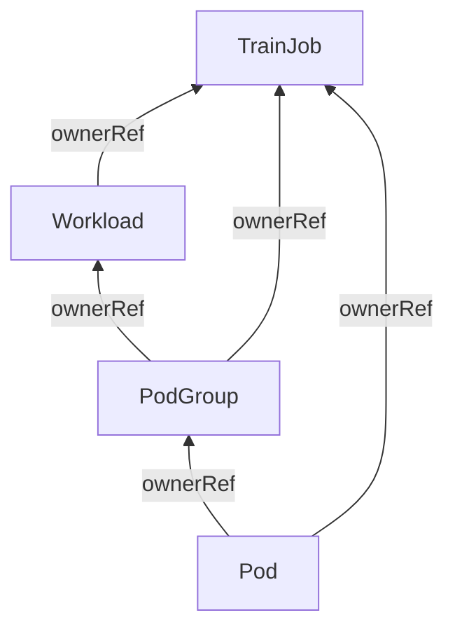

# KEP-3015: Workload Aware Scheduling for TrainJob

## Summary

This document proposes integrating the Kubernetes Workload API into Kubeflow Trainer to enable
native workload aware scheduling for TrainJobs. The Workload API, introduced in Kubernetes v1.35 (alpha)
and targeting v1.37 (beta), provides multiple features to enhance AI workload scheduling orchestration
including gang-scheduling: [KEP-4671](https://github.com/kubernetes/enhancements/tree/master/keps/sig-scheduling/4671-gang-scheduling),
topology-aware scheduling: [KEP-5732](https://github.com/kubernetes/enhancements/tree/master/keps/sig-scheduling/5732-topology-aware-workload-scheduling),
DRA: [KEP-5729](https://github.com/kubernetes/enhancements/tree/master/keps/sig-scheduling/5729-resourceclaim-support-for-workloads),
and other features through the Workload and PodGroup resources.

This integration will be implemented as a new `workload` plugin following the existing Trainer
Pipeline Framework pattern.

## Motivation

The Kubeflow TrainJob controller currently creates downstream resources (JobSet, Jobs, Pods)
without workload-aware scheduling constraints unless the user opts into an external solution:

- **Coscheduling plugin**: Requires installing the Kubernetes scheduler-plugins project
- **Volcano scheduler**: Requires deploying the Volcano scheduling system

The Kubernetes community has converged on the `Workload`/`PodGroup` APIs as the standard
expression of gang scheduling and other workload-aware scheduling primitives. With native
integration planned for [the Job controller](https://github.com/kubernetes/enhancements/tree/master/keps/sig-scheduling/5547-workload-job-integration)
and JobSet [kubernetes-sigs/jobset#1068](https://github.com/kubernetes-sigs/jobset/pull/1068),
TrainJob is the highest-level controller that must own the `Workload` creation.

This KEP brings native gang scheduling — and a path to other Workload-API features – to TrainJob
without requiring per-runtime opt-in or external scheduler installation.

### Goals

1. When the `WorkloadAwareScheduling` feature gate is enabled, the TrainJob controller
   automatically creates exactly one `Workload` and the corresponding `PodGroup` objects per
   TrainJob before any downstream Pod is created.
1. Automatically determine the `SchedulingPolicy` for each `PodGroupTemplate` from the TrainJob
   and TrainingRuntime spec (gang for `numNodes > 1` trainer pods, basic otherwise; initializers
   always basic).
1. Tie `Workload` and `PodGroup` lifecycle to TrainJob via `ownerReferences` so deletion cascades
   correctly.
1. Ensure gang-scheduling works with the MPI plugin and TrainJob initializers.
1. Maintain backward compatibility with existing Coscheduling and Volcano plugins when the
   feature gate is disabled.

### Non-Goals

1. Replace existing Coscheduling or Volcano plugins — they remain as alternatives when the
   feature gate is disabled.
1. Support all Workload API features immediately — focus on core gang scheduling first.
1. Support Kubernetes versions < 1.36 — Workload API requires v1.36+.
1. Support dynamic changes to `numNodes` at runtime when gang scheduling is active — elastic
   TrainJob is future work.
1. Support custom multi-`PodGroupTemplate` structures authored by users in the initial release.
1. Delegate `Workload` creation to JobSet — TrainJob is the highest-level controller and must
   own the `Workload`.

## Proposal

When the `WorkloadAwareScheduling` feature gate is enabled, the TrainJob controller is
responsible for ensuring a `Workload` and the corresponding `PodGroup` objects exist before any
downstream resources are created. The controller derives the `Workload` spec from the TrainJob
and TrainingRuntime spec — there is no per-runtime opt-in field, mirroring the model in KEP-5547
where Job controller integration is feature-gate driven rather than spec-field driven.

The key design principles are:

1. **One TrainJob – one Workload.** Each TrainJob maps to a single `Workload`. The `Workload`
   may contain one `PodGroupTemplate` (trainer only) or two `PodGroupTemplates` (initializer +
   trainer) depending on the TrainingRuntime.
1. **Automatic policy selection** based on TrainJob spec:
   - Trainer `PodGroupTemplate`: `GangSchedulingPolicy` with `minCount = numNodes` when
     `numNodes > 1`; otherwise `BasicSchedulingPolicy`.
   - Initializer `PodGroupTemplate` (when present): `BasicSchedulingPolicy` always —
     initializers run sequentially and benefit from lazy loading.
1. **Feature-gate driven.**. When `WorkloadAwareScheduling` feature gate it set, `Workload` is created.
1. **Lifecycle via `ownerReferences`.** The TrainJob controller sets `ownerReferences` on the
   `Workload` and `PodGroup` so Kubernetes garbage collection removes them when the TrainJob is
   deleted.
1. **`numNodes` is immutable while gang is active.** Updates to `numNodes` are rejected by
   validation when the resulting policy is gang scheduling, because the Workload API does not
   support changing `minCount` after creation. Future work will define an elastic story.

### User Stories

#### Story 1: Distributed PyTorch Training with Gang Scheduling

As a platform engineer, I want to run a distributed PyTorch TrainJob with 100 nodes that must
all be scheduled together. If only 99 workers can be scheduled, no pods should start.

The ClusterTrainingRuntime and TrainJob may look as follows

```yaml
apiVersion: trainer.kubeflow.org/v1alpha1
kind: ClusterTrainingRuntime
metadata:
  name: torch-distributed
spec:
  mlPolicy:
    numNodes: 1
    torch: {}
  template:
    spec:
      replicatedJobs:
        - name: node
          template:
            spec:
              template:
                metadata:
                  labels:
                    trainer.kubeflow.org/trainjob-ancestor-step: trainer
                spec:
                  containers:
                    - name: node
                      image: pytorch/pytorch:2.9.1-cuda12.8-cudnn9-runtime
---
apiVersion: trainer.kubeflow.org/v1alpha1
kind: TrainJob
metadata:
  name: my-job
spec:
  runtimeRef:
    name: torch-distributed
  trainer:
    image: docker.io/torch-run
    numNodes: 100
    resourcesPerNode:
      requests:
        nvidia.com/gpu: 4
```

When the feature gate is enabled, the TrainJob controller will create the following resources:

```yaml
apiVersion: scheduling.k8s.io/v1alpha2
kind: Workload
metadata:
  name: my-job-<hash>
  ownerReferences:
    - apiVersion: trainer.kubeflow.org/v1alpha1
      kind: TrainJob
      name: my-job
      controller: true
spec:
  controllerRef:
    apiVersion: trainer.kubeflow.org/v1alpha1
    kind: TrainJob
    name: my-job
  podGroupTemplates:
    - name: trainer
      schedulingPolicy:
        gang:
          minCount: 100 # Equal to trainJob.spec.trainer.numNodes
```

The PodGroup will be created automatically by the TrainJob controller:

```yaml
apiVersion: scheduling.k8s.io/v1alpha1
kind: PodGroup
metadata:
  name: <workload-name>-trainer-<hash>
  ownerReferences:
    - apiVersion: scheduling.k8s.io/v1alpha2
      kind: Workload
      name: <workload-name>
    - apiVersion: trainer.kubeflow.org/v1alpha1
      kind: TrainJob
      name: my-job
      controller: true
spec:
  podGroupTemplateRef:
    workload:
      workloadName: <workload-name>
      podGroupTemplateName: trainer
  schedulingPolicy:
    gang:
      minCount: 100
```

And the Pod specs will be updated with the scheduling group:

```yaml
spec:
  schedulingGroup:
    podGroupName: <workload-name>-trainer-<hash>
```

If the same TrainJob is created with `numNodes: 1`, the trainer `PodGroupTemplate` uses
`BasicSchedulingPolicy` instead, so future Workload-API features (DRA, topology-aware
scheduling) work uniformly without conditional logic.

#### Story 2: MPI Distributed Training with Gang Scheduling

As a platform engineer, I want to configure MPI-based distributed training with gang scheduling
to ensure all MPI nodes (launcher + workers) are scheduled together.

```yaml
apiVersion: trainer.kubeflow.org/v1alpha1
kind: ClusterTrainingRuntime
metadata:
  name: deepspeed-distributed
  labels:
    trainer.kubeflow.org/framework: deepspeed
spec:
  mlPolicy:
    numNodes: 1
    mpi:
      numProcPerNode: 4
      mpiImplementation: OpenMPI
  template:
    spec:
      network:
        publishNotReadyAddresses: true
      successPolicy:
        operator: All
        targetReplicatedJobs:
          - launcher
      replicatedJobs:
        - name: launcher
          template:
            metadata:
              labels:
                trainer.kubeflow.org/trainjob-ancestor-step: trainer
            spec:
              template:
                spec:
                  containers:
                    - name: node
                      image: ghcr.io/kubeflow/trainer/deepspeed-runtime
                      securityContext:
                        runAsUser: 1000
        - name: node
          template:
            spec:
              template:
                spec:
                  containers:
                    - name: node
                      image: ghcr.io/kubeflow/trainer/deepspeed-runtime
                      securityContext:
                        runAsUser: 1000
                      command:
                        - /usr/sbin/sshd
                      args:
                        - -De
                        - -f
                        - /home/mpiuser/.sshd_config
                      readinessProbe:
                        tcpSocket:
                          port: 2222
                        initialDelaySeconds: 5
---
apiVersion: trainer.kubeflow.org/v1alpha1
kind: TrainJob
metadata:
  name: my-job
spec:
  runtimeRef:
    name: deepspeed-distributed
  trainer:
    numNodes: 50
    resourcesPerNode:
      requests:
        nvidia.com/gpu: 4
```

When the feature gate is enabled, the TrainJob controller will create a single `Workload` with
one `PodGroupTemplate` covering both `launcher` and `node` ReplicatedJobs:

```yaml
apiVersion: scheduling.k8s.io/v1alpha2
kind: Workload
metadata:
  name: my-job-<hash>
  ownerReferences:
    - apiVersion: trainer.kubeflow.org/v1alpha1
      kind: TrainJob
      name: my-job
      controller: true
spec:
  controllerRef:
    apiVersion: trainer.kubeflow.org/v1alpha1
    kind: TrainJob
    name: my-job
  podGroupTemplates:
    - name: trainer
      schedulingPolicy:
        gang:
          minCount: 50 # Equal to trainJob.spec.trainer.numNodes
```

The corresponding PodGroup will be created:

```yaml
apiVersion: scheduling.k8s.io/v1alpha1
kind: PodGroup
metadata:
  name: <workload-name>-trainer-<hash>
  ownerReferences:
    - apiVersion: scheduling.k8s.io/v1alpha2
      kind: Workload
      name: <workload-name>
    - apiVersion: trainer.kubeflow.org/v1alpha1
      kind: TrainJob
      name: my-job
      controller: true
spec:
  podGroupTemplateRef:
    workload:
      workloadName: <workload-name>
      podGroupTemplateName: trainer
  schedulingPolicy:
    gang:
      minCount: 50
```

And the Pod specs will be updated with the scheduling group:

```yaml
spec:
  schedulingGroup:
    podGroupName: <workload-name>-trainer-<hash>
```

#### Story 3: LLM Fine-Tuning with Initializers and Gang Scheduling

As a platform engineer, I want to configure LLM fine-tuning with dataset/model initializers and
gang scheduling. The initializers and trainer should have separate PodGroups: initializers run
without gang scheduling (for lazy loading), while the trainer pods are gang-scheduled.

```yaml
apiVersion: trainer.kubeflow.org/v1alpha1
kind: ClusterTrainingRuntime
metadata:
  name: torchtune-qwen2.5-1.5b
  labels:
    trainer.kubeflow.org/framework: torchtune
spec:
  mlPolicy:
    numNodes: 1
    torch: {}
  template:
    spec:
      volumeClaimPolicies:
        - templates:
            - metadata:
                name: initializer
              spec:
                accessModes: ["ReadWriteOnce"]
                resources:
                  requests:
                    storage: 20Gi
      replicatedJobs:
        - name: dataset-initializer
          template:
            metadata:
              labels:
                trainer.kubeflow.org/trainjob-ancestor-step: dataset-initializer
            spec:
              template:
                spec:
                  containers:
                    - name: dataset-initializer
                      image: ghcr.io/kubeflow/trainer/dataset-initializer
                      env:
                        - name: STORAGE_URI
                          value: hf://tatsu-lab/alpaca
                      volumeMounts:
                        - mountPath: /workspace
                          name: initializer
        - name: model-initializer
          template:
            metadata:
              labels:
                trainer.kubeflow.org/trainjob-ancestor-step: model-initializer
            spec:
              template:
                spec:
                  containers:
                    - name: model-initializer
                      image: ghcr.io/kubeflow/trainer/model-initializer
                      env:
                        - name: STORAGE_URI
                          value: hf://Qwen/Qwen2.5-1.5B-Instruct
                      volumeMounts:
                        - name: initializer
                          mountPath: /workspace
        - name: node
          dependsOn:
            - name: dataset-initializer
              status: Complete
            - name: model-initializer
              status: Complete
          template:
            metadata:
              labels:
                trainer.kubeflow.org/trainjob-ancestor-step: trainer
            spec:
              template:
                spec:
                  containers:
                    - name: node
                      image: ghcr.io/kubeflow/trainer/torchtune-trainer
                      command:
                        - tune
                        - run
                        - full_finetune_distributed
                        - --config
                        - qwen2_5/1.5B_full
                        - dataset.source=parquet
                        - dataset.data_dir=/workspace/dataset/data
                        - output_dir=/workspace/output
                        - tokenizer.path=/workspace/model/vocab.json
                        - tokenizer.merges_file=/workspace/model/merges.txt
                        - checkpointer.checkpoint_dir=/workspace/model
                      resources:
                        limits:
                          nvidia.com/gpu: 2
                      volumeMounts:
                        - mountPath: /workspace
                          name: initializer
---
apiVersion: trainer.kubeflow.org/v1alpha1
kind: TrainJob
metadata:
  name: my-job
spec:
  runtimeRef:
    name: torchtune-qwen2.5-1.5b
  trainer:
    numNodes: 8
```

When the feature gate is enabled, the TrainJob controller will create a single `Workload` with
two `PodGroupTemplates` — one for initializers and one for the trainer. The initializer
`PodGroupTemplate` does not require gang-scheduling to enable lazy-loading:

```yaml
apiVersion: scheduling.k8s.io/v1alpha2
kind: Workload
metadata:
  name: my-job-<hash>
  ownerReferences:
    - apiVersion: trainer.kubeflow.org/v1alpha1
      kind: TrainJob
      name: my-job
      controller: true
spec:
  controllerRef:
    apiVersion: trainer.kubeflow.org/v1alpha1
    kind: TrainJob
    name: my-job
  podGroupTemplates:
    - name: initializer
      schedulingPolicy:
        basic: {}
    - name: trainer
      schedulingPolicy:
        gang:
          minCount: 8 # Equal to trainJob.spec.trainer.numNodes
```

The corresponding PodGroups will be created:

```yaml
apiVersion: scheduling.k8s.io/v1alpha1
kind: PodGroup
metadata:
  name: <workload-name>-initializer-<hash>
  ownerReferences:
    - apiVersion: scheduling.k8s.io/v1alpha2
      kind: Workload
      name: <workload-name>
    - apiVersion: trainer.kubeflow.org/v1alpha1
      kind: TrainJob
      name: my-job
      controller: true
spec:
  podGroupTemplateRef:
    workload:
      workloadName: <workload-name>
      podGroupTemplateName: initializer
  schedulingPolicy:
    basic: {}
---
apiVersion: scheduling.k8s.io/v1alpha1
kind: PodGroup
metadata:
  name: <workload-name>-trainer-<hash>
  ownerReferences:
    - apiVersion: scheduling.k8s.io/v1alpha2
      kind: Workload
      name: <workload-name>
    - apiVersion: trainer.kubeflow.org/v1alpha1
      kind: TrainJob
      name: my-job
      controller: true
spec:
  podGroupTemplateRef:
    workload:
      workloadName: <workload-name>
      podGroupTemplateName: trainer
  schedulingPolicy:
    gang:
      minCount: 8
```

Each Pod is associated with its respective PodGroup:

```yaml
# Initializer Pods (dataset-initializer, model-initializer)
spec:
  schedulingGroup:
    podGroupName: <workload-name>-initializer-<hash>
---
# Trainer Pod
spec:
  schedulingGroup:
    podGroupName: <workload-name>-trainer-<hash>
```

## Design Details

### Kubernetes Workload API Overview

The Workload API introduces two new resource types:

- **Workload**: A static template defining scheduling policies and `PodGroupTemplates`.
- **PodGroup**: Runtime instances representing actual pod groups with status tracking.

The key design principle from KEP-5547 is that **the highest-level controller creates the
Workload object**. Since TrainJob is the top-level resource in Kubeflow Trainer, the TrainJob
controller — not JobSet — must create the Workload object.

### Workload and PodGroup Discovery

Discovery of `Workload` and `PodGroup` objects for a TrainJob is based on **references**, not on
ownership. `ownerReferences` are used only to ensure garbage collection.

A `Workload` is the `Workload` for a TrainJob if:

1. The `Workload` is in the TrainJob's namespace.
1. Its `spec.controllerRef` points to this TrainJob (matching `apiVersion`, `kind`, and `name`).

A `PodGroup` is a `PodGroup` for a TrainJob if:

1. The `PodGroup` is in the TrainJob's namespace.
1. Its `spec.podGroupTemplateRef.workloadName` equals the name of the `Workload` for this
   TrainJob.

Discovery is reference-based (not name-based) so that the [naming pattern](#naming-conventions)
can evolve without breaking discovery.

### Controller Workflow

The TrainJob controller attempts to create `Workload` and `PodGroup` only when the TrainJob has
no downstream Pods yet. If Pods already exist, the controller only discovers and uses existing
`Workload`/`PodGroup` objects. This rule is critical for correctness when the controller
restarts or is upgraded mid-reconciliation (e.g., after creating the `Workload` but before
creating the `PodGroup` or Pods). On the next sync, the controller finds existing objects via
informers and continues without creating duplicates.

The workflow is:

1. **Skip if Pods exist.** If the TrainJob already owns one or more Pods (active or terminal),
   skip `Workload`/`PodGroup` creation. Discovery still runs so any new Pods get the correct
   `schedulingGroup.podGroupName`.
1. **Discover or create `Workload`.** Look up `Workload` objects whose `spec.controllerRef`
   points to this TrainJob.
   - **None found:** create a `Workload` with `ownerReference` and `spec.controllerRef` pointing
     to this TrainJob. Determine `PodGroupTemplates` and their `SchedulingPolicy` from the
     TrainJob and TrainingRuntime spec:
     - Trainer `PodGroupTemplate`: `GangSchedulingPolicy` with `minCount = numNodes` when
       `numNodes > 1`; otherwise `BasicSchedulingPolicy`.
     - Initializer `PodGroupTemplate` (when the runtime defines initializer ReplicatedJobs):
       `BasicSchedulingPolicy`.
   - **Multiple found:** treat as ambiguous. Emit an event and a TrainJob condition; do not
     create or modify.
   - **Exactly one found:** that is the `Workload` for this TrainJob. Do not modify it.
1. **Discover or create `PodGroups`.** For each `PodGroupTemplate` in the `Workload`, look up
   `PodGroup` objects whose `spec.podGroupTemplateRef.workloadName` and `podGroupTemplateName`
   match.
   - **None found:** create a `PodGroup` with two `ownerReferences` (TrainJob with
     `controller: true`, and `Workload`).
   - **Exactly one found:** that is the `PodGroup` for this template. Do not modify it.
   - **Multiple found:** treat as ambiguous, emit event and condition, do not create or modify.
1. **Create downstream resources.** Run the existing pod management logic (JobSet → Jobs →
   Pods). Each Pod template gets `spec.schedulingGroup.podGroupName` set to the `PodGroup`
   matching its `trainer.kubeflow.org/trainjob-ancestor-step` label
   (`trainer` / `dataset-initializer` / `model-initializer`).

The controller does not update `Workload` or `PodGroup` objects after they are created.

### Object Creation Order

The TrainJob controller creates objects in the following order so that references resolve and
any cross-object validation passes:

1. `Workload` (referenced by its `controllerRef` to TrainJob).
1. `PodGroup` objects (each referencing the `Workload` and the `TrainJob`).
1. JobSet / Job / Pods (Pods carry `schedulingGroup.podGroupName`).

The kube-scheduler waits for the `PodGroup` before binding Pods that reference it via
`schedulingGroup`, so scheduling correctness does not depend on this ordering at the API server
level. The order is enforced for consistency and to satisfy any cross-object validation.

### Naming Conventions

Naming is for human readability and logical linking only — discovery does not depend on it, so
the pattern can evolve in later releases.

Following prior art in the Kubernetes Job controller:

- **Workload**: `<(truncated-if-needed)trainjob-name>-<hash>`
- **PodGroup**: `<(truncated-if-needed)workload-name>-<(truncated-if-needed)podGroup-template-name>-<hash>`

Truncation is applied as needed to respect Kubernetes name length limits. The hash provides
collision avoidance and supports future multi-`PodGroup` cases. Object type (`Workload` vs
`PodGroup`) is identified via `ownerReferences[].kind`, not the name pattern.

### Workload Runtime Plugin

The integration is implemented as a plugin in `pkg/runtime/framework/plugins/workload/workload.go`,
following the existing Pipeline Framework pattern used by Coscheduling and Volcano. Unlike those
plugins, the Workload plugin does not have a corresponding `PodGroupPolicySource` field — it is
registered automatically when the `WorkloadAwareScheduling` feature gate is enabled.

The plugin implements the following framework interfaces:

#### Build Phase

The plugin implements the `ComponentBuilder` interface to build the `Workload` and `PodGroup`
objects:

```go
func (w *Workload) Build(ctx context.Context, info *runtime.Info, trainJob *trainv1alpha1.TrainJob) ([]runtime.ApplyConfiguration, error) {
    // 1. Discover existing Workload/PodGroup via controllerRef and podGroupTemplateRef.
    // 2. Skip creation if TrainJob already has Pods.
    // 3. Otherwise, build:
    //    - Workload with controllerRef to TrainJob and one PodGroupTemplate per
    //      runtime "step" (initializer, trainer).
    //    - SchedulingPolicy per template:
    //        trainer:     gang(minCount=numNodes) if numNodes > 1 else basic{}
    //        initializer: basic{}
    //    - PodGroup(s) with ownerReferences to TrainJob (controller) and Workload.
    // 4. Return apply configurations for the Workload and PodGroups.
}
```

#### EnforceRuntimeInfoPlugin Phase

The plugin implements `EnforceRuntimeInfoPlugin` to set `schedulingGroup.podGroupName` on each Pod
template, mapped to its `PodGroup` based on the
`trainer.kubeflow.org/trainjob-ancestor-step` label:

```go
func (w *Workload) EnforceRuntimeInfoPlugin(info *runtime.Info, trainJob *trainv1alpha1.TrainJob) error {
    // For each Pod template in info, set spec.schedulingGroup.podGroupName to the
    // PodGroup whose template matches the Pod's trainjob-ancestor-step label.
}
```

#### WatchExtension Phase

The plugin implements `WatchExtension` to watch `Workload` and `PodGroup` resources owned by the
TrainJob and trigger reconciliation on status changes:

```go
func (w *Workload) ReconcilerBuilders() []runtime.ReconcilerBuilder {
    // Watch Workload and PodGroup resources owned by TrainJob, trigger
    // reconciliation on PodGroup status changes.
}
```

The TrainJob controller requires additional RBAC permissions:

```go
// +kubebuilder:rbac:groups=scheduling.k8s.io,resources=workloads,verbs=get;list;watch;create
// +kubebuilder:rbac:groups=scheduling.k8s.io,resources=workloads/status,verbs=get
// +kubebuilder:rbac:groups=scheduling.k8s.io,resources=podgroups,verbs=get;list;watch;create
// +kubebuilder:rbac:groups=scheduling.k8s.io,resources=podgroups/status,verbs=get
```

### OwnerReferences Relationship

The ownerReferences relationship between `TrainJob`, `Workload`, `PodGroup`, and `Pod` is as
follows:


```mermaid
flowchart BT
    Pod[Pod]
    PodGroup[PodGroup]
    Workload[Workload]
    TrainJob[TrainJob]

    Workload -->|ownerRef| TrainJob
    PodGroup -->|ownerRef| TrainJob
    Pod -->|ownerRef| TrainJob

    PodGroup -->|ownerRef| Workload
    Pod -->|ownerRef| PodGroup
```

- The `Workload` object has an ownerReference to the `TrainJob` object with `controller: true`.
- The `PodGroup` object has an ownerReference to the `TrainJob` object with `controller: true`
  and another ownerReference to the `Workload` object.
- The `Pod` object has an ownerReference to the `Job` object with `controller: true` and
  another ownerReference to the `PodGroup` object.

By this ownerReferences relationship, garbage collection will remove objects accordingly,
avoiding orphaned Pods with a stale `PodGroup` reference.

### Resource Lifecycle

1. **Creation**: When a TrainJob is created and the `WorkloadAwareScheduling` feature gate is
   enabled, the Workload plugin creates the `Workload` and `PodGroup` objects with
   `ownerReferences` pointing to the TrainJob, before any downstream resources are created.

1. **Pod Association**: The plugin injects `schedulingGroup.podGroupName` into Pod specs,
   linking Pods to their `PodGroup`.

1. **Scheduling**: The kube-scheduler uses the Workload Scheduling Cycle to process entire
   `PodGroups` atomically, ensuring all Pods in a gang are scheduled together.

1. **Suspension**: When the TrainJob is suspended, downstream Pods are deleted but the
   `Workload` and `PodGroup` resources are preserved. On resume, the same `Workload`/`PodGroup`
   are reused. Future work may delete and recreate them on suspend/resume to support elastic
   TrainJob and to release `PodGroup`-tracked resources (DRA).

1. **Deletion**: When the TrainJob is deleted, Kubernetes garbage collection automatically
   cleans up the `Workload` and all `PodGroup` objects via `ownerReferences`.

1. **`numNodes` immutability**: While the feature gate is enabled and the resulting
   `SchedulingPolicy` is gang scheduling, updates to `trainJob.spec.trainer.numNodes` are
   rejected by the validating webhook because the Workload API does not support changing
   `minCount` after creation.

1. **Controller restart / upgrade**: Because the controller only creates `Workload`/`PodGroup`
   when the TrainJob has no Pods, restarts or upgrades mid-reconciliation are safe — on the
   next sync the controller discovers existing objects via informers and continues without
   creating duplicates.

### Feature Gate Dependencies

This feature requires:

- **Kubernetes feature gate `GenericWorkload`** on `kube-apiserver` and `kube-scheduler` to
  enable the `Workload` and `PodGroup` APIs and gang-scheduling integration in the scheduler.
- **Trainer feature gate `WorkloadAwareScheduling`** on `trainer-controller-manager` to enable
  the Workload runtime plugin.

When `WorkloadAwareScheduling` is enabled but `GenericWorkload` is unavailable on the
kube-apiserver, the TrainJob controller fails to create the `Workload`, surfaces a TrainJob
condition, and retries with backoff.

## Defaulting/Validation

- When the `WorkloadAwareScheduling` feature gate is enabled, validation rejects
  TrainingRuntimes that also set `podGroupPolicy.coscheduling` or `podGroupPolicy.volcano`.
- `spec.schedulingGroup` must not be manually set in Pod templates within a TrainingRuntime.
- When the feature gate is enabled and the post-update `SchedulingPolicy` would be gang
  scheduling, updates to `trainJob.spec.trainer.numNodes` are rejected. The validation logic
  mirrors the controller's gang-scheduling criteria; if those criteria change, the validation
  must be updated accordingly. This restriction will be lifted when elastic TrainJob support
  is defined.

## Test Plan

- [x] I/we understand the owners of the involved components may require updates to existing
      tests to make this code solid enough prior to committing the changes necessary to
      implement this enhancement.

### Unit Tests

In `pkg/runtime/framework/plugins/workload`:

- `SchedulingPolicy` selection for various TrainJob/TrainingRuntime configurations
  (`numNodes > 1` → gang; `numNodes == 1` → basic; runtime with initializers → two templates).
- `Workload` and `PodGroup` build output, including correct `controllerRef` and
  `ownerReferences` shape (Workload: controller ownerRef to TrainJob; PodGroup: controller
  ownerRef to TrainJob and non-controller ownerRef to Workload).
- Naming patterns conform to [Naming Conventions](#naming-conventions) and respect length
  limits.
- Pod template injection of `schedulingGroup.podGroupName`, mapped via
  `trainer.kubeflow.org/trainjob-ancestor-step`.

In `pkg/controller`:

- TrainJob controller skips `Workload`/`PodGroup` creation when Pods already exist.
- Discovery via `controllerRef` and `podGroupTemplateRef` returns existing objects after a
  restart mid-reconciliation; no duplicates are created.

In `pkg/webhooks`:

- Updates to `trainJob.spec.trainer.numNodes` are rejected when the feature gate is enabled
  and the post-update policy is gang scheduling.
- TrainingRuntimes that combine `WorkloadAwareScheduling` with `podGroupPolicy.coscheduling`
  or `podGroupPolicy.volcano` are rejected.

### Integration Tests

- End-to-end lifecycle: TrainJob → `Workload` and `PodGroup` created with correct policy and
  ownerReferences → Pods carry `schedulingGroup.podGroupName` → TrainJob deletion cascades
  to `Workload` and `PodGroup` deletion.
- Feature gate disable/enable behavior: existing TrainJobs unchanged; new TrainJobs get
  `Workload`/`PodGroup`.
- Suspended TrainJob: Pods deleted but `Workload`/`PodGroup` preserved; on resume, the same
  `PodGroup` is reused.
- Initializer + trainer scenario: initializer `PodGroup` uses basic policy, trainer `PodGroup`
  uses gang.

### E2E Tests

Verify the `Workload` and `PodGroup` orchestration end-to-end, including:

- Gang scheduling: all trainer Pods scheduled together or none (insufficient capacity →
  no Pods bind; capacity added → all bind together).
- Initializer + trainer flow runs end-to-end with the correct PodGroup associations.

## Future Plans

- **Additional Workload-API features**: incrementally adopt topology-aware scheduling, DRA,
  and preemption as those upstream KEPs progress. For example, a topology constraint:

  ```yaml
  workloadPolicy:
    constraints:
      topology:
        - key: topology.kubernetes.io/rack
  ```

- **Integrate with workloadBuilder Library**: refactor integration once [KEP-6089](https://github.com/kubernetes/enhancements/pull/6092)
  is complete with workloadBuilder library.
- **Elastic TrainJob support**: define semantics for changing `numNodes` on a gang-scheduled
  TrainJob (likely by deleting and recreating the `Workload`/`PodGroup`), removing the
  current immutability restriction.
- **Suspend/resume**: delete `Workload`/`PodGroup` on suspend and recreate on resume, so
  workload-tracked resources (DRA) are released during suspension.

## Implementation History

- 2026-06-09: Initial KEP to support gang-scheduling via WorkloadAwareScheduling feature flag.

## Alternatives

### Set Workload Spec in the TrainJob API

We can integrate the Workload spec in the TrainJob API directly. That might introduce
inconsistency with other PodGroupPolicy plugins. Alternatively, we can allow setting Workload
parameters in the Runtime and TrainJob spec, similarly to the Trainer/Initializer.

```yaml
apiVersion: trainer.kubeflow.org/v1alpha1
kind: TrainJob
metadata:
  name: my-job
spec:
  runtimeRef:
    name: torch-distributed
  workloadPolicy: {}
```

### Custom Setting for PodGroupTemplates

We could allow users to override the default Workload API behavior to enable custom
orchestration for TrainJob. To support this, we would need to extend the API accordingly.
Alternatively, we could rely on
[the JobSet integration](https://github.com/kubernetes-sigs/jobset/pull/1068) to provide users
with more fine-grained control over PodGroup configuration.

```yaml
apiVersion: trainer.kubeflow.org/v1alpha1
kind: ClusterTrainingRuntime
metadata:
  name: custom-workload
spec:
  podGroupPolicy:
    workload:
      podGroupTemplates:
        - name: trainer
          targetJobs:
            - name: launcher
            - name: node
          schedulingPolicy:
            gang:
              minCount: 10
        - name: evaluator
          targetJobs:
            - name: evaluator
          schedulingPolicy:
            gang:
              minCount: 2
```

### Per-Runtime Opt-In via podGroupPolicy.workload

The original design proposed a `WorkloadPodGroupPolicySource` field analogous to the existing
`Coscheduling` and `Volcano` sources:

```go
type PodGroupPolicySource struct {
    Coscheduling *CoschedulingPodGroupPolicySource `json:"coscheduling,omitempty"`
    Volcano      *VolcanoPodGroupPolicySource      `json:"volcano,omitempty"`
    Workload     *WorkloadPodGroupPolicySource     `json:"workload,omitempty"`
}
```

Rejected in favor of the feature-gate-driven model proposed in this KEP. Reasons:

- Matches the upstream KEP-5547 model, which is also feature-gate-driven (no opt-in field on
  the Job spec).
- Reduces user-facing API surface during the upstream alpha period.
- Cluster operators control rollout uniformly via the feature gate; runtime authors do not
  need to add a field per runtime.

The trade-off is that cluster operators cannot enable the feature for some runtimes and disable
it for others. Per-runtime opt-out can be revisited later if needed.
