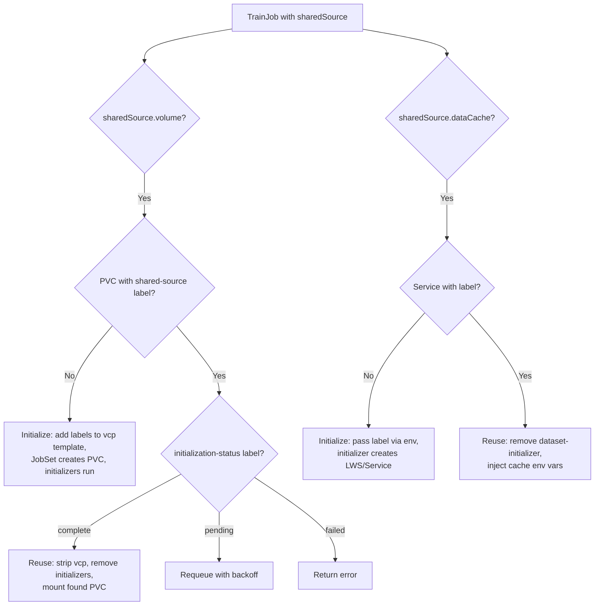

# KEP-3310: Shared Initializer Plugin

**Authors**: [@akshaychitneni](https://github.com/akshaychitneni)

## Summary

Add a **SharedInitializer plugin** to the Trainer framework that allows multiple TrainJobs to
share pre-initialized data (PVC or data cache) instead of each running its own initialization.
The first TrainJob to reconcile initializes the data; subsequent TrainJobs with the same
`sharedSource` name skip initialization and reuse it.

## Motivation

The current Trainer architecture initializes data **per TrainJob** using two patterns:

- **Disk-based:** The runtime's `volumeClaimPolicies` creates a PVC per JobSet. Initializer
  ReplicatedJobs download data into the PVC before training starts.
- **Cache-based:** The `dataset-initializer` creates a LeaderWorkerSet data cache cluster.
  Data is streamed over gRPC during training.

In multi-job workflows (HPO trials, iterative experiments, team-shared datasets), this causes:

- **Redundant downloads:** N TrainJobs over the same dataset = N downloads (e.g., N * 100GB egress)
- **Redundant cache clusters:** Each TrainJob spins up its own LWS cluster
- **Sequential bottleneck:** For large datasets, initialization dominates wall time

```
Without sharing:                        With sharing:
TrainJob-A  TrainJob-B  TrainJob-N      TrainJob-A (first)    TrainJob-B..N
  65GB dl     65GB dl     65GB dl         65GB dl               0 dl
  own PVC     own PVC     own PVC         creates PVC           reuses PVC
```

### Goals

- Allow multiple TrainJobs to share a single PVC or data cache with pre-initialized data
- Use label-based discovery (`trainer.kubeflow.org/shared-source-name: <name>`) to decouple
  shared data identity from JobSet naming
- Provide per-job output isolation via `subPathExpr` on shared `ReadWriteMany` PVCs
- Implement as a framework plugin following established patterns
- Maintain backward compatibility — existing TrainJobs without `sharedSource` are unchanged

### Non-Goals

- HPO controller or experiment-level orchestration (this provides building blocks only)
- Cross-namespace sharing (Kubernetes PVC limitation)
- Automatic PVC garbage collection (cleanup is by user or external controller via labels)
- Dataset versioning or cache invalidation
- New CRD (all functionality uses existing `Initializer` type + new plugin)

## Proposal

### User Stories

#### Story 1: Multi-Job Shared Dataset

> As an ML engineer running multiple TrainJobs over the same dataset, I want the first job to
> download the data and subsequent jobs to reuse it automatically.

#### Story 2: Platform Admin Providing Shared Runtimes

> As a platform admin, I want to define a ClusterTrainingRuntime with shared initialization
> support so teams can share datasets without understanding PVC mechanics.

#### Story 3: Cost-Conscious Team

> As a team lead, I want to avoid paying N * 100GB in S3 egress when N TrainJobs each download
> the same dataset.

### High-Level Design

A new `SharedInitializer` plugin queries for resources labeled
`trainer.kubeflow.org/shared-source-name: <name>` at reconcile time:

- **Not found (initialize):** Add labels to the `volumeClaimPolicies` PVC template, let
  JobSet create the PVC, and run initializers normally.
- **Found (reuse):** Strip `volumeClaimPolicies`, remove initializer ReplicatedJobs, and
  mount the found PVC directly.

The same pattern applies symmetrically to data cache Services.



**Notes:**
- `volume` and `dataCache` can coexist (e.g., cache for dataset, PVC for model).
- `model-initializer` is always preserved when only `dataCache` is set.
- **Race condition:** Concurrent first-time TrainJobs may each create their own PVC. This is
  safe — subsequent jobs find one of the labeled resources. See [Future Work](#future-work)
  for a `claimName` override to eliminate duplication.

## Design Details

### Why Label-Based Discovery

JobSet's `volumeClaimPolicies` generates PVC names as `<templateName>-<jobsetName>` — the
plugin cannot predict or control the name at creation time. Labels decouple the shared data
identity from any specific JobSet. The user provides `sharedSource.volume.name` (e.g.,
`"exp-data"`), which becomes the label value for discovery.

### Plugin Interfaces

The plugin implements three interfaces from `pkg/runtime/framework/interface.go`:

| Interface | Purpose |
|:----------|:--------|
| `EnforceMLPolicyPlugin` | Query PVCs/Services by shared-source label. If found and complete: remove initializer PodSets. |
| `ComponentBuilderPlugin` | Initialize mode: add labels to vcp template. Reuse mode: strip vcp, inject found PVC as volume. Symmetric logic for data cache Services. |
| `CustomValidationPlugin` | Validate `sharedSource` names are DNS labels; require `retentionPolicy.whenDeleted: Retain` on vcp. |

The plugin runs **after** ML framework plugins (Torch, MPI, etc.) so trainer configuration
is fully set up before shared sources are applied.

### Initialization Readiness

The creating JobSet may be deleted before subsequent TrainJobs arrive, so readiness is tracked
as a **durable label on the PVC** that outlives the JobSet:

- `trainer.kubeflow.org/initialization-status: pending` — set at PVC creation
- `trainer.kubeflow.org/initialization-status: complete` — patched by the plugin when
  initializer ReplicatedJobs succeed
- `trainer.kubeflow.org/initialization-status: failed` — patched on initializer failure

Subsequent TrainJobs check this label: `complete` enters reuse mode, `pending` requeues
with backoff, `failed` returns an error.

### Volume Mounting

- **Initialize mode:** Plugin adds labels to the `volumeClaimPolicies` PVC template. JobSet
  creates the PVC with standard naming plus labels. JobSet's `addVolumes()` auto-injects
  the volume — no plugin injection needed.
- **Reuse mode:** Plugin strips `volumeClaimPolicies` and injects a direct `volumes` entry
  with `claimName` pointing to the found PVC. Existing `volumeMounts` referencing the
  `initializer` template name work unchanged.

### Resource Lifecycle and Cleanup

Shared resources persist independently — the plugin never deletes them. JobSet's `Retain`
policy creates PVCs without ownerReferences. Cleanup is via label selector
(`trainer.kubeflow.org/shared-source-name=<name>`), either manually
(`kubectl delete pvc -l ...`) or by an external controller's finalizer (e.g., OptimizationJob).

### JobSet Plugin Modification

The existing JobSet plugin validation that checks initializer ReplicatedJobs exist must be
relaxed when `sharedSource` is configured and the PVC already exists, since the
SharedInitializer plugin intentionally removes those ReplicatedJobs.

### RBAC

Additional controller permissions:

| Resource | Verbs | Reason |
|:---------|:------|:-------|
| `persistentvolumeclaims` | `list`, `update` | Query by label; patch `initialization-status` |
| `services` | `list` | Query by label for data cache discovery |

## API

### New Types

Add to `pkg/apis/trainer/v1alpha1/trainjob_types.go`:

```go
// SharedSourceSpec defines shared data sources reusable across multiple TrainJobs.
// Volume and DataCache can be used independently or together.
type SharedSourceSpec struct {
	// volume references a shared PVC by label name for disk-based data.
	// +optional
	Volume *SharedVolumeRef `json:"volume,omitempty"`

	// dataCache references a shared data cache service by label name.
	// +optional
	DataCache *SharedDataCacheRef `json:"dataCache,omitempty"`
}

// SharedVolumeRef references a shared PVC by a label name used for discovery.
type SharedVolumeRef struct {
	// name is the shared-source label value used to discover PVCs.
	// Added as label trainer.kubeflow.org/shared-source-name on the PVC.
	// +kubebuilder:validation:MinLength=1
	// +kubebuilder:validation:Pattern=`^[a-z]([-a-z0-9]*[a-z0-9])?$`
	// +required
	Name string `json:"name"`
}

// SharedDataCacheRef references a shared data cache service by a label name.
type SharedDataCacheRef struct {
	// name is the shared-source label value used to discover cache Services.
	// +kubebuilder:validation:MinLength=1
	// +kubebuilder:validation:Pattern=`^[a-z]([-a-z0-9]*[a-z0-9])?$`
	// +required
	Name string `json:"name"`

	// port is the port of the data cache service. Defaults to 50051.
	// +optional
	// +kubebuilder:default=50051
	Port *int32 `json:"port,omitempty"`
}
```

### Modified Types

Add `SharedSource` field to `Initializer`:

```go
type Initializer struct {
	// dataset defines the configuration for the dataset initialization.
	// +optional
	Dataset *DatasetInitializer `json:"dataset,omitempty"`

	// model defines the configuration for the pre-trained model initialization.
	// +optional
	Model *ModelInitializer `json:"model,omitempty"`

	// sharedSource enables sharing initialized data across multiple TrainJobs.
	// All TrainJobs sharing data should use identical specs.
	// +optional
	SharedSource *SharedSourceSpec `json:"sharedSource,omitempty"`
}
```

### User Examples

**TrainJob with shared PVC:**

```yaml
apiVersion: trainer.kubeflow.org/v1alpha1
kind: TrainJob
metadata:
  name: trainjob-a
  namespace: ml-team
spec:
  runtimeRef:
    name: torch-distributed-shared-storage
  initializer:
    sharedSource:
      volume:
        name: exp-42-data           # Same across all jobs sharing this data
    dataset:
      storageUri: "hf://tatsu-lab/alpaca"
    model:
      storageUri: "hf://meta-llama/Llama-3.2-1B"
  trainer:
    image: my-training-image:latest
    command: ["torchrun"]
    args: ["--nnodes=2", "train.py", "--lr=0.001"]
    numNodes: 2
    resourcesPerNode:
      requests:
        nvidia.com/gpu: 4
      limits:
        nvidia.com/gpu: 4
```

**TrainJob with shared data cache + shared model PVC:**

```yaml
apiVersion: trainer.kubeflow.org/v1alpha1
kind: TrainJob
metadata:
  name: trainjob-b
  namespace: ml-team
spec:
  runtimeRef:
    name: torch-distributed-with-cache
  initializer:
    sharedSource:
      dataCache:
        name: exp-42-cache
      volume:
        name: exp-42-models
    model:
      storageUri: "hf://meta-llama/Llama-3.2-1B"
  trainer:
    image: my-training-image:latest
    command: ["torchrun"]
    args: ["--nnodes=2", "train.py"]
    numNodes: 2
```

**ClusterTrainingRuntime with shared volume support:**

> Uses `ReadWriteMany` and `retentionPolicy.whenDeleted: Retain` (required so the PVC
> persists after the creating JobSet is deleted).

```yaml
apiVersion: trainer.kubeflow.org/v1alpha1
kind: ClusterTrainingRuntime
metadata:
  name: torch-distributed-shared-storage
spec:
  mlPolicy:
    numNodes: 1
    torch: {}
  template:
    spec:
      volumeClaimPolicies:
        - retentionPolicy:
            whenDeleted: Retain
          templates:
            - metadata:
                name: initializer
              spec:
                accessModes: ["ReadWriteMany"]
                resources:
                  requests:
                    storage: 100Gi
                storageClassName: efs-sc
      replicatedJobs:
        - name: dataset-initializer
          template:
            metadata:
              labels:
                trainer.kubeflow.org/trainjob-ancestor-step: dataset-initializer
            spec:
              parallelism: 1
              completions: 1
              template:
                spec:
                  restartPolicy: OnFailure
                  containers:
                    - name: dataset-initializer
                      image: docker.io/kubeflow/dataset-initializer:latest
                      volumeMounts:
                        - name: initializer
                          mountPath: /workspace/dataset
        - name: model-initializer
          template:
            metadata:
              labels:
                trainer.kubeflow.org/trainjob-ancestor-step: model-initializer
            spec:
              parallelism: 1
              completions: 1
              template:
                spec:
                  restartPolicy: OnFailure
                  containers:
                    - name: model-initializer
                      image: docker.io/kubeflow/model-initializer:latest
                      volumeMounts:
                        - name: initializer
                          mountPath: /workspace/model
        - name: node
          dependsOn:
            - name: dataset-initializer
              status: Complete
            - name: model-initializer
              status: Complete
          template:
            metadata:
              labels:
                trainer.kubeflow.org/trainjob-ancestor-step: trainer
            spec:
              parallelism: 1
              completions: 1
              template:
                spec:
                  restartPolicy: OnFailure
                  containers:
                    - name: node
                      image: docker.io/kubeflow/trainer-torchtune:latest
                      env:
                        - name: TRAINJOB_NAME
                          valueFrom:
                            fieldRef:
                              fieldPath: metadata.labels['trainer.kubeflow.org/trainjob-name']
                      volumeMounts:
                        - name: initializer
                          mountPath: /workspace/dataset
                          subPath: dataset
                        - name: initializer
                          mountPath: /workspace/model
                          subPath: model
                        - name: initializer
                          mountPath: /workspace/output
                          subPathExpr: output/$(TRAINJOB_NAME)
```

## Test Plan

### Unit Tests

- `pkg/runtime/framework/plugins/sharedinitializer/`:
  - Initialize mode: labels added to vcp template when no PVC found
  - Reuse mode: vcp stripped, initializers removed, found PVC injected
  - Readiness: requeue on `pending`, error on `failed`, reuse on `complete`
  - Data cache: symmetric initialize/reuse for Services
  - Validation: DNS label enforcement, Retain policy required

### Integration Tests

- `test/integration/controller/`:
  - First TrainJob creates PVC with shared-source labels; training completes
  - Second TrainJob with same `sharedSource.volume.name` skips initializers and mounts
    existing PVC
  - Concurrent TrainJobs both initialize safely (no crash, one PVC wins)

## Alternatives

### Plugin Creates PVC Directly

Plugin creates PVCs via `client.Create` with ownerReference for Kubernetes GC. Rejected —
requires `create` RBAC on PVCs; the label-based approach delegates creation to JobSet and
only needs `list`/`update`.

### Hash-Based PVC Naming

Auto-derive PVC name from `storageUri` hash for implicit sharing. Deferred — explicit name
is simpler and more predictable; could be added later when `sharedSource.volume.name` is omitted.

## Future Work

### Proposed JobSet Enhancements

Two upstream JobSet changes would simplify this design:

1. **`claimName` override on `VolumeClaimPolicy` templates:** Allow a fixed PVC name instead of
   `<templateName>-<jobsetName>`. This would eliminate the race condition (all JobSets target
   the same name with atomic `AlreadyExists` semantics) and remove the need for label-based
   discovery.

2. **`ownerReferences` propagation on PVC templates:** JobSet currently copies only Labels and
   Annotations to created PVCs. Adding ownerReference propagation would enable automatic
   Kubernetes GC when the owner (e.g., OptimizationJob) is deleted.

### Hash-Based PVC Naming

Auto-derive PVC name from `storageUri` hash when `sharedSource.volume.name` is omitted,
enabling implicit sharing without user coordination.

## Implementation History

- **TBD**: KEP drafted
- **TBD**: Alpha implementation
