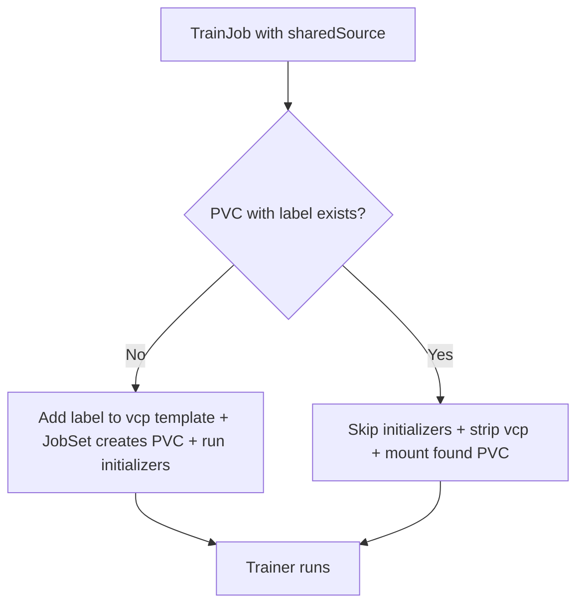
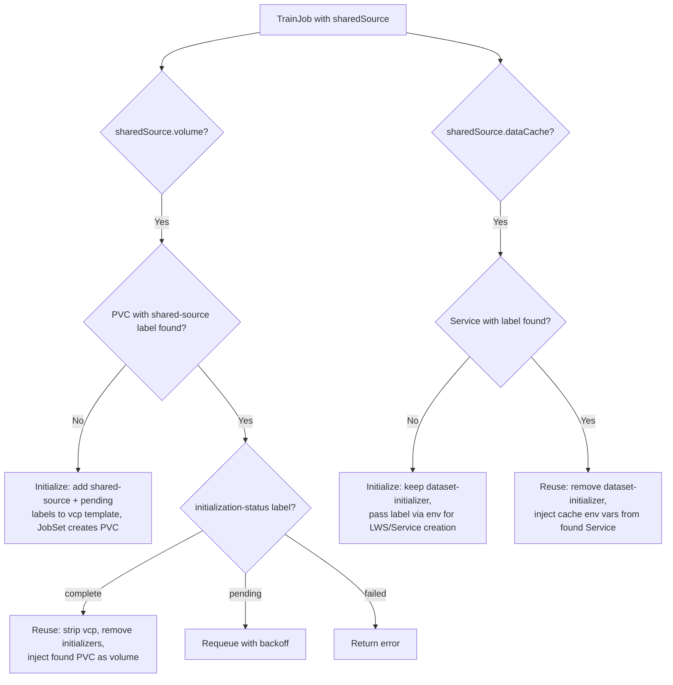
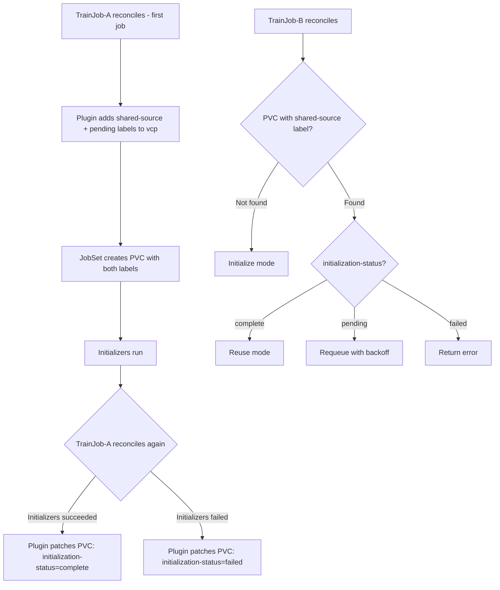

# KEP: Shared Initializer Plugin

**Authors**: [@akshaychitneni](https://github.com/akshaychitneni)

## Table of Contents

- [Summary](#summary)
- [Motivation](#motivation)
- [Goals](#goals)
- [Non-Goals](#non-goals)
- [User Stories](#user-stories)
- [Proposal](#proposal)
- [Design Details](#design-details)
- [API](#api)
- [Alternatives](#alternatives)
- [Future Work](#future-work)

---

## Summary

This KEP proposes a **SharedInitializer plugin** for the Kubeflow Trainer framework that allows
multiple TrainJobs to share pre-initialized data instead of each TrainJob running its own
dataset/model initialization. The plugin decides at reconcile time whether to run initialization or
reuse existing data, based on PVC or data cache service existence. The plugin also identifies proposed upstream JobSet
enhancements that would simplify the design.

### Label-Based Approach

The plugin uses a **label-based discovery** pattern rather than fixed PVC names. The user provides
a `sharedSource.volume.name` (e.g., `"exp-data"`), which the plugin uses as a label value
(`trainer.kubeflow.org/shared-source-name: exp-data`) to find existing shared PVCs:

1. **First TrainJob (no labeled PVC found):** Add the label to the runtime's
   `volumeClaimPolicies` PVC template, then let JobSet create the PVC normally. JobSet names
   the PVC `initializer-<jobset-name>` and stamps it with the shared-source label. Initializers
   run to populate the PVC.
2. **Subsequent TrainJobs (labeled PVC found):** Strip `volumeClaimPolicies`, remove initializer
   ReplicatedJobs, and inject a direct `volumes` entry pointing to the found PVC's actual name.

This indirection (label → PVC) is necessary because JobSet's `volumeClaimPolicies` generates PVC
names as `<templateName>-<jobsetName>` — the plugin cannot predict or control the PVC name at
creation time. Labels decouple the shared data identity from any specific JobSet.

### Proposed JobSet Enhancements

The label-based approach works today but has two limitations that upstream JobSet changes would
address:

1. **`claimName` override on `VolumeClaimPolicy` templates.** A new field that overrides
   JobSet's `GeneratePVCName()`, allowing a fixed PVC name (e.g., `exp-data` instead of
   `initializer-<jobset-name>`). This would eliminate the race condition where concurrent
   first-time TrainJobs each create their own PVC (since all JobSets would target the same
   name with atomic `AlreadyExists` semantics), and remove the need for label-based PVC
   discovery entirely.

2. **`ownerReferences` propagation on PVC templates.** JobSet currently copies only `Labels`
   and `Annotations` from PVC templates to created PVCs — not `OwnerReferences`. Adding
   ownerReference propagation would let the plugin set an owner (e.g., OptimizationJob) on
   the PVC template, enabling automatic Kubernetes GC when the owner is deleted. This would
   replace the current label-based cleanup strategy.

### Key Design Areas

- **PVC lifecycle**: PVC creation delegated to JobSet via `volumeClaimPolicies` with `Retain` policy; cleanup via label selectors by user or external controllers (e.g., OptimizationJob finalizer)
- **Cache lifecycle**: Symmetric label-based discovery for data cache service; first TrainJob creates LWS cluster with shared-source label, subsequent TrainJobs inject cache env vars
- **Readiness check**: Durable `initialization-status` label on PVC (`pending` → `complete`/`failed`) stamped by the controller when initializers finish; survives JobSet/TrainJob deletion. Subsequent TrainJobs requeue if `pending`, enter reuse mode if `complete`.
- **Per-job output isolation**: Shared `ReadWriteMany` PVC with `subPathExpr` for job-specific output directories
- **Plugin interfaces**: Implements `EnforceMLPolicyPlugin`, `ComponentBuilderPlugin`, and `CustomValidationPlugin`; runs after ML framework plugins

---

## Motivation

The current Trainer architecture initializes data **per TrainJob**. Today there are two
initialization patterns depending on the runtime:

**Pattern A — Disk-based:** The runtime defines `volumeClaimPolicies`
in the JobSet template. The JobSet controller creates a PVC (named
`initializer-<jobset-name>`) before starting any ReplicatedJobs. The `dataset-initializer`
and `model-initializer` ReplicatedJobs download data into this PVC. The trainer ReplicatedJob
(`dependsOn` initializers with `status: Complete`) mounts the same PVC for training.

**Pattern B — Cache-based (`torch-distributed-with-cache`):** The runtime has **no
`volumeClaimPolicies` and no PVC**. The `dataset-initializer` container programmatically creates a LeaderWorkerSet (data cache cluster) with Arrow Flight endpoints.
Data is streamed over gRPC during training, not read from disk.

While both patterns work well for standalone training jobs, they create significant
inefficiencies in multi-job workflows:

1. **Redundant downloads** (Pattern A): When multiple TrainJobs use the same dataset (e.g.,
   HPO trials, iterative experiments, team-shared datasets), each one re-downloads the same
   data, wasting bandwidth, time, and storage. Each TrainJob's JobSet creates its own PVC.
2. **Redundant cache clusters** (Pattern B): Each TrainJob spins up its own
   LeaderWorkerSet-based data cache cluster, duplicating memory and compute resources.
3. **No cross-job sharing**: Neither pattern provides a mechanism to share initialized
   artifacts (PVC or cache cluster) across multiple TrainJobs.
4. **Sequential bottleneck**: For large datasets (100GB+), initialization can take longer than
   training itself. Multiplied across jobs, this dominates total wall time.

### Current Data Flow (Per-TrainJob Initialization)

**Pattern A — Disk-based:** Each TrainJob gets its own PVC via `volumeClaimPolicies`.

```
TrainJob-A                      TrainJob-B                      TrainJob-N
┌─────────────────────┐         ┌─────────────────────┐         ┌─────────────────────┐
│ volumeClaimPolicies  │         │ volumeClaimPolicies  │         │ volumeClaimPolicies  │
│   → creates PVC      │         │   → creates PVC      │         │   → creates PVC      │
│ dataset-initializer  │         │ dataset-initializer  │         │ dataset-initializer  │
│   ↓ download 50GB   │         │   ↓ download 50GB   │         │   ↓ download 50GB   │
│ model-initializer    │         │ model-initializer    │         │ model-initializer    │
│   ↓ download 15GB   │         │   ↓ download 15GB   │         │   ↓ download 15GB   │
│ trainer (node)       │         │ trainer (node)       │         │ trainer (node)       │
└─────────────────────┘         └─────────────────────┘         └─────────────────────┘
     PVC + 65GB download             PVC + 65GB download             PVC + 65GB download
```

### Proposed Data Flow (Shared Initialization)

**All TrainJobs use the same spec.** The plugin decides based on PVC existence.

```
TrainJob-A (first to reconcile)     TrainJob-B, C, ..N (PVC found by label)
┌──────────────────────────────┐    ┌──────────────────────────────┐
│ sharedSource.volume.name: "exp-data" │    │ sharedSource.volume.name: "exp-data" │
│                               │    │                               │
│ Plugin: no PVC with label     │    │ Plugin: PVC with label        │
│   "shared-source-name=exp-data"│    │   "shared-source-name=exp-data"│
│   → add label to vcp template │    │   found → skip initializers   │
│   → let JobSet create PVC     │    │   → strip vcp                 │
│                               │    │   → mount found PVC (RWX)     │
│ → JobSet creates labeled PVC  │    │                               │
│ → Runs dataset-initializer    │    │ trainer (node)                │
│ → Runs model-initializer      │    │   ↓ reads shared data         │
│ → trainer reads from PVC      │    └──────────────────────────────┘
└──────────────────────────────┘         0 download, 0 new PVC
```

---

## Goals

| Goal | Description |
|:-----|:------------|
| Shared PVC Support | Allow multiple TrainJobs to share a single PVC with pre-initialized data, where the first job initializes and subsequent jobs reuse |
| Label-Based PVC Discovery | PVCs are discovered by label `trainer.kubeflow.org/shared-source-name: <name>`, decoupling shared data identity from JobSet naming |
| Read/Write Isolation | Shared PVC uses `ReadWriteMany` access mode; trainers write outputs to job-specific subdirectories |
| Plugin Architecture | Implement as a new plugin within the existing Trainer framework, following established plugin patterns |
| Backward Compatibility | All changes are additive. Existing TrainJobs without `sharedSource` continue to work unchanged |

---

## Non-Goals

| Non-Goal | Rationale |
|:---------|:----------|
| HPO Controller | This KEP does not implement an HPO controller or experiment-level orchestration. It provides building blocks that any multi-job workflow can use. |
| Cross-Namespace Sharing | Shared PVCs must be in the same namespace as the TrainJob. Cross-namespace volume sharing is a Kubernetes limitation. |
| Automatic PVC Garbage Collection | PVC lifecycle is managed by the user or an external controller. The plugin labels PVCs for discoverability but does not auto-delete them. |
| Data Versioning | No built-in mechanism for dataset versioning or cache invalidation. |
| New CRD | All functionality is expressed through extensions to the existing `Initializer` type and a new framework plugin. |

---

## User Stories

### Story 1: Multi-Job Shared Dataset

> As an ML engineer running multiple TrainJobs over the same dataset, I want the first job to
> download the dataset into a shared PVC and subsequent jobs to reuse it automatically, so that
> I avoid redundant downloads and reduce wall time.

**Workflow:**
1. All TrainJobs specify `initializer.sharedSource.volume.name: "my-experiment-data"` with the same
   `dataset.storageUri`.
2. The first TrainJob to reconcile finds no PVC labeled
   `trainer.kubeflow.org/shared-source-name: my-experiment-data`. The plugin adds this label
   to the `volumeClaimPolicies` PVC template and lets JobSet create the PVC. Initializer
   ReplicatedJobs run to populate it, then training proceeds.
3. Subsequent TrainJobs find a PVC with the label. The plugin removes initializer
   ReplicatedJobs, strips `volumeClaimPolicies`, and mounts the found PVC directly into
   trainer pods.
4. Each TrainJob writes outputs to job-specific subdirectories on the shared PVC.

### Story 2: Platform Admin Providing Shared Runtimes

> As a platform admin, I want to define a ClusterTrainingRuntime that supports shared
> initialization, so that teams can share datasets across TrainJobs without understanding
> the underlying PVC mechanics.

**Workflow:**
1. Define a ClusterTrainingRuntime with `volumeClaimPolicies` using `ReadWriteMany` access
   mode and sufficient storage.
2. Teams create TrainJobs with `sharedSource.volume.name` pointing to a shared name they agree on.
3. The plugin handles PVC creation/reuse transparently.

### Story 3: Cost-Conscious Team

> As a team lead, I want to avoid paying for redundant S3 egress charges when multiple
> TrainJobs each download the same 100GB dataset from HuggingFace Hub.

**Impact:** With shared initialization, the dataset is downloaded once (100GB egress) instead
of N times (N * 100GB egress).

---

## Proposal

A new **SharedInitializer plugin** that allows TrainJobs to reference a shared PVC or data
cache service via `initializer.sharedSource`. At reconcile time, the plugin queries for PVCs
labeled with `trainer.kubeflow.org/shared-source-name: <name>` — if none found, it adds this
label to the runtime's `volumeClaimPolicies` template and lets JobSet create the PVC normally;
if found, it skips initializers and mounts the found PVC directly. User-provided labels on
shared resources enable label-based cleanup by external controllers (e.g., OptimizationJob).



---

## Design Details

### Plugin Interfaces

The `SharedInitializer` plugin implements three interfaces from `pkg/runtime/framework/interface.go`:

| Interface | Purpose |
|:----------|:--------|
| `EnforceMLPolicyPlugin` | Query PVCs / Services by label `trainer.kubeflow.org/shared-source-name: <name>`. If found: remove relevant initializer PodSets. If not found: pass through. |
| `ComponentBuilderPlugin` | Volume: if PVC found by label, strip `volumeClaimPolicies` and inject direct PVC volume; if not found, add shared-source label to `volumeClaimPolicies` template (JobSet creates PVC). DataCache: if Service found by label, remove dataset-initializer and inject cache env vars using found service; if not found, pass shared-source label name via env vars so initializer creates LWS/Service with the label. |
| `CustomValidationPlugin` | Validate sharedSource configuration. |

The plugin runs **after** ML framework plugins (Torch, MPI, etc.) in the pipeline so that
trainer configuration is fully set up before shared sources are applied.

### Decision Logic

Both `volume` and `dataCache` follow the same initialize-or-reuse pattern using label
`trainer.kubeflow.org/shared-source-name: <name>`:



> **Notes:**
> - `volume` and `dataCache` can coexist (cache for dataset, PVC for model).
> - `model-initializer` is always preserved when only `dataCache` is set.
> - **Race condition:** If concurrent TrainJobs both see "not found", each runs its own initialization. This is safe — subsequent TrainJobs find one of the labeled resources. See [Future Work](#future-work) for a `claimName` override to eliminate duplication.

### Initialization Readiness Check

The creating JobSet may be deleted (TTL, manual cleanup, TrainJob deletion) before subsequent
TrainJobs arrive, so the plugin cannot rely solely on JobSet status. Instead, readiness is
tracked as a **durable label on the PVC** that outlives the JobSet.

The plugin adds two labels to the `volumeClaimPolicies` PVC template at creation:
- `trainer.kubeflow.org/shared-source-name: <name>` (discovery)
- `trainer.kubeflow.org/initialization-status: pending` (readiness)

**Completion stamping:** During reconciliation of the first TrainJob, if the creating JobSet
exists and its initializer ReplicatedJobs have completed (`Succeeded > 0`), the plugin patches
the PVC label to `initialization-status: complete`. This happens in the plugin's
`EnforceMLPolicy` or `Build` phase when it detects it is the creating TrainJob (its own
JobSet owns the PVC).

**Subsequent TrainJobs** query for PVCs with both `shared-source-name=<name>` and check
the `initialization-status` label:
- `complete` → reuse mode (strip vcp, remove initializers, mount PVC)
- `pending` → requeue with backoff (initialization still in progress or creating
  JobSet was deleted before stamping — requires manual intervention or retry of the
  first TrainJob)
- `failed` → return error (initializer failed; user must investigate)

**Failure stamping:** If the creating JobSet's initializer ReplicatedJobs have failed, the
plugin patches the PVC label to `initialization-status: failed`.



### Volume Mounting

**Initialize mode (no labeled PVC found):** The plugin adds the shared-source label and
`initialization-status: pending` label to the `volumeClaimPolicies` PVC template. JobSet
creates the PVC with the standard naming (`<templateName>-<jobsetName>`) plus both labels.
JobSet's `addVolumes()` auto-injects the volume into pods. Everything works as standard —
no plugin volume injection needed.

**Reuse mode (labeled PVC found):** The plugin strips `volumeClaimPolicies` (preventing
JobSet from creating a new PVC) and injects a direct `volumes` entry using the runtime's
template name (`initializer`) with `claimName` pointing to the found PVC's actual name.
Existing `volumeMounts` in the runtime template work unchanged since they reference
`initializer` by name. The PVC is mounted read-write (`ReadWriteMany`).

### Resource Lifecycle and Cleanup

Shared resources (PVC, data cache LWS) persist independently — the plugin never deletes them.
JobSet's `volumeClaimPolicies` with `Retain` policy creates PVCs without ownerReferences (JobSet
only copies Labels/Annotations from PVC templates). Cleanup is done via label selector
(`trainer.kubeflow.org/shared-source-name=<name>`), either manually (`kubectl delete pvc -l ...`)
or by an external controller's finalizer (e.g., OptimizationJob). See
[Proposed JobSet Enhancements](#proposed-jobset-enhancements) for upstream changes that would
enable ownerReference-based Kubernetes GC.

### VolumeClaimPolicies

Shipped runtimes already use `volumeClaimPolicies` (`torchtune-llama3.2-1b`, `torchtune-qwen2.5-1.5b`: 20Gi ReadWriteOnce PVC) or no PVC (`torch-distributed-with-cache`: LWS cache cluster). The existing `JobSetSpec` → `ApplyConfiguration` conversion preserves `volumeClaimPolicies` — no changes needed for the standard (non-shared) flow.

**Shared flow (`sharedSource.volume.name` set):** The plugin validates `retentionPolicy.whenDeleted: Retain` (required so PVC survives the creating JobSet), then queries PVCs by shared-source label:
- **First job**: Adds shared-source + `initialization-status: pending` labels to vcp template → JobSet creates PVC (`initializer-<jobsetName>`) with labels → initializers run → plugin patches PVC to `initialization-status: complete` on success
- **Subsequent jobs**: Finds PVC with `initialization-status: complete` → strips vcp, injects direct PVC volume (`claimName` = found PVC) → initializers removed

### Plugin Ordering

The SharedInitializer's `EnforceMLPolicy` must run **after** the ML framework plugins
(Torch, MPI, etc.) so that trainer configuration is fully set up before shared volumes
are applied. The plugin is registered last in the registry to achieve this ordering.

### Validation Rules

The `CustomValidationPlugin` enforces: `sharedSource.volume.name` and `sharedSource.dataCache.name`
must be valid DNS labels; the runtime must have `volumeClaimPolicies` with
`retentionPolicy.whenDeleted: Retain` when `sharedSource.volume` is set. `volume` and `dataCache`
can coexist (e.g., cache for dataset, PVC for model), and `storageUri` coexists with `sharedSource`
(storageUri tells the first job what to download; sharedSource tells all jobs where to find it).

### RBAC

The trainer controller needs additional permissions:

| Resource | Verbs | Reason |
|:---------|:------|:-------|
| `persistentvolumeclaims` | `list`, `update` | Query PVCs by shared-source label; patch `initialization-status` label on completion/failure |
| `services` | `list` | Query Services by shared-source label to detect existing data cache clusters |

PVC creation is delegated to JobSet via `volumeClaimPolicies`, and cleanup is handled by
the user or external controllers via label-based queries.

---

## API

### New Types

Add to `pkg/apis/trainer/v1alpha1/trainjob_types.go`:

```go
// SharedSourceSpec defines shared data sources that can be reused across
// multiple TrainJobs. Supports both disk-based (PVC) and memory-based
// (data cache) sharing. Volume and DataCache can be used independently
// or together (e.g., cache for dataset, PVC for model).
type SharedSourceSpec struct {
	// volume references a shared PVC by a label name for disk-based data
	// (dataset and/or model). The name is used as a label value
	// (trainer.kubeflow.org/shared-source-name) on the PVC created via
	// volumeClaimPolicies. The plugin queries PVCs by this label to detect
	// existing shared data, and mounts the found PVC for
	// subsequent TrainJobs.
	// +optional
	Volume *SharedVolumeRef `json:"volume,omitempty"`

	// dataCache references a shared data cache by a label name. The name is
	// used as a label value (trainer.kubeflow.org/shared-source-name) on the
	// Service created by the dataset-initializer. The plugin queries Services
	// by this label — if not found, the initializer runs and creates the cache
	// with the label; if found, the initializer is removed and cache env vars
	// are injected into the trainer.
	// +optional
	DataCache *SharedDataCacheRef `json:"dataCache,omitempty"`
}

// SharedVolumeRef references a shared PVC by a label name used for discovery.
type SharedVolumeRef struct {
	// name is the shared-source label value used to discover PVCs.
	// Added as label trainer.kubeflow.org/shared-source-name on the PVC.
	// +kubebuilder:validation:MinLength=1
	// +kubebuilder:validation:Pattern=`^[a-z]([-a-z0-9]*[a-z0-9])?$`
	// +required
	Name string `json:"name"`
}

// SharedDataCacheRef references a shared data cache service by a label name used for discovery.
type SharedDataCacheRef struct {
	// name is the shared-source label value used to discover cache Services.
	// Added as label trainer.kubeflow.org/shared-source-name on the Service
	// created by the dataset-initializer.
	// +kubebuilder:validation:MinLength=1
	// +kubebuilder:validation:Pattern=`^[a-z]([-a-z0-9]*[a-z0-9])?$`
	// +required
	Name string `json:"name"`

	// port is the port of the data cache service.
	// Defaults to 50051.
	// +optional
	// +kubebuilder:default=50051
	Port *int32 `json:"port,omitempty"`
}
```

### Modified Types

Add `SharedSource` field to `Initializer`:

```go
// Initializer represents the desired configuration for the dataset and model initialization.
type Initializer struct {
	// dataset defines the configuration for the dataset initialization and pre-processing.
	// +optional
	Dataset *DatasetInitializer `json:"dataset,omitempty"`

	// model defines the configuration for the pre-trained model initialization.
	// +optional
	Model *ModelInitializer `json:"model,omitempty"`

	// sharedSource enables sharing initialized data across multiple TrainJobs.
	// Supports disk-based sharing (PVC) and/or memory-based sharing (data cache).
	// All TrainJobs sharing data should use identical specs.
	// +optional
	SharedSource *SharedSourceSpec `json:"sharedSource,omitempty"`
}
```

### Example: Shared PVC (Disk-Based Dataset + Model)

```yaml
apiVersion: trainer.kubeflow.org/v1alpha1
kind: TrainJob
metadata:
  name: trainjob-a
  namespace: ml-team
spec:
  runtimeRef:
    name: torch-distributed-shared-storage
  initializer:
    sharedSource:
      volume:
        name: exp-42-data         # Shared PVC name — same across all jobs
    dataset:
      storageUri: "hf://tatsu-lab/alpaca"
    model:
      storageUri: "hf://meta-llama/Llama-3.2-1B"
  trainer:
    image: my-training-image:latest
    command: ["torchrun"]
    args: ["--nnodes=2", "train.py", "--lr=0.001"]
    numNodes: 2
    resourcesPerNode:
      requests:
        nvidia.com/gpu: 4
      limits:
        nvidia.com/gpu: 4
```

### Example: OptimizationJob Integration (Label-Based Cleanup)

```yaml
# Created by OptimizationJob controller — shared resources cleaned up
# by OptimizationJob finalizer using shared-source-name label
apiVersion: trainer.kubeflow.org/v1alpha1
kind: TrainJob
metadata:
  name: exp-42-trial-3
  namespace: ml-team
spec:
  runtimeRef:
    name: torch-distributed-shared-storage
  initializer:
    sharedSource:
      volume:
        name: exp-42-data               # OptimizationJob controller knows this name
    dataset:                             # and uses it to clean up PVCs via label selector
      storageUri: "hf://tatsu-lab/alpaca"
    model:
      storageUri: "hf://meta-llama/Llama-3.2-1B"
  trainer:
    image: my-training-image:latest
    command: ["torchrun"]
    args: ["--nnodes=2", "train.py", "--lr=0.001"]
    numNodes: 2
```

### Example: Shared Data Cache (Dataset via Cache, Model via PVC)

```yaml
apiVersion: trainer.kubeflow.org/v1alpha1
kind: TrainJob
metadata:
  name: trainjob-b
  namespace: ml-team
spec:
  runtimeRef:
    name: torch-distributed-with-cache
  initializer:
    sharedSource:
      dataCache:
        name: exp-42-cache              # Cache service name to check/create
      volume:
        name: exp-42-models         # Shared PVC for model weights
    model:
      storageUri: "hf://meta-llama/Llama-3.2-1B"
  trainer:
    image: my-training-image:latest
    command: ["torchrun"]
    args: ["--nnodes=2", "train.py"]
    numNodes: 2
```

### Example: ClusterTrainingRuntime with Shared Volume Support

> **Note:** This differs from the existing `torchtune-llama3.2-1b` runtime in that it uses
> `accessModes: ReadWriteMany` and a larger storage size to support multi-job sharing.
> The access mode is a runtime-level decision — the plugin uses it verbatim when JobSet
> creates the shared PVC. The `retentionPolicy.whenDeleted: Retain` is required so the PVC
> persists after the creating JobSet is deleted.

```yaml
apiVersion: trainer.kubeflow.org/v1alpha1
kind: ClusterTrainingRuntime
metadata:
  name: torch-distributed-shared-storage
spec:
  mlPolicy:
    numNodes: 1
    torch: {}
  template:
    spec:
      volumeClaimPolicies:
        - retentionPolicy:
            whenDeleted: Retain
          templates:
            - metadata:
                name: initializer
              spec:
                accessModes: ["ReadWriteMany"]
                resources:
                  requests:
                    storage: 100Gi
                storageClassName: efs-sc
      replicatedJobs:
        - name: dataset-initializer
          template:
            metadata:
              labels:
                trainer.kubeflow.org/trainjob-ancestor-step: dataset-initializer
            spec:
              parallelism: 1
              completions: 1
              template:
                spec:
                  restartPolicy: OnFailure
                  containers:
                    - name: dataset-initializer
                      image: docker.io/kubeflow/dataset-initializer:latest
                      volumeMounts:
                        - name: initializer
                          mountPath: /workspace/dataset
        - name: model-initializer
          template:
            metadata:
              labels:
                trainer.kubeflow.org/trainjob-ancestor-step: model-initializer
            spec:
              parallelism: 1
              completions: 1
              template:
                spec:
                  restartPolicy: OnFailure
                  containers:
                    - name: model-initializer
                      image: docker.io/kubeflow/model-initializer:latest
                      volumeMounts:
                        - name: initializer
                          mountPath: /workspace/model
        - name: node
          dependsOn:
            - name: dataset-initializer
              status: Complete
            - name: model-initializer
              status: Complete
          template:
            metadata:
              labels:
                trainer.kubeflow.org/trainjob-ancestor-step: trainer
            spec:
              parallelism: 1
              completions: 1
              template:
                spec:
                  restartPolicy: OnFailure
                  containers:
                    - name: node
                      image: docker.io/kubeflow/trainer-torchtune:latest
                      env:
                        - name: TRAINJOB_NAME
                          valueFrom:
                            fieldRef:
                              fieldPath: metadata.labels['trainer.kubeflow.org/trainjob-name']
                      volumeMounts:
                        - name: initializer
                          mountPath: /workspace/dataset
                          subPath: dataset
                        - name: initializer
                          mountPath: /workspace/model
                          subPath: model
                        - name: initializer          # per-job output isolation
                          mountPath: /workspace/output
                          subPathExpr: output/$(TRAINJOB_NAME)
```
---

### JobSet Plugin Modification

The existing validation in the JobSet plugin checks that initializer ReplicatedJobs exist when
the TrainJob references them. This check must be relaxed when `sharedSource` is configured
and the PVC already exists, since the SharedInitializer plugin intentionally removes those
ReplicatedJobs.

---

## Alternatives

### Plugin Creates PVC Directly with OwnerReference

Plugin creates PVCs via `client.Create` with user-provided `ownerReference` for Kubernetes GC.
Rejected — requires `create` RBAC on PVCs; the label-based approach delegates creation to JobSet
and only needs `list`. See [Proposed JobSet Enhancements](#proposed-jobset-enhancements) for
upstream ownerReference propagation that would achieve the same GC benefit.

### Hash-Based PVC Naming

Auto-derive PVC name from `storageUri` hash instead of user-provided name, enabling implicit
sharing across TrainJobs with the same data sources. Deferred — explicit name is simpler and
more predictable; hash-based naming could be added later as opt-in when
`sharedSource.volume.name` is omitted.

---

## Future Work

### JobSet `volumeClaimPolicies` Enhancements

Propose upstream JobSet changes described in [Proposed JobSet Enhancements](#proposed-jobset-enhancements):
**(1) `claimName` override** to allow fixed PVC names, eliminating the race condition and
label-based discovery. **(2) `ownerReferences` propagation** to enable automatic Kubernetes GC
of shared PVCs.

### Hash-Based PVC Naming

Auto-derive PVC name from `storageUri` hash when `sharedSource.volume.name` is omitted,
enabling implicit sharing across TrainJobs with the same data sources without user coordination.
