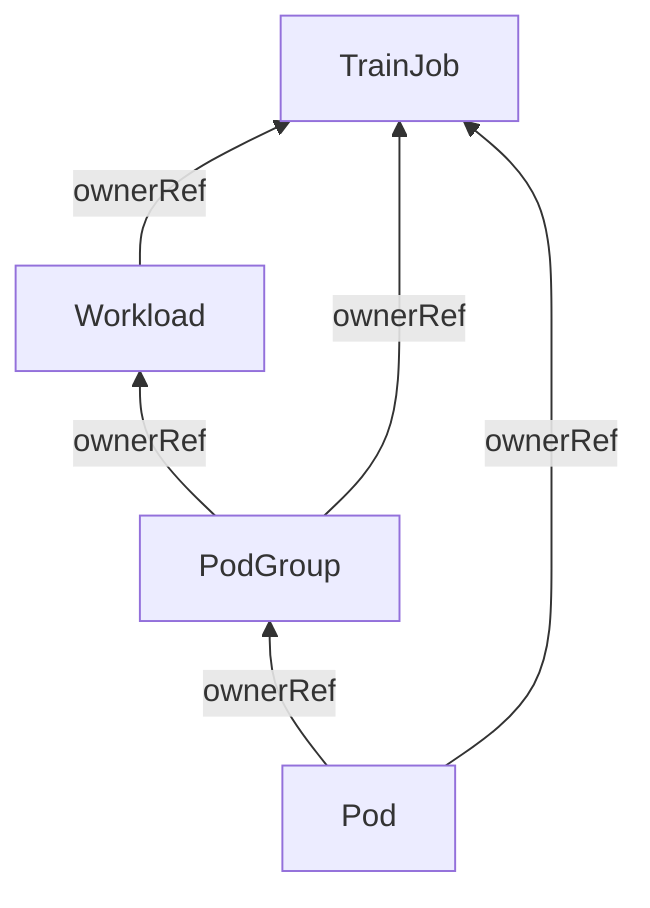

# KEP-3015: Workload Aware Scheduling for TrainJob

## Summary

This document proposes integrating the Kubernetes Workload API into Kubeflow Trainer to enable
native workload aware scheduling for TrainJobs. The Workload API, introduced in Kubernetes v1.35 (alpha)
and promoted to beta in Kubernetes v1.37, provides multiple features to enhance AI workload scheduling orchestration
including gang-scheduling: [KEP-4671](https://github.com/kubernetes/enhancements/tree/master/keps/sig-scheduling/4671-gang-scheduling),
topology-aware scheduling: [KEP-5732](https://github.com/kubernetes/enhancements/tree/master/keps/sig-scheduling/5732-topology-aware-workload-scheduling),
DRA: [KEP-5729](https://github.com/kubernetes/enhancements/tree/master/keps/sig-scheduling/5729-resourceclaim-support-for-workloads),
and other features through the Workload and PodGroup resources.

An optional `spec.scheduling` field on the TrainingRuntime and ClusterTrainingRuntime lets runtime
authors configure gang-scheduling, topology constraints, disruption modes, and shared resource
claims.

## Motivation

The Kubeflow TrainJob controller currently creates downstream resources (JobSet, Jobs, Pods)
without workload-aware scheduling constraints unless the user opts into an external solution:

- **Coscheduling plugin**: Requires installing the Kubernetes scheduler-plugins project
- **Volcano scheduler**: Requires deploying the Volcano scheduling system

The Kubernetes community has converged on the `Workload`/`PodGroup` APIs as the standard
expression of gang scheduling and other workload-aware scheduling primitives. With native
integration planned for [the Job controller](https://github.com/kubernetes/enhancements/tree/master/keps/sig-scheduling/5547-workload-job-integration)
and JobSet [kubernetes-sigs/jobset#1253](https://github.com/kubernetes-sigs/jobset/pull/1253),
TrainJob is the highest-level controller that must own the `Workload` creation.

This KEP brings Workload-API features to TrainJob without requiring external scheduler installation.

### Goals

1. Add an optional, centralized `spec.scheduling` API to TrainingRuntime and ClusterTrainingRuntime
   which follows the targeted-policy design agreed for JobSet.
1. Support scheduling configuration at three levels: the whole TrainJob, groups of ReplicatedJobs,
   and individual Jobs (ReplicatedJob replicas).
1. Support Basic and Gang scheduling policies, topology constraints, disruption modes, and shared
   TrainJob-level, ReplicatedJob-level and Job-level resource claims.
1. When `spec.scheduling` is set and the `TrainJobWorkloadAwareScheduling` feature gate is enabled,
   the TrainJob controller creates exactly one `Workload` and the corresponding `PodGroup` objects
   per TrainJob before any downstream Pod is created.
1. Derive Gang `minCount` for every generated `PodGroupTemplate` from the resolved TrainJob and
   runtime spec, so users continue to control the training scale through
   `trainJob.spec.trainer.numNodes`.
1. Tie `Workload` and `PodGroup` lifecycle to TrainJob via `ownerReferences` so deletion cascades
   correctly.
1. Ensure gang-scheduling works with the MPI plugin and TrainJob initializers.
1. Maintain backward compatibility with existing Coscheduling and Volcano plugins.

### Future Goals

1. Create a `CompositePodGroup` hierarchy under the `TrainJobCompositePodGroup` feature gate, so a
   TrainJob-wide policy can be combined with per-ReplicatedJob and per-Job policies. This is
   deferred because `CompositePodGroup` is alpha in Kubernetes v1.37, while `Workload` and
   `PodGroup` are beta.
1. Allow TrainJob users to override the runtime's scheduling configuration through the TrainJob
   API.

### Non-Goals

1. Replace existing Coscheduling or Volcano plugins — they remain as alternatives for clusters
   without the Workload API.
1. Support Kubernetes versions < 1.37 — Workload beta APIs requires v1.37+.
1. Support dynamic changes to `numNodes` at runtime when gang scheduling is active — elastic
   TrainJob is future work.
1. Delegate `Workload` creation to JobSet — TrainJob is the highest-level controller and must
   own the `Workload`.
1. Implement Kueue admission or queue management. Kueue integration is limited to exposing enough
   scheduling configuration for Kueue to understand the TrainJob's workload shape.

## Proposal

Add `spec.scheduling` to `TrainingRuntimeSpec`, shared by TrainingRuntime and
ClusterTrainingRuntime. When the field is set and the `TrainJobWorkloadAwareScheduling` feature
gate is enabled, the TrainJob controller builds one `Workload`, materializes one `PodGroup` per
generated `PodGroupTemplate`, and maps the downstream Jobs and Pods to those PodGroups. When the
field is nil, no scheduling objects are created and TrainJob behavior is unchanged.

The key design principles are:

1. **Opt-in via the runtime API.** Scheduling configuration is authored on the runtime, next to
   the JobSet template whose ReplicatedJobs it targets. A TrainJob referencing a runtime without
   `spec.scheduling` creates no `Workload` and no `PodGroup`.
1. **One TrainJob – one Workload.** Each TrainJob maps to a single `Workload` containing one
   `PodGroupTemplate` per scheduling group.
1. **Centralized, targeted policies.** Configuration lives in one place on the runtime spec and
   targets ReplicatedJobs by name, mirroring the JobSet design and Trainer's existing
   `targetReplicatedJobs` patterns such as `successPolicy`.
1. **`minCount` is always computed by the controller.** Users express the training scale through
   `trainJob.spec.trainer.numNodes`, so an explicit `gang.minCount` in the runtime is rejected.
1. **Lifecycle via `ownerReferences`.** The TrainJob controller sets `ownerReferences` on the
   `Workload` and `PodGroup` so Kubernetes garbage collection removes them when the TrainJob is
   deleted.
1. **`numNodes` is immutable while gang is active.** Although, the PodGroup API supports changes to
   `minCount`, we need to enable elastic TrainJob capability to make it work. We will track this as
   a future work.
1. **TrainJob hierarchy scheduling.** The API schema is intentionally designed to represent the full
   CompositePodGroup (CPG) hierarchy (Level 1 root CPG -> Level 2 child CPGs -> Level 3 leaf PGs).
   The single-level mutual exclusivity in alpha is not an API limitation, but a temporary validation
   restriction while CPG is in Kubernetes alpha stage. After CPG graduation that validation rule will
   be dropped to unlock multi-level hierarchies without any API schema changes.

### User Stories

| User need                                                      | Behavior                                                                                                                           |
| -------------------------------------------------------------- | ---------------------------------------------------------------------------------------------------------------------------------- |
| Gang-schedule an entire TrainJob                               | A level 1 Gang policy creates one PodGroup whose `minCount` is the total Pod count of the TrainJob.                                |
| Gang-schedule MPI launcher and workers together                | A `replicatedJobs` entry targeting `launcher` and `node` creates one PodGroup covering both.                                       |
| Keep initializers out of the trainer gang                      | A `replicatedJobs` entry gives the initializers a Basic policy and the trainer a Gang policy, for lazily load data initialization. |
| Constrain trainer placement to one topology domain             | `schedulingConstraints` on the trainer's `replicatedJobs` entry requests coordinated placement.                                    |
| Keep existing TrainJobs unchanged                              | A runtime without `spec.scheduling` creates no WAS resources.                                                                      |
| Share a DRA claim across a Job's Pods                          | A `resourceClaims` entry is copied to the generated PodGroup, and every Pod in the group references the shared claim.              |
| Run a TPU multi-slice workload                                 | A `replicatedJobs` entry sets `job`, so each replica becomes its own gang with its own topology request and slice-scoped claim.    |
| Combine a TrainJob-wide policy with per-ReplicatedJob policies | Requires the `TrainJobCompositePodGroup` feature gate and `CompositePodGroup`; rejected at admission otherwise.                    |

#### Story 1: Distributed PyTorch Training with Gang Scheduling

As a platform engineer, I want to run a distributed PyTorch TrainJob with 100 nodes that must
all be scheduled together. If only 99 workers can be scheduled, no pods should start.

The ClusterTrainingRuntime and TrainJob may look as follows:

```yaml
apiVersion: trainer.kubeflow.org/v1alpha1
kind: ClusterTrainingRuntime
metadata:
  name: torch-distributed
spec:
  mlPolicy:
    numNodes: 1
    torch: {}
  scheduling:
    schedulingPolicy:
      gang: {}
  template:
    spec:
      replicatedJobs:
        - name: node
          template:
            spec:
              template:
                metadata:
                  labels:
                    trainer.kubeflow.org/trainjob-ancestor-step: trainer
                spec:
                  containers:
                    - name: node
                      image: pytorch/pytorch:2.9.1-cuda12.8-cudnn9-runtime
---
apiVersion: trainer.kubeflow.org/v1alpha1
kind: TrainJob
metadata:
  name: my-job
spec:
  runtimeRef:
    name: torch-distributed
  trainer:
    image: docker.io/torch-run
    numNodes: 100
    resourcesPerNode:
      requests:
        nvidia.com/gpu: 4
```

When the feature gate is enabled, the TrainJob controller will create the following resources:

```yaml
apiVersion: scheduling.k8s.io/v1alpha2
kind: Workload
metadata:
  name: my-job-<hash>
  ownerReferences:
    - apiVersion: trainer.kubeflow.org/v1alpha1
      kind: TrainJob
      name: my-job
      controller: true
spec:
  controllerRef:
    apiVersion: trainer.kubeflow.org/v1alpha1
    kind: TrainJob
    name: my-job
  podGroupTemplates:
    - name: my-job
      schedulingPolicy:
        gang:
          minCount: 100 # Computed from trainJob.spec.trainer.numNodes
```

The PodGroup will be created automatically by the TrainJob controller:

```yaml
apiVersion: scheduling.k8s.io/v1alpha1
kind: PodGroup
metadata:
  name: <workload-name>-<hash>
  ownerReferences:
    - apiVersion: scheduling.k8s.io/v1alpha2
      kind: Workload
      name: <workload-name>
    - apiVersion: trainer.kubeflow.org/v1alpha1
      kind: TrainJob
      name: my-job
      controller: true
spec:
  podGroupTemplateRef:
    workload:
      workloadName: <workload-name>
      podGroupTemplateName: my-job
  schedulingPolicy:
    gang:
      minCount: 100
```

And the Pod specs will be updated with the scheduling group:

```yaml
spec:
  schedulingGroup:
    podGroupName: <workload-name>-<hash>
```

#### Story 2: MPI Distributed Training with Gang Scheduling

As a platform engineer, I want to configure MPI-based distributed training with gang scheduling
to ensure all MPI nodes (launcher + workers) are scheduled together.

The launcher and the workers must be admitted as a single gang, which is expressed with one
`replicatedJobs` entry targeting both ReplicatedJobs:

```yaml
apiVersion: trainer.kubeflow.org/v1alpha1
kind: ClusterTrainingRuntime
metadata:
  name: deepspeed-distributed
  labels:
    trainer.kubeflow.org/framework: deepspeed
spec:
  mlPolicy:
    numNodes: 1
    mpi:
      numProcPerNode: 4
      mpiImplementation: OpenMPI
  scheduling:
    replicatedJobs:
      - targetReplicatedJobs: ["launcher", "node"]
        schedulingPolicy:
          gang: {}
  template:
    spec:
      network:
        publishNotReadyAddresses: true
      successPolicy:
        operator: All
        targetReplicatedJobs:
          - launcher
      replicatedJobs:
        - name: launcher
          template:
            metadata:
              labels:
                trainer.kubeflow.org/trainjob-ancestor-step: trainer
            spec:
              template:
                spec:
                  containers:
                    - name: node
                      image: ghcr.io/kubeflow/trainer/deepspeed-runtime
                      securityContext:
                        runAsUser: 1000
        - name: node
          template:
            spec:
              template:
                spec:
                  containers:
                    - name: node
                      image: ghcr.io/kubeflow/trainer/deepspeed-runtime
                      securityContext:
                        runAsUser: 1000
                      command:
                        - /usr/sbin/sshd
                      args:
                        - -De
                        - -f
                        - /home/mpiuser/.sshd_config
                      readinessProbe:
                        tcpSocket:
                          port: 2222
                        initialDelaySeconds: 5
---
apiVersion: trainer.kubeflow.org/v1alpha1
kind: TrainJob
metadata:
  name: my-job
spec:
  runtimeRef:
    name: deepspeed-distributed
  trainer:
    numNodes: 50
    resourcesPerNode:
      requests:
        nvidia.com/gpu: 4
```

The TrainJob controller will create a single `Workload` with one `PodGroupTemplate` covering both
the `launcher` and `node` ReplicatedJobs:

```yaml
apiVersion: scheduling.k8s.io/v1alpha2
kind: Workload
metadata:
  name: my-job-<hash>
  ownerReferences:
    - apiVersion: trainer.kubeflow.org/v1alpha1
      kind: TrainJob
      name: my-job
      controller: true
spec:
  controllerRef:
    apiVersion: trainer.kubeflow.org/v1alpha1
    kind: TrainJob
    name: my-job
  podGroupTemplates:
    - name: launcher-node
      schedulingPolicy:
        gang:
          minCount: 51 # 1 launcher Pod + 50 trainer nodes
```

The corresponding PodGroup will be created:

```yaml
apiVersion: scheduling.k8s.io/v1alpha1
kind: PodGroup
metadata:
  name: <workload-name>-launcher-node-<hash>
  ownerReferences:
    - apiVersion: scheduling.k8s.io/v1alpha2
      kind: Workload
      name: <workload-name>
    - apiVersion: trainer.kubeflow.org/v1alpha1
      kind: TrainJob
      name: my-job
      controller: true
spec:
  podGroupTemplateRef:
    workload:
      workloadName: <workload-name>
      podGroupTemplateName: launcher-node
  schedulingPolicy:
    gang:
      minCount: 51
```

And the Pod specs of both ReplicatedJobs will be updated with the scheduling group:

```yaml
spec:
  schedulingGroup:
    podGroupName: <workload-name>-launcher-node-<hash>
```

#### Story 3: LLM Fine-Tuning with Initializers and Gang Scheduling

As a platform engineer, I want to configure LLM fine-tuning with dataset/model initializers and
gang scheduling. The initializers and trainer should have separate PodGroups: initializers run
without gang scheduling (for lazy loading), while the trainer pods are gang-scheduled.

The runtime targets the initializers and the trainer with separate `replicatedJobs` entries:

```yaml
apiVersion: trainer.kubeflow.org/v1alpha1
kind: ClusterTrainingRuntime
metadata:
  name: torchtune-qwen2.5-1.5b
  labels:
    trainer.kubeflow.org/framework: torchtune
spec:
  mlPolicy:
    numNodes: 1
    torch: {}
  scheduling:
    replicatedJobs:
      - targetReplicatedJobs: ["dataset-initializer", "model-initializer"]
        schedulingPolicy:
          basic: {}
      - targetReplicatedJobs: ["node"]
        schedulingPolicy:
          gang: {}
  template:
    spec:
      volumeClaimPolicies:
        - templates:
            - metadata:
                name: initializer
              spec:
                accessModes: ["ReadWriteOnce"]
                resources:
                  requests:
                    storage: 20Gi
      replicatedJobs:
        - name: dataset-initializer
          template:
            metadata:
              labels:
                trainer.kubeflow.org/trainjob-ancestor-step: dataset-initializer
            spec:
              template:
                spec:
                  containers:
                    - name: dataset-initializer
                      image: ghcr.io/kubeflow/trainer/dataset-initializer
                      env:
                        - name: STORAGE_URI
                          value: hf://tatsu-lab/alpaca
                      volumeMounts:
                        - mountPath: /workspace
                          name: initializer
        - name: model-initializer
          template:
            metadata:
              labels:
                trainer.kubeflow.org/trainjob-ancestor-step: model-initializer
            spec:
              template:
                spec:
                  containers:
                    - name: model-initializer
                      image: ghcr.io/kubeflow/trainer/model-initializer
                      env:
                        - name: STORAGE_URI
                          value: hf://Qwen/Qwen2.5-1.5B-Instruct
                      volumeMounts:
                        - name: initializer
                          mountPath: /workspace
        - name: node
          dependsOn:
            - name: dataset-initializer
              status: Complete
            - name: model-initializer
              status: Complete
          template:
            metadata:
              labels:
                trainer.kubeflow.org/trainjob-ancestor-step: trainer
            spec:
              template:
                spec:
                  containers:
                    - name: node
                      image: ghcr.io/kubeflow/trainer/torchtune-trainer
                      command:
                        - tune
                        - run
                        - full_finetune_distributed
                        - --config
                        - qwen2_5/1.5B_full
                        - dataset.source=parquet
                        - dataset.data_dir=/workspace/dataset/data
                        - output_dir=/workspace/output
                        - tokenizer.path=/workspace/model/vocab.json
                        - tokenizer.merges_file=/workspace/model/merges.txt
                        - checkpointer.checkpoint_dir=/workspace/model
                      resources:
                        limits:
                          nvidia.com/gpu: 2
                      volumeMounts:
                        - mountPath: /workspace
                          name: initializer
---
apiVersion: trainer.kubeflow.org/v1alpha1
kind: TrainJob
metadata:
  name: my-job
spec:
  runtimeRef:
    name: torchtune-qwen2.5-1.5b
  trainer:
    numNodes: 8
```

The TrainJob controller will create a single `Workload` with two `PodGroupTemplates` — one for the
initializers and one for the trainer. The initializer `PodGroupTemplate` uses a Basic policy to
enable lazy-loading:

```yaml
apiVersion: scheduling.k8s.io/v1alpha2
kind: Workload
metadata:
  name: my-job-<hash>
  ownerReferences:
    - apiVersion: trainer.kubeflow.org/v1alpha1
      kind: TrainJob
      name: my-job
      controller: true
spec:
  controllerRef:
    apiVersion: trainer.kubeflow.org/v1alpha1
    kind: TrainJob
    name: my-job
  podGroupTemplates:
    - name: dataset-initializer-model-initializer
      schedulingPolicy:
        basic: {}
    - name: node
      schedulingPolicy:
        gang:
          minCount: 8 # Computed from trainJob.spec.trainer.numNodes
```

The corresponding PodGroups will be created:

```yaml
apiVersion: scheduling.k8s.io/v1alpha1
kind: PodGroup
metadata:
  name: <workload-name>-dataset-initializer-model-initializer-<hash>
  ownerReferences:
    - apiVersion: scheduling.k8s.io/v1alpha2
      kind: Workload
      name: <workload-name>
    - apiVersion: trainer.kubeflow.org/v1alpha1
      kind: TrainJob
      name: my-job
      controller: true
spec:
  podGroupTemplateRef:
    workload:
      workloadName: <workload-name>
      podGroupTemplateName: dataset-initializer-model-initializer
  schedulingPolicy:
    basic: {}
---
apiVersion: scheduling.k8s.io/v1alpha1
kind: PodGroup
metadata:
  name: <workload-name>-node-<hash>
  ownerReferences:
    - apiVersion: scheduling.k8s.io/v1alpha2
      kind: Workload
      name: <workload-name>
    - apiVersion: trainer.kubeflow.org/v1alpha1
      kind: TrainJob
      name: my-job
      controller: true
spec:
  podGroupTemplateRef:
    workload:
      workloadName: <workload-name>
      podGroupTemplateName: node
  schedulingPolicy:
    gang:
      minCount: 8
```

Each Pod is associated with its respective PodGroup:

```yaml
# Initializer Pods (dataset-initializer, model-initializer)
spec:
  schedulingGroup:
    podGroupName: <workload-name>-dataset-initializer-model-initializer-<hash>
---
# Trainer Pod
spec:
  schedulingGroup:
    podGroupName: <workload-name>-node-<hash>
```

Note that a level 1 Gang policy cannot be used for this runtime: the `node` ReplicatedJob
`dependsOn` the initializers, so a single PodGroup requiring every Pod of the TrainJob could never
reach its `minCount`.

#### Story 4: Per-Replica Gangs for Multi-Slice Training

As a platform engineer, I want each replica of my trainer ReplicatedJob to be scheduled as an
independent gang within a single topology domain, and to share one resource claim per replica. This
is the TPU multi-slice pattern, where each slice must be placed coherently but slices are
independent of each other.

```yaml
apiVersion: trainer.kubeflow.org/v1alpha1
kind: ClusterTrainingRuntime
metadata:
  name: multi-slice
spec:
  mlPolicy:
    numNodes: 4
    torch: {}
  scheduling:
    replicatedJobs:
      - targetReplicatedJobs: ["node"]
        job:
          schedulingPolicy:
            gang: {}
          schedulingConstraints:
            topologyRequest: ... # rack
          disruptionMode:
            all: {}
          resourceClaims:
            - name: tpu-slice
              resourceClaimTemplateName: tpu-slice-template
  template:
    spec:
      replicatedJobs:
        - name: node
          replicas: 3
          template:
            spec:
              template:
                metadata:
                  labels:
                    trainer.kubeflow.org/trainjob-ancestor-step: trainer
                spec:
                  containers:
                    - name: node
                      image: ghcr.io/kubeflow/trainer/torch-runtime
```

The TrainJob controller will create one `Workload` and multiple `PodGroups` per Replica in `node` ReplicatedJob.

## Design Details

### Kubernetes Workload API Overview

The Workload API introduces two new resource types:

- **Workload**: A static template defining scheduling policies and `PodGroupTemplates`.
- **PodGroup**: Runtime instances representing actual pod groups with status tracking.

The key design principle from KEP-5547 is that **the highest-level controller creates the
Workload object**. Since TrainJob is the top-level resource in Kubeflow Trainer, the TrainJob
controller — not JobSet — must create the Workload object.

The upstream group version used by the implementation tracks
[KEP-6089](https://github.com/kubernetes/enhancements/tree/master/keps/sig-scheduling/6089-was-controller-apis);
`Workload` and `PodGroup` target beta in Kubernetes v1.37, and the exact version referenced by the
examples in this document will be pinned when the implementation lands.

### Multi-Level Support

TrainJob has three layers that can be scheduled: the TrainJob itself, the ReplicatedJobs of its
JobSet, and the individual Jobs (replicas) of each ReplicatedJob.

| Level                    | API field                         | Use case                                        |
| ------------------------ | --------------------------------- | ----------------------------------------------- |
| Level 1 – TrainJob       | `scheduling.schedulingPolicy`     | Gang-schedule an entire TrainJob                |
| Level 2 – ReplicatedJobs | `scheduling.replicatedJobs[]`     | Gang-schedule MPI launcher and workers together |
| Level 3 – Jobs           | `scheduling.replicatedJobs[].job` | Each replica is its own gang,                   |

Level 3 is most useful for runtimes whose ReplicatedJobs set `replicas > 1`. The builtin Trainer
runtimes map `trainJob.spec.trainer.numNodes` to Job `parallelism` with `replicas: 1`, so for them
level 2 and level 3 produce the same single PodGroup per ReplicatedJob.

In alpha, level 1, level 2, and level 3 scheduling configurations are **mutually exclusive**, because
it requires a `CompositePodGroup` to orchestrate hierarchy. We will relax this rule in the future iterations.

### Gang of Gangs Support

With the `TrainJobCompositePodGroup` feature gate enabled and the upstream `CompositePodGroup` (CPG)
feature available, the levels above become a hierarchy instead of mutually exclusive alternatives:

- Level 1 compiles to the root `CompositePodGroup`.
- Each `replicatedJobs` entry compiles to a `CompositePodGroup` parented by the root.
- Level 3 (`job`) compiles to the leaf `PodGroups`, one per replica.

For a TrainJob whose runtime defines a `launcher` ReplicatedJob and a `node` ReplicatedJob with
two replicas, a gang-of-gangs configuration could be represented as:

```text
TrainJob (root CPG, basic, zone-level topology)
  launcher (CPG-A, disruption: all)   node (CPG-B, disruption: all)
    Job1 (PG1, gang, rack)              Job2 (PG2, gang, rack, DRA)
                                        Job3 (PG3, gang, rack, DRA)
```

### API

`spec.scheduling` is added to `TrainingRuntimeSpec`, which is shared by TrainingRuntime and
ClusterTrainingRuntime. The upstream scheduling types are reused directly instead of being
re-declared in the Trainer API, so that Workload-API features become available to TrainJob as they
graduate upstream:

```go
// +kubebuilder:validation:XValidation:rule="!(has(self.scheduling) && has(self.podGroupPolicy))",message="scheduling and podGroupPolicy are mutually exclusive"
// +kubebuilder:validation:XValidation:rule="!(has(self.scheduling) && has(self.template) && has(self.template.spec) && has(self.template.spec.scheduling))",message="JobSet scheduling must not be set, it is owned by the TrainJob controller"
// +kubebuilder:validation:XValidation:rule="!(has(self.scheduling) && has(self.template) && has(self.template.spec) && self.template.spec.replicatedJobs.exists(r, has(r.template.spec.scheduling)))",message="Job scheduling must not be set, it is owned by the TrainJob controller"
// +kubebuilder:validation:XValidation:rule="!(has(self.scheduling) && has(self.template) && has(self.template.spec) && self.template.spec.replicatedJobs.exists(r, has(r.template.spec.template.spec.schedulingGroup)))",message="Pod schedulingGroup must not be set, it is owned by the TrainJob controller"
type TrainingRuntimeSpec struct {

    // scheduling defines the Workload-Aware Scheduling configuration for TrainJobs which
    // reference this runtime. When nil, no scheduling objects are created and TrainJob
    // behavior is unchanged.
    // Requires the TrainJobWorkloadAwareScheduling feature gate.
    // +optional
    Scheduling *Scheduling `json:"scheduling,omitempty"`

    // podGroupPolicy defines the configuration for the PodGroup to enable gang-scheduling via
    // supported plugins.
    // +optional
    PodGroupPolicy *PodGroupPolicy `json:"podGroupPolicy,omitempty"`

    // template for the JobSet which will be used by TrainJob.
    // +optional
    Template JobSetTemplateSpec `json:"template,omitzero"`
}

// Scheduling defines the Workload-Aware Scheduling configuration for a TrainJob.
// Unless the TrainJobCompositePodGroup feature gate is enabled, a runtime must configure
// scheduling using exactly one of two mutually exclusive models, since composite
// Gang-of-Gangs PodGroup hierarchies linking a parent PodGroup to leaf PodGroups
// are not created without that gate:
//   - the TrainJob-level (level 1) model: set schedulingPolicy, schedulingConstraints,
//     and/or disruptionMode to configure a single PodGroup covering the whole
//     TrainJob, and leave replicatedJobs unset.
//   - the per-ReplicatedJob (level 2) model: set replicatedJobs and leave schedulingPolicy,
//     schedulingConstraints, and disruptionMode unset at the top level.
//     Every ReplicatedJob in the runtime template must then be targeted by exactly one
//     replicatedJobs entry, since there is no top-level policy for an untargeted
//     ReplicatedJob to fall back to.
// +kubebuilder:validation:XValidation:rule="!has(self.replicatedJobs) || self.replicatedJobs.all(e, self.replicatedJobs.filter(o, sets.intersects(o.targetReplicatedJobs, e.targetReplicatedJobs)).size() == 1)",message="a ReplicatedJob must not be targeted by more than one replicatedJobs entry"
type Scheduling struct {
    // schedulingPolicy defines the TrainJob-level (level 1) scheduling policy for every Pod
    // created by the TrainJob. Defaults to Gang when spec.scheduling is set but
    // schedulingPolicy is nil and replicatedJobs is not set.
    // +optional
    // +kubebuilder:validation:XValidation:rule="!has(self.gang) || !has(self.gang.minCount)",message="gang.minCount is computed from numNodes and must not be set"
    SchedulingPolicy *schedulingv1alpha2.PodGroupSchedulingPolicy `json:"schedulingPolicy,omitempty"`

    // schedulingConstraints defines TrainJob-level (level 1) topology constraints for every
    // Pod created by the TrainJob.
    // +optional
    SchedulingConstraints *schedulingv1alpha2.PodGroupSchedulingConstraints `json:"schedulingConstraints,omitempty"`

    // disruptionMode defines how the Pods of the entire TrainJob (level 1) can be disrupted.
    // +optional
    DisruptionMode *schedulingv1alpha2.DisruptionMode `json:"disruptionMode,omitempty"`

    // replicatedJobs specifies per-ReplicatedJob (level 2) scheduling configuration.
    // Without the TrainJobCompositePodGroup feature gate, this field is mutually exclusive with
    // the TrainJob-level schedulingPolicy, schedulingConstraints, disruptionMode, and
    // resourceClaims fields.
    // +optional
    // +listType=atomic
    // +kubebuilder:validation:MaxItems=8
    ReplicatedJobs []ReplicatedJobScheduling `json:"replicatedJobs,omitempty"`
}

// ReplicatedJobScheduling targets one or more ReplicatedJobs of the runtime template with
// level 2 scheduling configuration.
type ReplicatedJobScheduling struct {
    // targetReplicatedJobs is the list of ReplicatedJob names this policy applies to.
    // When more than one name is listed, the targeted ReplicatedJobs share a single PodGroup.
    // Every name must exist in the runtime template and must be unique across all
    // replicatedJobs entries.
    // +required
    // +listType=set
    // +kubebuilder:validation:MinItems=1
    // +kubebuilder:validation:MaxItems=8
    // +kubebuilder:validation:items:MaxLength=253
    TargetReplicatedJobs []string `json:"targetReplicatedJobs,omitempty"`

    // schedulingPolicy defines the level 2 scheduling policy for the Pods created by the
    // targeted ReplicatedJobs. Defaults to Gang when not specified.
    // +optional
    // +kubebuilder:validation:XValidation:rule="!has(self.gang) || !has(self.gang.minCount)",message="gang.minCount is computed from numNodes and must not be set"
    SchedulingPolicy *schedulingv1alpha2.PodGroupSchedulingPolicy `json:"schedulingPolicy,omitempty"`

    // schedulingConstraints defines level 2 topology constraints for the Pods created by the
    // targeted ReplicatedJobs.
    // +optional
    SchedulingConstraints *schedulingv1alpha2.PodGroupSchedulingConstraints `json:"schedulingConstraints,omitempty"`

    // disruptionMode defines how the Pods created by the targeted ReplicatedJobs can be
    // disrupted.
    // +optional
    DisruptionMode *schedulingv1alpha2.DisruptionMode `json:"disruptionMode,omitempty"`

    // job defines Job-level (level 3) scheduling configuration, where every replica of the
    // targeted ReplicatedJobs forms its own independent gang, so one PodGroup is created per
    // Job instead of a single PodGroup shared across every replica.
    // Without the TrainJobCompositePodGroup feature gate, targetReplicatedJobs must contain exactly
    // one ReplicatedJob name and the level 2 schedulingPolicy, schedulingConstraints,
    // disruptionMode, and resourceClaims fields must not be set, since they configure a shared
    // PodGroup that the job field replaces with one PodGroup per Job.
    // +optional
    Job *JobScheduling `json:"job,omitempty"`
}

// JobScheduling defines scheduling configuration applied to individual Jobs (ReplicatedJob
// replicas), enabling each replica to be scheduled as its own independent gang. The
// controller compiles one PodGroupTemplate and PodGroup per Job, sized to that Job's own
// parallelism, rather than one PodGroup shared across all of the ReplicatedJob's replicas.
type JobScheduling struct {
    // +optional
    // +kubebuilder:validation:XValidation:rule="!has(self.gang) || !has(self.gang.minCount)",message="gang.minCount is computed from numNodes and must not be set"
    SchedulingPolicy *schedulingv1alpha2.PodGroupSchedulingPolicy `json:"schedulingPolicy,omitempty"`
    // +optional
    SchedulingConstraints *schedulingv1alpha2.PodGroupSchedulingConstraints `json:"schedulingConstraints,omitempty"`
    // +optional
    DisruptionMode *schedulingv1alpha2.DisruptionMode `json:"disruptionMode,omitempty"`
    // +optional
    // +listType=atomic
    // +kubebuilder:validation:MaxItems=4
    ResourceClaims []schedulingv1alpha2.PodGroupResourceClaim `json:"resourceClaims,omitempty"`
}
```

Unlike `JobSetSpec.Scheduling`, `TrainingRuntimeSpec.Scheduling` is **not** immutable via a CEL
`self == oldSelf` rule, because runtimes are long-lived objects shared by many TrainJobs and
[mutable by design](../2599-mutable-runtimes/README.md). Immutability is enforced per TrainJob
instead: the `Workload` and `PodGroup` objects are built once before the first downstream Pod is
created and are never updated afterwards, so editing a runtime affects only TrainJobs created after
the edit. This is described in [Controller Workflow](#controller-workflow).

### Defaulting

Defaulting applies only when `spec.scheduling` is set:

- **Level 1**: when `schedulingPolicy` is nil and `replicatedJobs` is unset, the policy defaults to
  Gang.
- **Level 2 and level 3**: when an entry's `schedulingPolicy` is nil, the policy defaults to Gang.
- Gang `minCount` is always computed by the controller from the resolved runtime, never defaulted
  by a webhook:
  - **Level 1**: the total Pod count of the TrainJob, that is the sum of
    `parallelism × replicas` across all ReplicatedJobs.
  - **Level 2**: the sum of `parallelism × replicas` across the ReplicatedJobs targeted by the
    entry.
  - **Level 3**: the `parallelism` of a single Job of the targeted ReplicatedJob.

`minCount` cannot be defaulted by a webhook on the runtime because the trainer's Pod count comes
from `trainJob.spec.trainer.numNodes` or `trainingRuntime.spec.mlPolicy.numNodes`, which is only
known when a TrainJob references the runtime. The `workload` plugin therefore computes it from
`runtime.Info.TemplateSpec.PodSets[].Count` after the ML policy plugins have resolved `numNodes`.
Level 3 additionally needs the ReplicatedJob's `replicas`, which is read from the runtime's
JobSet template.

### Validation

The TrainingRuntime and ClusterTrainingRuntime validation enforces that:

- `spec.scheduling` is rejected when the `TrainJobWorkloadAwareScheduling` feature gate is
  disabled.
- `spec.scheduling` and `spec.podGroupPolicy` are mutually exclusive, so a runtime cannot request
  both the Workload API and the Coscheduling or Volcano plugins.
- Every name in `targetReplicatedJobs` exists in `spec.template.spec.replicatedJobs`, and no
  ReplicatedJob is targeted by more than one entry.
- When `replicatedJobs` is set and no level 1 field is set, every ReplicatedJob in the runtime
  template is targeted by exactly one entry, since there is no level 1 policy for an untargeted
  ReplicatedJob to fall back to.
- Setting a level 1 `schedulingPolicy`, `schedulingConstraints`, or `disruptionMode` together with
  `replicatedJobs` is rejected unless the `TrainJobCompositePodGroup` feature gate is enabled,
  since without a `CompositePodGroup` there is nothing to reconcile the two levels.
- Setting `job` on an entry together with that entry's own `schedulingPolicy`,
  `schedulingConstraints`, `disruptionMode`, or `resourceClaims` is rejected unless the
  `TrainJobCompositePodGroup` feature gate is enabled, for the same reason one level down. Without that
  gate, `targetReplicatedJobs` must also contain exactly one name when `job` is set.
- An explicit `gang.minCount` is rejected. The Pod count of a TrainJob is derived from
  `trainJob.spec.trainer.numNodes` or `trainingRuntime.spec.mlPolicy.numNodes`.
- The number of `PodGroupTemplates` the configuration resolves to does not exceed the upstream
  `Workload` cap of 8. Level 3 multiplies the template count by the ReplicatedJob's `replicas`, so
  a runtime with many replicas can exceed the cap; it is rejected rather than partitioned across
  multiple `Workloads`.
- The JobSet `spec.scheduling`, the Job `spec.scheduling`, and the Pod `spec.schedulingGroup` are
  all owned by the TrainJob controller, since TrainJob owns the `Workload`.

The TrainJob validating webhook enforces that:

- Updates to `trainJob.spec.trainer.numNodes` are rejected when the resolved runtime configures
  gang scheduling, because the Workload API does not support changing `minCount` after creation.
  The validation logic mirrors the controller's `minCount` computation; if that computation
  changes, the validation must be updated accordingly. This restriction will be lifted when
  elastic TrainJob support is defined.

### Controller Integration

When the `TrainJobWorkloadAwareScheduling` feature gate is enabled and the resolved runtime sets
`spec.scheduling`, the controller selects one of three modes per scheduling group:

1. **TrainJob mode (level 1)** is selected when only level 1 fields are set and startup is not
   sequenced. One `PodGroupTemplate` represents the entire TrainJob. For a Gang policy, its
   `minCount` is the total Pod count; for a Basic policy, the `PodGroup` has no `minCount` and each
   Pod is admitted independently.
1. **ReplicatedJob mode (level 2)** is selected for each `replicatedJobs` entry that does not set
   `job`. One `PodGroupTemplate` is built per entry, shared by all ReplicatedJobs the entry targets
   and all of their replicas.
1. **Job mode (level 3)** is selected for each `replicatedJobs` entry that sets `job`. One
   `PodGroupTemplate` is built per replica of the targeted ReplicatedJob, sized to that Job's own
   `parallelism`, so replicas are gang-scheduled and preempted independently and can carry
   per-replica resource claims.

### Controller Workflow

The TrainJob controller attempts to create `Workload` and `PodGroup` only when the TrainJob has
no downstream Pods yet. If Pods already exist, the controller only discovers and uses existing
`Workload`/`PodGroup` objects. This rule is critical for correctness when the controller
restarts or is upgraded mid-reconciliation (e.g., after creating the `Workload` but before
creating the `PodGroup` or Pods). On the next sync, the controller finds existing objects via
informers and continues without creating duplicates. It is also what makes runtime mutations safe:
a TrainJob keeps the scheduling resources it started with.

The workflow is:

1. **Skip if `spec.scheduling` is nil.** No `Workload`, no `PodGroup`, and no
   `schedulingGroup.podGroupName` on Pods.
1. **Skip if Pods exist.** If the TrainJob already owns one or more Pods (active or terminal),
   skip `Workload`/`PodGroup` creation. Discovery still runs so any new Pods get the correct
   `schedulingGroup.podGroupName`.
1. **Discover or create `Workload`.** Look up `Workload` objects whose `spec.controllerRef`
   points to this TrainJob.
   - **None found:** create a `Workload` with `ownerReference` and `spec.controllerRef` pointing
     to this TrainJob, with one `PodGroupTemplate` per scheduling group resolved from
     `spec.scheduling` as described in [Controller Integration](#controller-integration) and
     [Defaulting](#defaulting).
   - **Exactly one found:** that is the `Workload` for this TrainJob. Do not modify it.
1. **Discover or create `PodGroups`.** For each `PodGroupTemplate` in the `Workload`, look up
   `PodGroup` objects whose `spec.podGroupTemplateRef.workloadName` and `podGroupTemplateName`
   match.
   - **None found:** create a `PodGroup` with two `ownerReferences` (TrainJob with
     `controller: true`, and `Workload`).
   - **Exactly one found:** that is the `PodGroup` for this template. Do not modify it.
1. **Create downstream resources.** Run the existing pod management logic (JobSet → Jobs →
   Pods). Each Pod template gets `spec.schedulingGroup.podGroupName` set to the `PodGroup` of the
   scheduling group its ReplicatedJob belongs to.

The controller does not update `Workload` or `PodGroup` objects after they are created.

### Object Creation Order

The TrainJob controller creates objects in the following order so that references resolve and
any cross-object validation passes:

1. `Workload` (referenced by its `controllerRef` to TrainJob).
1. `PodGroup` objects (each referencing the `Workload` and the `TrainJob`).
1. JobSet / Job / Pods (Pods carry `schedulingGroup.podGroupName`).

The kube-scheduler waits for the `PodGroup` before binding Pods that reference it via
`schedulingGroup`, so scheduling correctness does not depend on this ordering at the API server
level. The order is enforced for consistency and to satisfy any cross-object validation.

### Naming Conventions

Naming is for human readability and logical linking only — discovery does not depend on it, so
the pattern can evolve in later releases. Names must not exceed 63-character limit.

Following prior art in the Kubernetes Job controller:

- **Workload**: `<(truncated-if-needed)trainjob-name>-<hash>`
- **PodGroupTemplate**, depending on the mode that produced it:
  - **TrainJob mode (level 1)**: the TrainJob name.
  - **ReplicatedJob mode (level 2)**: the entry's target names joined with `-`, for example
    `launcher-node`. A single target yields the ReplicatedJob's own name.
  - **Job mode (level 3)**: `<replicatedjob-name>-<job-index>`, one per replica.
  - **Sequenced-startup fallback**: the ReplicatedJob's own name.
- **PodGroup**: `<(truncated-if-needed)workload-name>-<(truncated-if-needed)podgroup-template-name>-<hash>`.
  When the `PodGroupTemplate` name equals the TrainJob name (level 1), the redundant segment is
  omitted and the `PodGroup` is named `<workload-name>-<hash>`.

### Workload Runtime Plugin

The integration is implemented as a plugin in `pkg/runtime/framework/plugins/workload/workload.go`,
following the existing Extensions Framework pattern used by Coscheduling and Volcano. The plugin is
registered when the `TrainJobWorkloadAwareScheduling` feature gate is enabled, and is a no-op for
runtimes that do not set `spec.scheduling`.

The plugin implements the following framework interfaces, in pipeline order. No new extension
point is added: the plugin combines `EnforcePodSpecPlugin` and `ComponentBuilderPlugin` the same
way the TrainJobStatus plugin does.

#### EnforcePodSpec Phase

Enforcement only has to set one field on the Pod spec of every scheduling group:

```yaml
spec:
  schedulingGroup:
    podGroupName: <workload-name>-<hash>
```

`RunEnforcePodSpecPlugins` already runs after `RunEnforceMLPolicyPlugins` and
`RunEnforcePodGroupPolicyPlugins` and before `RunPreComponentBuilderPlugins`, so the PodSet counts
that Gang `minCount` is derived from are final by the time this plugin runs:

#### Build Phase

The plugin implements the `ComponentBuilder` interface to build the `Workload` and `PodGroup`
objects.

#### WatchExtension Phase

The plugin implements `WatchExtension` to watch `Workload` and `PodGroup` resources owned by the
TrainJob and trigger reconciliation on status changes.

The TrainJob controller requires additional RBAC permissions:

```go
// +kubebuilder:rbac:groups=scheduling.k8s.io,resources=workloads,verbs=get;list;watch;create
// +kubebuilder:rbac:groups=scheduling.k8s.io,resources=workloads/status,verbs=get
// +kubebuilder:rbac:groups=scheduling.k8s.io,resources=podgroups,verbs=get;list;watch;create
// +kubebuilder:rbac:groups=scheduling.k8s.io,resources=podgroups/status,verbs=get
```

### OwnerReferences Relationship

The ownerReferences relationship between `TrainJob`, `Workload`, `PodGroup`, and `Pod` is as
follows:



- The `Workload` object has an ownerReference to the `TrainJob` object with `controller: true`.
- The `PodGroup` object has an ownerReference to the `TrainJob` object with `controller: true`
  and another ownerReference to the `Workload` object.
- The `Pod` object has an ownerReference to the `Job` object with `controller: true` and
  another ownerReference to the `PodGroup` object.

By this ownerReferences relationship, garbage collection will remove objects accordingly,
avoiding orphaned Pods with a stale `PodGroup` reference.

### Workload Lifecycle

| Event                                    | Action                                                                               |
| ---------------------------------------- | ------------------------------------------------------------------------------------ |
| Scheduling configured and gate enabled   | Create one Workload and its PodGroups.                                               |
| No scheduling configuration              | Create no WAS resources.                                                             |
| Suspend                                  | Delete the Workload and PodGroups                                                    |
| Resume                                   | Reuse the same Workload and PodGroups.                                               |
| Runtime mutated                          | Retain scheduling resources; the new configuration applies to new TrainJobs.         |
| `numNodes` updated with gang scheduling  | Reject at admission, since `minCount` is immutable.                                  |
| Restart                                  | Discover scheduling resources by reference; recreated Pods receive the same mapping. |
| Delete                                   | OwnerReferences provide cleanup.                                                     |
| Gate disabled with scheduling configured | Reject the runtime at admission.                                                     |

### Feature Gate Dependencies

This feature requires:

- **Kubernetes feature gate `GenericWorkload`** on `kube-apiserver` and `kube-scheduler` to
  enable the `Workload` and `PodGroup` APIs and gang-scheduling integration in the scheduler.
- **Trainer feature gate `TrainJobWorkloadAwareScheduling`** on `trainer-controller-manager` to
  enable the `spec.scheduling` API and the Workload runtime plugin.

Gang-of-gangs additionally requires:

- **Kubernetes feature gate `CompositePodGroup`** on `kube-apiserver` and `kube-scheduler`.
- **Trainer feature gate `TrainJobCompositePodGroup`** on `trainer-controller-manager`, which lifts the
  mutual exclusion between levels and makes the controller create the `CompositePodGroup`
  hierarchy.

## Test Plan

- [x] I/we understand the owners of the involved components may require updates to existing
      tests to make this code solid enough prior to committing the changes necessary to
      implement this enhancement.

### Unit Tests

In `pkg/runtime/framework/plugins/workload`:

- No-op behavior when the runtime does not set `spec.scheduling`.
- `PodGroupTemplate` generation for each mode: level 1 (single template), level 2 (one template
  per entry, including an entry targeting multiple ReplicatedJobs), and level 3 (one template per
  replica).
- Gang `minCount` computation for each level from the resolved `runtime.Info` PodSets, including
  the MPI launcher plus workers case and `numNodes: 1`.
- Sequenced-startup fallback: a runtime using `dependsOn` or `InOrder` with only level 1 fields
  produces one template per ReplicatedJob.
- Defaulting of a missing `schedulingPolicy` to Gang at each level.
- `Workload` and `PodGroup` build output, including correct `controllerRef` and
  `ownerReferences` shape (Workload: controller ownerRef to TrainJob; PodGroup: controller
  ownerRef to TrainJob and non-controller ownerRef to Workload).
- Propagation of `schedulingConstraints`, and `disruptionMode` from each level to the generated templates.
- Naming patterns conform to [Naming Conventions](#naming-conventions) and respect length
  limits, including truncation for long TrainJob and ReplicatedJob names and distinct names per
  replica in level 3.
- `EnforcePodSpec` sets the expected `SchedulingGroupName` on every PodSet, including the case
  where different ReplicatedJobs belong to different groups.

In `pkg/runtime/framework/core`:

- `RunEnforcePodSpecPlugins` passes the whole `Info` object to every registered
  `EnforcePodSpecPlugin`, and the existing TrainJobStatus expectations still hold after the
  signature change.

In `pkg/webhooks`:

- `spec.scheduling` combined with `spec.podGroupPolicy.coscheduling` or
  `spec.podGroupPolicy.volcano` is rejected.
- A `targetReplicatedJobs` name that does not exist in the runtime template is rejected, and so is
  a ReplicatedJob targeted by two entries.
- With only `replicatedJobs` set, a ReplicatedJob left untargeted is rejected; the same runtime
  with every ReplicatedJob targeted is accepted.
- A level 1 field combined with `replicatedJobs` is rejected without `TrainJobCompositePodGroup` and
  accepted with it.
- `job` combined with the same entry's level 2 fields, or with more than one target, is rejected
  without `TrainJobCompositePodGroup` and accepted with it.
- An explicit `gang.minCount` is rejected.
- A configuration resolving to more than 8 `PodGroupTemplates` is rejected.
- A runtime Pod template setting `spec.schedulingGroup` is rejected.
- Updates to `trainJob.spec.trainer.numNodes` are rejected when the resolved runtime configures
  gang scheduling.

### Integration Tests

- End-to-end lifecycle for each level: TrainJob → `Workload` and `PodGroups` created with the
  expected policies, `minCount`, and ownerReferences → Pods carry
  `schedulingGroup.podGroupName` → TrainJob deletion cascades to `Workload` and `PodGroup`
  deletion.
- Level 1: MPI runtime: `launcher` and `node` share one `PodGroup` whose `minCount` covers both.
- Level 2: Initializer plus trainer runtime: the initializer `PodGroup` uses a Basic policy and the trainer
  `PodGroup` uses Gang.
- Level 3: one `PodGroup` per replica, each with its own `resourceClaims`, and distinct generated
  names after truncation for long ReplicatedJob names.
- Suspended TrainJob: Pods deleted but `Workload`/`PodGroup` preserved; on resume, the same
  `PodGroup` is reused.
- Feature gate disabled: no scheduling objects are created and reconciliation is skipped even if
  a runtime already stores `spec.scheduling` from an earlier admission.

### E2E Tests

Verify the `Workload` and `PodGroup` orchestration end-to-end, including:

- Gang scheduling: all trainer Pods scheduled together or none (insufficient capacity →
  no Pods bind; capacity added → all bind together).

## Graduation Criteria

This feature depends on the upstream `GenericWorkload` and `CompositePodGroup` feature gates and
APIs. `Workload` and `PodGroup` target beta in Kubernetes v1.37, while `CompositePodGroup` is
alpha in v1.37.

### Alpha (v2.4.0)

- `TrainJobWorkloadAwareScheduling` feature gate, the `spec.scheduling` API, defaulting, and
  validation are implemented.
- The controller creates `Workloads` and leaf `PodGroups` for levels 1, 2, and 3, with level 1 and
  level 2 mutually exclusive.
- Unit, integration, and Workload-API-enabled E2E coverage is available.

### Alpha 2

- `TrainJobCompositePodGroup` feature gate is implemented: the controller creates the
  `CompositePodGroup` hierarchy and the mutual exclusion between levels is lifted.

### Beta

- Trainer discovers the `scheduling.k8s.io` APIs on the cluster and enables
  `TrainJobWorkloadAwareScheduling` when `Workload` and `PodGroup` are available, and
  `TrainJobCompositePodGroup` when `CompositePodGroup` is available.

### GA

- No known bugs, and the upstream scheduling APIs are GA.

## Future Plans

- **TrainJob-level overrides**: allow TrainJob users to override the runtime's scheduling
  configuration, for example to request a topology constraint for one job without editing the
  shared runtime.
- **Additional Workload-API features**: incrementally adopt further topology-aware scheduling and
  DRA capabilities as those upstream KEPs progress.
- **Integrate with workloadBuilder Library**: refactor the integration to use the
  `workloadbuilder` library once [KEP-6089](https://github.com/kubernetes/enhancements/pull/6092)
  is complete, as the JobSet integration does.
- **Elastic TrainJob support**: define semantics for changing `numNodes` on a gang-scheduled
  TrainJob (either by patching the generated `minCount` in place, or by deleting and recreating the
  `Workload`/`PodGroup`), removing the current immutability restriction and the rejection of an
  explicit `gang.minCount`.
- **Kueue integration**: expose enough of the scheduling shape for Kueue to build a representative
  aggregate workload for a TrainJob, and define partial eviction and per-ReplicatedJob restart
  behavior. This mirrors the phased Kueue plan in the JobSet KEP and requires a separate design on
  the Kueue side.

## Implementation History

- 2026-06-09: Initial KEP to support gang-scheduling via the `Workload` API.
- 2026-08-19: Restructured the API to follow the centralized targeted-policy design agreed for
  JobSet in [KEP-969](https://github.com/kubernetes-sigs/jobset/pull/1253), with three scheduling
  levels and the `TrainJobCompositePodGroup` feature gate for the `CompositePodGroup` hierarchy.

## Alternatives

### Feature-Gate-Driven Scheduling with No API

An earlier iteration of this KEP had no user-facing API at all: enabling the
`TrainJobWorkloadAwareScheduling` feature gate made the controller derive the `PodGroupTemplates`
from the runtime, using a Gang policy with `minCount = numNodes` for trainer Pods and a Basic
policy for initializers. This matched the feature-gate-driven model of KEP-5547 and kept the API
surface at zero during the upstream alpha period.

Rejected because the derived shape cannot express what users actually need: which ReplicatedJobs
belong to the same gang (MPI launcher plus workers), topology constraints, disruption modes, or
shared DRA claims. Every one of those would have required either a new heuristic or a new field,
and the resulting behavior would not have matched the JobSet API that Trainer users see one layer
down. The current design keeps the same feature gate but makes the configuration explicit, and the
old derived behavior is now expressible as an ordinary level 2 configuration.

### Per-Runtime Opt-In via `podGroupPolicy.workload`

The scheduling configuration could be added as a new member of the existing
`PodGroupPolicySource` union, alongside `coscheduling` and `volcano`:

```go
type PodGroupPolicySource struct {
    Coscheduling *CoschedulingPodGroupPolicySource `json:"coscheduling,omitempty"`
    Volcano      *VolcanoPodGroupPolicySource      `json:"volcano,omitempty"`
    Workload     *WorkloadPodGroupPolicySource     `json:"workload,omitempty"`
}
```

This would make mutual exclusion with Coscheduling and Volcano automatic, since only one member of
the union may be set.

Rejected because `PodGroupPolicySource` models a small amount of per-plugin configuration for a
single PodGroup, whereas `spec.scheduling` describes a three-level structure that determines how
many PodGroups exist and which Pods belong to them. Nesting that structure inside a plugin-source
union would misrepresent it and would diverge from `JobSetSpec.scheduling`, which TrainJob users
already read. Mutual exclusion with `podGroupPolicy` is enforced by validation instead.

### Set the Scheduling API on TrainJobSpec

The `scheduling` field could live on `TrainJobSpec` instead, mirroring `JobSetSpec.scheduling`
literally and making it immutable with a CEL `self == oldSelf` rule.

Rejected as the primary location because targeted policies name ReplicatedJobs, which are defined
by the runtime, not the TrainJob. A user would have to know the internal structure of the runtime
they reference in order to write any level 2 or level 3 configuration, which contradicts the
Trainer abstraction where users specify what to train and runtimes specify how it is orchestrated.
Allowing TrainJobs to override a subset of the runtime's scheduling configuration is listed in
[Future Plans](#future-plans).

### Template Delegation Model

KEP-6089 also permits scheduling configuration inside an embedded Job template, which for Trainer
would mean setting `spec.scheduling` on the Jobs in the runtime's JobSet template and letting the
Job controller compile them.

Rejected for the same reasons as in the JobSet KEP: it splits configuration across API levels,
depends on the upstream Job API integration, and does not match the targeted-policy pattern used
elsewhere in the Trainer API. TrainJob is also the highest-level controller, so it must own the
`Workload` in order to represent the whole training job as one schedulable unit. Setting
`spec.scheduling` inside a runtime's Job templates is rejected at validation time.
