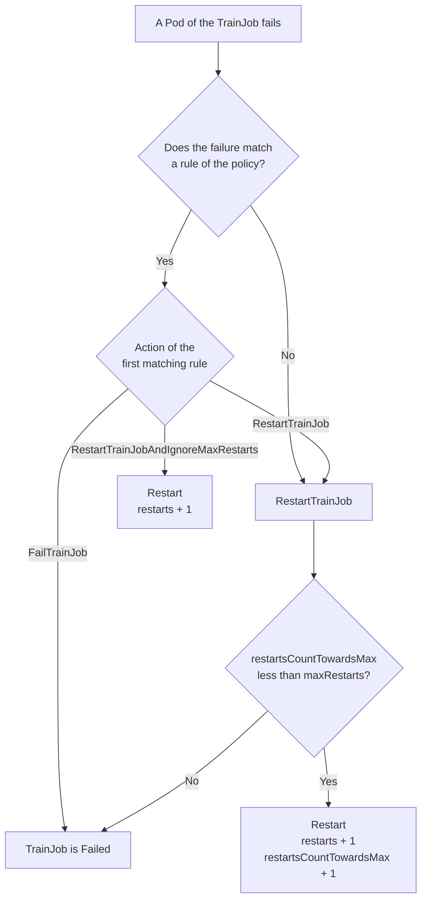
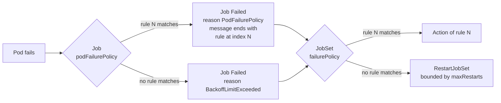

# KEP-4162: TrainJob Failure Policy

## Summary

This KEP adds a typed failure policy to the Trainer runtimes and restart counters to the
TrainJob status.

- **Platform admins** define the policy on a `ClusterTrainingRuntime` or `TrainingRuntime`,
  under `spec.runPolicy.failurePolicy`. It holds `maxRestarts`, the number of restarts before
  a TrainJob is marked `Failed`, and `rules`, which decide for each failure whether to restart
  the TrainJob, restart it without consuming the restart budget, or fail it immediately. A
  rule matches on Pod conditions, for example `DisruptionTarget`, which Kubernetes sets on
  preemption and node drain, or on container exit codes.
- **Every TrainJob** reports `status.restarts` and `status.restartsCountTowardsMax`.
- **`TrainJobSpec` is unchanged.** A per-TrainJob retry budget is listed under
  [Future Plan](#future-plan) and waits for user demand.

The Trainer controller does not implement restarts itself. It translates the policy into the
[JobSet failure policy](https://github.com/kubernetes-sigs/jobset/blob/main/keps/262-ConfigurableFailurePolicy/README.md)
and the
[Job Pod failure policy](https://kubernetes.io/docs/concepts/workloads/controllers/job/#pod-failure-policy)
of the JobSet it already creates, and the JobSet and Job controllers do the work.

## Motivation

Long training jobs fail for reasons that have nothing to do with the training code. Nodes are
preempted, drained for upgrades, or lost. On preemptible GPU capacity this is the normal case.
A training platform has to answer two questions when a Pod fails: should the job be retried,
and how many times. Today a platform admin can only answer them by hand-writing three layers
of JobSet and Job fields, and the result is invisible on the TrainJob.

[KEP-2170](../2170-kubeflow-trainer-v2/README.md) names `PodFailurePolicy` and the Pod
disruption condition as features that moving to JobSet would let Trainer "introduce easily",
and it assigns failure policy to the runtime, which platform engineers manage. This KEP follows
that split. It gives the runtime a typed policy and leaves the TrainJob API as it is.

### How failures are handled today

A TrainJob becomes a JobSet, the JobSet creates one Job per step, and each Job creates Pods.
Failure handling is spread over three layers of that stack:

| Layer | Field | What it controls | Value in a TrainJob today |
| --- | --- | --- | --- |
| Pod | `restartPolicy` | Whether the kubelet restarts a failed container in place. | `OnFailure`. JobSet sets it when the template leaves it empty. |
| Job | `backoffLimit` | How many Pod failures and container restarts the Job tolerates. | 6, the Kubernetes default. |
| Job | `podFailurePolicy` | Rules that treat failures differently by exit code or Pod condition. | Unset. |
| JobSet | `failurePolicy` | What happens when a Job fails: fail the JobSet, or recreate its Jobs up to `maxRestarts` times. | Unset. The JobSet fails as soon as one Job fails. |

None of the runtimes shipped in `manifests/base/runtimes` set any of these fields, so every
TrainJob runs with the values in the last column. That has three consequences:

1. **A bug is retried before it is reported.** A training script that fails deterministically
   is restarted in place, with increasing backoff, until the Job-wide limit of six is reached.
   The user waits for all of those attempts before the TrainJob shows `Failed`.
2. **One incident can use up the whole budget.** All Pods of the trainer step belong to one
   Job and share one `backoffLimit`. With `OnFailure`, every container restart in the Job
   counts towards it. When one worker of an 8-node job disappears, the other seven usually
   crash as well, and those crashes alone can exceed the limit of six.
3. **A preemption is counted like a bug.** Nothing distinguishes a Pod that was evicted from a
   Pod whose training code crashed.

### Why a typed policy instead of the JobSet template

An admin can change the behavior above by writing the JobSet and Job fields in the runtime
template, and some do ([#3779](https://github.com/kubeflow/trainer/issues/3779)). This KEP
proposes a typed `runPolicy.failurePolicy` on the runtime instead, for four reasons.

**The three layers have to agree, and the failure modes are silent.** A JobSet `failurePolicy`
only sees a Pod failure after the Job has given up, so with the default `backoffLimit` of 6
the JobSet rules run after six in-place retries. A `podFailurePolicy` is only accepted with
`restartPolicy: Never`, and because JobSet defaults the template to `OnFailure`, the error
appears when the JobSet tries to create the Job, after the TrainJob was admitted. Matching a
JobSet rule to a `podFailurePolicy` rule requires a regular expression on the Job failure
message. With a typed policy the controller owns all of this and the runtime webhook rejects an
invalid policy when the runtime is created.

**The runtime API already abstracts over JobSet.** `mlPolicy` and `podGroupPolicy` describe
intent and let plugins produce the JobSet fields, and the API comments anticipate other
backends such as LWS, Grove or Slurm. A JobSet `failurePolicy` in the template is tied to one
backend. A Trainer policy can be translated for each of them.

**The TrainJob has to understand restarts to report them.** `TrainJobStatus` does not show how
many times a TrainJob was restarted, so users read the JobSet, which the TrainJob API is meant
to hide. The counters proposed here are copied whenever the JobSet reports them, so they also
help the runtimes that set the JobSet `failurePolicy` by hand today.

**A typed policy is the base for a per-TrainJob override.** If users ask for a retry budget on
the TrainJob, it can be added as one field that adjusts the runtime policy. There is no clean
way to let a TrainJob adjust a hand-written JobSet template.

### What users have asked for

- [#3316](https://github.com/kubeflow/trainer/pull/3316) added Pod recreation after scheduler
  preemption directly in the TrainJob controller. It was closed with a request to propose a KEP.
- [#2185](https://github.com/kubeflow/trainer/issues/2185) and
  [#2072](https://github.com/kubeflow/trainer/issues/2072) asked for a maximum retry count and
  for recovery from failed nodes in v1. Both were deferred to the v2 API.
- [#3779](https://github.com/kubeflow/trainer/issues/3779) shows a user setting
  `failurePolicy.maxRestarts` in the JobSet template to survive failures.

None of these asked for a per-TrainJob setting, which is why this KEP leaves `TrainJobSpec`
unchanged.

[KEP-2899](../2899-resource-timeouts/README.md) is introducing `RunPolicy` on the runtime
([#3824](https://github.com/kubeflow/trainer/pull/3824)) and names `BackoffLimit` as an example
of a lifecycle knob that can be added to it later. This KEP is that addition.

### Goals

- Add `failurePolicy` to `RunPolicy` on `TrainingRuntimeSpec` so platform admins can define a
  retry budget and failure rules for every TrainJob that uses a runtime, without hand-writing
  three layers of JobSet and Job fields.
- Let a policy treat infrastructure disruptions (preemption, eviction, node drain) differently
  from application failures, and fail immediately on exit codes that are known to be
  non-retriable.
- Report restart counters in `TrainJobStatus` and in the Kubeflow Python SDK.
- Build on the JobSet and Job failure policies. Add no Pod watches and no Pod permissions to
  the Trainer controller.

### Non-Goals

- Adding failure-handling fields to `TrainJobSpec`. A per-TrainJob retry budget is deferred
  until there is user demand. See [Future Plan](#future-plan) and
  [Alternative 6](#alternative-6-a-retry-budget-on-the-trainjob).
- Checkpointing or resuming training state. A restarted TrainJob starts its containers again.
  Resuming from a checkpoint is the responsibility of the training code. See
  [#2777](https://github.com/kubeflow/trainer/issues/2777) and
  [#2245](https://github.com/kubeflow/trainer/issues/2245).
- Restarting only part of a TrainJob, such as a single Pod or a single step. See
  [Future Plan](#future-plan).
- Detecting TrainJobs that hang without failing.
- Preventing disruptions. PodDisruptionBudgets are covered by
  [#3304](https://github.com/kubeflow/trainer/issues/3304).
- Retrying failed trials of an OptimizationJob
  ([#3743](https://github.com/kubeflow/trainer/issues/3743)).
- Changing the behavior of TrainJobs whose runtime has no failure policy.

## Proposal

The runtime defines the policy and the controller turns it into JobSet and Job fields. When a
Pod of a TrainJob fails, the policy picks one of three actions:

| Action | Effect |
| --- | --- |
| `FailTrainJob` | The TrainJob is marked `Failed` immediately. |
| `RestartTrainJob` | The TrainJob is restarted if fewer than `maxRestarts` counted restarts have happened. Otherwise it is marked `Failed`. This is the default for a failure that matches no rule. |
| `RestartTrainJobAndIgnoreMaxRestarts` | The TrainJob is restarted and the restart does not count towards `maxRestarts`. |

The decision path for one Pod failure:



In the common setup the admin ships one rule for `DisruptionTarget` and a small `maxRestarts`.
ML engineers submit TrainJobs as they do today and see the outcome in the TrainJob status.
Nobody touches a JobSet or Job field.

### User Stories

#### Story 1

As a **Platform Admin**, I want to set a failure policy on a `ClusterTrainingRuntime` so that
every TrainJob using it survives node preemptions and drains during cluster upgrades, and
stops after one restart when the training code itself crashes, without each ML engineer
knowing about Pod conditions or JobSet restarts.

#### Story 2

As an **ML Platform Engineer** maintaining a `TrainingRuntime` for my team's training image,
which exits with code 42 when it detects an invalid configuration, I want TrainJobs that use
the runtime to fail immediately on that exit code and skip the restarts.

#### Story 3

As an **ML Engineer**, I want to see how many times my TrainJob has restarted, in
`kubectl get trainjob` and in the Kubeflow Python SDK, without reading JobSet objects.

### Notes/Constraints/Caveats

- **A restart recreates every Job of the TrainJob.** For distributed training this is the
  correct unit, because a single replaced worker cannot rejoin a running PyTorch DDP or MPI
  job. It also means that initializer steps run again on every restart, so initializers must
  be safe to re-run. [What a restart does](#what-a-restart-does) has the details.
- **Classification is best effort.** The first failed Pod that Kubernetes observes decides
  which rule applies. When a preempted worker takes its peers down with it, a peer's crash can
  be observed before the preempted Pod's `DisruptionTarget` condition. That incident is then
  handled as an ordinary failure.
- **The policy is fixed when the TrainJob is created.** The runtime policy is read from the
  runtime snapshot, so editing a runtime only affects TrainJobs created afterwards.
- **A restart is only as useful as the checkpoint behind it.** Without checkpoints on a
  persistent volume or in object storage, a restarted TrainJob repeats the whole run.

### Risks and Mitigations

| Risk | Mitigation |
| --- | --- |
| A disruption is classified as an ordinary failure and consumes a counted restart. | The error is in the safe direction, because it never causes extra restarts. The admin guide recommends `maxRestarts` of at least 1 when the policy relies on a disruption rule. |
| A `FailTrainJob` exit-code rule matches a worker that crashed only because a peer was preempted, which turns a preemption into a terminal failure. | The admin guide recommends `FailTrainJob` only for exit codes that the training image reserves for non-retriable errors, and warns against generic codes such as 1. |
| `RestartTrainJobAndIgnoreMaxRestarts` restarts a TrainJob forever on a flapping node pool. | `activeDeadlineSeconds` is not reset by restarts, so it bounds the total run time. The runtime webhook returns an admission warning when this action is used and `runPolicy.activeDeadlineSeconds` is unset. |
| Rules are mapped to JobSet rules by matching the Job failure message (`... matching FailJob rule at index N`), which Kubernetes does not version as an API. | This is the usage documented by JobSet [KEP-262](https://github.com/kubernetes-sigs/jobset/blob/main/keps/262-ConfigurableFailurePolicy/README.md). Integration and E2E tests pin the format on every supported Kubernetes version. |
| Re-running initializers on each restart is slow for large models and datasets. | Documented. Restarting only the failed step is planned once the JobSet `RestartJob` action graduates. |

## Design Details

### API Design

#### TrainingRuntimeSpec Changes

Add `FailurePolicy` to the `RunPolicy` struct introduced by KEP-2899, in
`pkg/apis/trainer/v1alpha1/trainingruntime_types.go`:

```go
type RunPolicy struct {
    // ... activeDeadlineSeconds and ttlSecondsAfterFinished from KEP-2899 ...

    // failurePolicy defines how TrainJobs that reference this runtime react when
    // one of their Pods fails.
    // This is an alpha field and requires enabling the TrainJobFailurePolicy feature gate.
    // +optional
    FailurePolicy *FailurePolicy `json:"failurePolicy,omitempty"`
}

// FailurePolicy defines how a TrainJob reacts to Pod failures.
type FailurePolicy struct {
    // maxRestarts is the number of times a TrainJob can be restarted by the
    // RestartTrainJob action before it is marked Failed.
    // Defaults to 0, which fails the TrainJob on the first counted failure.
    // +optional
    // +kubebuilder:validation:Minimum=0
    MaxRestarts *int32 `json:"maxRestarts,omitempty"`

    // rules are evaluated in order against a failed Pod. The first matching rule
    // decides the action. A failure that matches no rule is handled with the
    // RestartTrainJob action.
    // +optional
    // +listType=atomic
    // +kubebuilder:validation:MaxItems=20
    Rules []FailurePolicyRule `json:"rules,omitempty"`
}

// FailurePolicyAction is the action taken when a FailurePolicyRule matches.
// +kubebuilder:validation:Enum=FailTrainJob;RestartTrainJob;RestartTrainJobAndIgnoreMaxRestarts
type FailurePolicyAction string

const (
    // FailTrainJob marks the TrainJob as Failed immediately.
    FailTrainJob FailurePolicyAction = "FailTrainJob"

    // RestartTrainJob restarts the TrainJob if fewer than maxRestarts counted
    // restarts have happened. Otherwise the TrainJob is marked Failed.
    RestartTrainJob FailurePolicyAction = "RestartTrainJob"

    // RestartTrainJobAndIgnoreMaxRestarts restarts the TrainJob without counting
    // the restart towards maxRestarts.
    RestartTrainJobAndIgnoreMaxRestarts FailurePolicyAction = "RestartTrainJobAndIgnoreMaxRestarts"
)

// FailurePolicyRule describes the action taken when a failed Pod meets the requirement.
// Exactly one of onExitCodes and onPodConditions must be set.
// +kubebuilder:validation:XValidation:rule="has(self.onExitCodes) != has(self.onPodConditions)", message="exactly one of onExitCodes and onPodConditions must be set"
type FailurePolicyRule struct {
    // action is taken when the requirement is met.
    // +required
    Action FailurePolicyAction `json:"action,omitempty"`

    // onExitCodes is the requirement on the container exit codes of the failed Pod.
    // +optional
    OnExitCodes *batchv1.PodFailurePolicyOnExitCodesRequirement `json:"onExitCodes,omitempty"`

    // onPodConditions is the requirement on the conditions of the failed Pod.
    // It is met if at least one pattern matches a Pod condition.
    // +optional
    // +listType=atomic
    // +kubebuilder:validation:MaxItems=20
    OnPodConditions []batchv1.PodFailurePolicyOnPodConditionsPattern `json:"onPodConditions,omitempty"`
}
```

Two choices in this API are worth calling out:

- **The requirement types are reused from `batch/v1`.** `onExitCodes` and `onPodConditions`
  have the same fields and the same meaning as in the Job Pod failure policy, so admins who
  know the Job API do not learn a second vocabulary, and the controller copies them unchanged.
- **The action names follow JobSet** (`FailJobSet`, `RestartJobSet`,
  `RestartJobSetAndIgnoreMaxRestarts`), with `TrainJob` as the object.

If `RunPolicy` has not merged when this KEP is implemented, this KEP introduces the struct
with `failurePolicy` as its first field.

#### TrainJobStatus Changes

```go
type TrainJobStatus struct {
    // ... existing fields ...

    // restarts is the number of times the TrainJob has been restarted.
    // +optional
    Restarts int32 `json:"restarts,omitempty"`

    // restartsCountTowardsMax is the number of restarts that count towards
    // the maxRestarts of the failure policy.
    // +optional
    RestartsCountTowardsMax int32 `json:"restartsCountTowardsMax,omitempty"`
}
```

Both fields mirror the fields of the same name in `JobSetStatus`, and they are copied whenever
the JobSet reports them. A runtime that sets the JobSet `failurePolicy` by hand in its template
gets the counters as well. A TrainJob that survived one preemption and one crash, with
`maxRestarts: 2`, reports:

```yaml
status:
  restarts: 2
  restartsCountTowardsMax: 1
```

`restarts` is added as a printer column, so that `kubectl get trainjob` shows it.

This KEP does not change how the `Failed` condition is derived. Its reason and message are
copied from the JobSet `Failed` condition, as today. With a failure policy the reasons are:

| TrainJob outcome | `Failed` condition reason |
| --- | --- |
| A `FailTrainJob` rule matched. | `FailJobSetFailurePolicyAction` |
| A counted failure occurred after `maxRestarts` restarts. | `ReachedMaxRestarts` |

#### TrainJobSpec

Unchanged. See [Future Plan](#future-plan) for the per-TrainJob retry budget.

### Semantics

#### Which failures match which requirement

`onPodConditions` is evaluated against the conditions of the failed Pod. The condition that
matters for training jobs is `DisruptionTarget`, which Kubernetes adds before it removes a Pod
for a reason outside the Pod's control. The
[Pod disruption conditions](https://kubernetes.io/docs/concepts/workloads/pods/disruptions/#pod-disruption-conditions)
documentation lists the reasons:

| `DisruptionTarget` reason | When Kubernetes sets it |
| --- | --- |
| `PreemptionByScheduler` | The scheduler preempts the Pod to place a Pod with a higher priority. |
| `DeletionByTaintManager` | The Pod is deleted because of a `NoExecute` taint it does not tolerate, for example on an unreachable node. |
| `EvictionByEvictionAPI` | The Pod is evicted through the Eviction API, for example by `kubectl drain` or by the cluster autoscaler. |
| `DeletionByPodGC` | The Pod is bound to a node that no longer exists. |
| `TerminationByKubelet` | The kubelet terminates the Pod because of node pressure or a graceful node shutdown. |

`onExitCodes` is evaluated against the exit codes of the containers of the failed Pod, and can
be limited to one container with `containerName`. The container names in the built-in runtimes
are `node`, `launcher`, `dataset-initializer`, and `model-initializer`.

A container that is killed for exceeding its own memory limit exits with code 137 and does not
get a `DisruptionTarget` condition. It is an ordinary failure unless an exit-code rule matches
it.

#### Rule evaluation

Rules are evaluated in order, and the first rule whose requirement is met decides the action.
A failure that meets no requirement is handled with `RestartTrainJob`. This has two useful
consequences:

- A policy without rules is a plain retry limit.
- `maxRestarts: 0` with a single `DisruptionTarget` rule means "never retry the training code,
  always survive a disruption".

#### What a restart does

A restart is the JobSet `RestartJobSet` action with the default `Recreate` strategy:

- Every Job of the JobSet is deleted and created again, and with it every Pod of every step.
  The new Pods are scheduled from scratch.
- Steps start in the same order as on the first attempt. In runtimes where the trainer step
  depends on the initializers, the initializer Jobs run again before the trainer starts.
- The JobSet, its headless Service, and the objects that Trainer plugins create, such as the
  MPI SSH Secret and hostfile ConfigMap, are kept. Job names and Pod hostnames do not change,
  so the addresses injected into the trainer, for example `PET_MASTER_ADDR`, stay valid.
- Data on persistent volumes is kept. Data in `emptyDir` volumes is lost.
- The Jobs and Pods of the new attempt carry the label and annotation
  `jobset.sigs.k8s.io/restart-attempt` with the attempt number. Training code can read it
  through the downward API to tell a restart from a first start.

| Runtime | What restarts |
| --- | --- |
| PyTorch (`torch-distributed`, TorchTune) | All `node` Pods. `torchrun` rendezvous again on the same addresses. |
| MPI (OpenMPI, DeepSpeed, MLX) | The `launcher` and `node` Jobs. The SSH keys and the hostfile are reused. |
| JAX, XGBoost | All `node` Pods. |
| Any runtime with initializers | The initializer Jobs first, then the trainer. |

### Policy Resolution

The policy of a TrainJob is `runPolicy.failurePolicy` of the runtime snapshot taken when the
TrainJob was created, following KEP-2899. When the runtime has no policy, nothing changes and
failures are handled by the runtime's JobSet template as today. There is nothing to merge in
this version of the KEP, because the TrainJob carries no failure-handling fields.

### User Examples

**Runtime policy (Platform Admin):**

```yaml
apiVersion: trainer.kubeflow.org/v1alpha1
kind: ClusterTrainingRuntime
metadata:
  name: torch-distributed
spec:
  runPolicy:
    activeDeadlineSeconds: 172800
    failurePolicy:
      maxRestarts: 1
      rules:
        # Preemption, eviction, and node drain do not consume the restart budget.
        - action: RestartTrainJobAndIgnoreMaxRestarts
          onPodConditions:
            - type: DisruptionTarget
        # The team's training image reserves exit code 42 for invalid configuration.
        - action: FailTrainJob
          onExitCodes:
            containerName: node
            operator: In
            values: [42]
  template:
    # ... JobSet template ...
```

**TrainJob (ML Engineer), unchanged from today:**

```yaml
apiVersion: trainer.kubeflow.org/v1alpha1
kind: TrainJob
metadata:
  name: preemptible-finetune
spec:
  runtimeRef:
    name: torch-distributed
  trainer:
    numNodes: 8
```

After one preemption the TrainJob shows:

```
$ kubectl get trainjob preemptible-finetune
NAME                   STATE     RESTARTS   AGE
preemptible-finetune   Running   1          3h
```

### Implementation Overview

All changes are in the JobSet plugin (`pkg/runtime/framework/plugins/jobset`), the runtime
webhooks, and the runtime `Info` object, which carries the policy. The controller gains no new
watches and no new RBAC.

#### Translation to JobSet

When the runtime has a policy, the JobSet plugin sets the following fields when it builds the
JobSet:

1. On every replicated Job:
   - `backoffLimit: 0` and Pod `restartPolicy: Never`, so that the first Pod failure fails the
     Job and the decision is made once, at the JobSet level. `restartPolicy: Never` is also
     required by Kubernetes when `podFailurePolicy` is set.
   - `podFailurePolicy` with one `FailJob` rule per policy rule, in the same order, with the
     requirement copied unchanged.
2. On the JobSet, `failurePolicy.maxRestarts` and one rule per policy rule:

   | Policy action | JobSet action |
   | --- | --- |
   | `FailTrainJob` | `FailJobSet` |
   | `RestartTrainJob` | `RestartJobSet` |
   | `RestartTrainJobAndIgnoreMaxRestarts` | `RestartJobSetAndIgnoreMaxRestarts` |

   Each JobSet rule matches `onJobFailureReasons: [PodFailurePolicy]` and the message pattern
   `matching FailJob rule at index N$`, where N is the index of the corresponding Pod failure
   policy rule.

The two layers then work together as follows:



A Pod failure that matches no rule fails its Job with reason `BackoffLimitExceeded`. No JobSet
rule matches that reason, so JobSet applies its default action, `RestartJobSet`, which is
bounded by `maxRestarts`.

Kubernetes rejects a Job whose Pod failure policy names a container that is not in its Pod
template. An exit-code rule with `containerName` is therefore added only to the Jobs that have
that container. Because this can shift rule indexes between Jobs, the generated JobSet rules
are scoped with `targetReplicatedJobs`.

For the `torch-distributed` runtime above, the generated JobSet contains:

```yaml
spec:
  failurePolicy:
    maxRestarts: 1
    rules:
      - name: TrainJobFailurePolicyRule0
        action: RestartJobSetAndIgnoreMaxRestarts
        onJobFailureReasons: [PodFailurePolicy]
        onJobFailureMessagePatterns: ["matching FailJob rule at index 0$"]
      - name: TrainJobFailurePolicyRule1
        action: FailJobSet
        onJobFailureReasons: [PodFailurePolicy]
        onJobFailureMessagePatterns: ["matching FailJob rule at index 1$"]
        targetReplicatedJobs: [node]
  replicatedJobs:
    - name: node
      template:
        spec:
          backoffLimit: 0
          podFailurePolicy:
            rules:
              - action: FailJob
                onPodConditions:
                  - type: DisruptionTarget
                    status: "True"
              - action: FailJob
                onExitCodes:
                  containerName: node
                  operator: In
                  values: [42]
          template:
            spec:
              restartPolicy: Never
```

#### Worked Scenarios

The three scenarios below use the `torch-distributed` runtime and the `preemptible-finetune`
TrainJob from the user examples, with `maxRestarts: 1` and the two rules.

**A node is preempted.**

1. The scheduler preempts one of the eight `node` Pods. It adds the `DisruptionTarget`
   condition with reason `PreemptionByScheduler` and deletes the Pod.
2. The Pod terminates. The Job controller matches Pod failure policy rule 0 and fails the Job
   with reason `PodFailurePolicy` and a message that ends with
   `has condition DisruptionTarget matching FailJob rule at index 0`. The remaining Pods of
   the Job are terminated.
3. The JobSet controller matches `TrainJobFailurePolicyRule0` and applies
   `RestartJobSetAndIgnoreMaxRestarts`. It recreates the Jobs.
4. The TrainJob reports `restarts: 1` and `restartsCountTowardsMax: 0`. The restart budget is
   untouched.

**The training code crashes with exit code 1.**

1. A `node` container exits with code 1. No Pod failure policy rule matches. With
   `backoffLimit: 0` the Job fails with reason `BackoffLimitExceeded`.
2. No JobSet rule matches, so the JobSet controller applies `RestartJobSet`. The TrainJob
   reports `restarts: 1` and `restartsCountTowardsMax: 1`.
3. The code crashes again on the second attempt. The budget of one restart is used up, and the
   TrainJob is `Failed` with reason `ReachedMaxRestarts`. Today the same script would have been
   retried in place six times before the TrainJob failed.

**The training code exits with the reserved code 42.**

1. The `node` container exits with code 42. The Job controller matches Pod failure policy
   rule 1 and fails the Job with a message that ends with `matching FailJob rule at index 1`.
2. The JobSet controller matches `TrainJobFailurePolicyRule1` and applies `FailJobSet`.
3. The TrainJob is `Failed` with reason `FailJobSetFailurePolicyAction` and `restarts: 0`.

#### Status

The JobSet plugin copies `status.restarts` and `status.restartsCountTowardsMax` from the JobSet
to the TrainJob on every status sync, whether the JobSet `failurePolicy` came from the typed
policy or from the template. The controller emits a `Warning` event on the TrainJob each time
`status.restarts` increases, so that a restart is visible with `kubectl describe trainjob`.

#### Validation

| Check | Where | Result |
| --- | --- | --- |
| `maxRestarts` is negative. | CRD schema | Rejected. |
| A rule sets both or neither of `onExitCodes` and `onPodConditions`. | CRD schema (CEL) | Rejected. |
| `onExitCodes` or `onPodConditions` values break the Job API constraints, for example unordered exit codes. | Runtime webhook | Rejected at admission, so that the error does not surface later when a JobSet is created. |
| `onPodConditions[].status` is omitted. | Runtime defaulting | Set to `"True"`, matching the Job API. |
| A runtime sets `runPolicy.failurePolicy` together with `failurePolicy` on the JobSet template or `podFailurePolicy` on a Job template. | Runtime webhook | Rejected. A typed policy and a hand-written one cannot be combined. |
| A rule uses `RestartTrainJobAndIgnoreMaxRestarts` and `runPolicy.activeDeadlineSeconds` is unset. | Runtime webhook | Accepted with an admission warning. |

`backoffLimit` and `restartPolicy` in the runtime template are overridden when a policy is set,
because the translation depends on them.

#### Feature Gate

The feature is guarded by the `TrainJobFailurePolicy` feature gate, alpha and disabled by
default.

- With the gate disabled, the runtime webhooks reject a runtime that sets
  `runPolicy.failurePolicy`, and the status counters are not populated.
- A policy that is already stored is still honored after the gate is disabled, so that turning
  the gate off does not change the JobSet of a running TrainJob.
- TrainJobs whose runtime has no policy are not affected by the gate in either state.

### Interaction with Other Features

- **`activeDeadlineSeconds`** ([KEP-2899](../2899-resource-timeouts/README.md)): a restart does
  not reset the deadline. The deadline bounds the total active time across all restarts, which
  makes it the natural companion of a disruption rule.
- **Suspend and Kueue**: suspending a TrainJob is not a failure and evaluates no rule. Kueue
  preempts a TrainJob by suspending it, so Kueue preemption does not consume the restart
  budget. The restart counters are kept across suspend and resume.
- **MultiKueue**: the policy comes from the runtime in the worker cluster, like every other
  runtime setting. Admins who want the same behavior in every cluster install the same runtime
  everywhere, which MultiKueue already requires.
- **`ttlSecondsAfterFinished`** (KEP-2899): applies only after the TrainJob is terminal, so it
  does not interact with restarts.
- **TrainJob progress** ([KEP-2779](../2779-trainjob-progress/README.md)): `trainerStatus` is
  not reset on restart. The restarted trainer overwrites it with its next update.
- **PodDisruptionBudgets** ([#3304](https://github.com/kubeflow/trainer/issues/3304)): the two
  features complement each other. A PodDisruptionBudget reduces voluntary disruptions, and the
  failure policy decides what happens when a disruption still occurs.
- **OptimizationJob** ([KEP-3562](https://github.com/kubeflow/trainer/issues/3562)): trials are
  TrainJobs and use the runtime policy, so a trial can survive a preemption without being
  reported as failed.

### Kubeflow SDK Changes

No new argument to `TrainerClient.train()`. The SDK `TrainJob` type gains the two counters, so
that users can see restarts without reading Kubernetes objects:

```python
from kubeflow.trainer import TrainerClient

job = TrainerClient().get_job("preemptible-finetune")
print(job.restarts, job.restarts_count_towards_max)
```

### Test Plan

[x] I/we understand the owners of the involved components may require updates to existing
tests to make this code solid enough prior to committing the changes necessary to implement
this enhancement.

#### Unit Tests

- `pkg/runtime/framework/plugins/jobset`:
  - Translation: each action maps to the expected JobSet rule and Pod failure policy rule.
  - An exit-code rule with `containerName` is added only to Jobs that have the container, and
    the JobSet rule indexes and `targetReplicatedJobs` match.
  - No policy: the JobSet built from the runtime template is unchanged.
  - Status: restart counters are copied from the JobSet, with and without a typed policy.
- `pkg/webhooks`: field validation, conflict with a template-level failure policy, feature
  gate disabled, admission warning for unbounded restarts.

#### Integration Tests

- A runtime policy produces a JobSet with the expected `failurePolicy`, `podFailurePolicy`,
  `backoffLimit`, and `restartPolicy`.
- A runtime edited after the TrainJob is created does not change the applied policy.
- Restart counters on the JobSet status are reflected on the TrainJob status, for a typed
  policy and for a hand-written JobSet `failurePolicy`.
- A runtime that combines a typed and a hand-written policy is rejected.

#### E2E Tests

- `test/e2e/trainjob_failure_policy_test.go`:
  - A trainer that fails on every attempt, on a runtime with `maxRestarts: 1`, ends `Failed`
    with reason `ReachedMaxRestarts` and `status.restarts: 1`.
  - A trainer that exits with a code matched by a `FailTrainJob` rule ends `Failed` with
    `status.restarts: 0`.
  - A trainer Pod evicted through the Eviction API, on a runtime with a `DisruptionTarget`
    rule, is restarted with `status.restarts: 1` and `status.restartsCountTowardsMax: 0`.

### Graduation Criteria

**Alpha**

- `TrainJobFailurePolicy` feature gate, disabled by default.
- Runtime policy, translation, status counters, and validation implemented.
- Unit, integration, and E2E tests in place.

**Beta**

- Feature gate enabled by default.
- SDK exposes the restart counters.
- Admin guide for fault-tolerant runtimes published.
- Decision made on a per-TrainJob retry budget, based on user feedback collected during alpha.
- Decision made on restarting only the failed step, based on the state of the JobSet
  `RestartJob` feature.
- Decision made on shipping a default policy in the built-in runtimes.

**Stable**

- No changes to the API for two releases.

## Future Plan

- **A per-TrainJob retry budget.** If users ask to adjust the number of restarts for one run,
  for example because their script resumes from checkpoints and the runtime default is
  conservative, a single `maxRestarts` value can be added to the TrainJob and merged with the
  runtime rules. Whether that value belongs on `TrainJobSpec` or in `runtimePatches` is
  decided then. The typed runtime policy makes either option a small change.
- **Restart only the failed step.** JobSet v0.12 has the `RestartJob` and
  `RestartJobAndIgnoreMaxRestarts` actions behind an alpha feature gate. Once they are enabled
  by default, a restart can recreate only the trainer step and leave completed initializer
  steps alone.
- **In-place restart.** The JobSet `InPlaceRestart` strategy, also alpha, restarts healthy
  Pods in place and avoids rescheduling them.
- **Default policy in the built-in runtimes**, for example a disruption rule with one restart.
- **Stalled TrainJob detection**, building on the progress reported through KEP-2779.

## Open Questions

1. The `Failed` condition reasons are the JobSet reasons (`ReachedMaxRestarts`,
   `FailJobSetFailurePolicyAction`). Should the TrainJob map them to its own reason names?
2. Should the built-in runtimes ship a default policy with a `DisruptionTarget` rule once the
   feature is beta?
3. Should the status counters be populated for hand-written JobSet failure policies while the
   feature gate is disabled? This KEP keeps them behind the gate for alpha.

## Implementation History

- **2026-10-05**: Initial KEP draft.
- **2026-10-06**: Narrowed the TrainJob API to `maxRestarts` after review feedback on
  [#4163](https://github.com/kubeflow/trainer/pull/4163).
- **2026-10-07**: Removed the TrainJob API change. The policy lives on the runtime only, and a
  per-TrainJob retry budget is deferred until there is user demand.

## Drawbacks

- The feature adds a second place where failure handling can be configured on a runtime, next
  to the JobSet and Job templates. Validation rejects mixing them, but admins have to learn
  which one applies.
- The translation depends on the Job failure message format, which is not a versioned API.
- Every retry budget needs its own runtime until a per-TrainJob value is added.

## Alternatives

### Alternative 1: Allow `runtimePatches` to patch the JobSet and Job failure policies

Extend `runtimePatches` with the JobSet `failurePolicy` and the Job `backoffLimit` and
`podFailurePolicy`.

**Pros:**
- No new API types.
- Fits the existing mechanism for per-TrainJob infrastructure changes.

**Cons:**
- Exposes three interacting Kubernetes layers to the TrainJob author, who has to keep them
  consistent, for example a Pod failure policy with `restartPolicy: OnFailure` is rejected.
- Does not help the runtime side, where the same three layers still have to be written by hand.
- Hard to expose as a simple SDK option.

**Decision:** Not adopted for the runtime policy. It remains a candidate for a per-TrainJob
override later, see [Future Plan](#future-plan).

### Alternative 2: Configure the policy only in the runtime's JobSet template

Keep the status quo and document how admins write the JobSet `failurePolicy` and the Job
`podFailurePolicy` in the runtime template.

**Pros:**
- No API change.

**Cons:**
- The three layers have to be right by hand, and the failure modes are silent, as described in
  [Why a typed policy instead of the JobSet template](#why-a-typed-policy-instead-of-the-jobset-template).
- The policy is tied to the JobSet backend.
- The TrainJob status still does not report restarts, and the SDK has nothing to expose. The
  status counters of this KEP could ship on their own, but without a typed policy there is no
  Trainer-level definition of what a restart is.

**Decision:** Rejected.

### Alternative 3: Handle failures in the TrainJob controller

Watch Pods in the TrainJob controller and delete or recreate them, as proposed in
[#3316](https://github.com/kubeflow/trainer/pull/3316).

**Cons:**
- Duplicates logic that the Job and JobSet controllers already implement.
- Requires Pod watches and Pod delete permissions in the Trainer controller, which works
  against the scalability goals in [#2318](https://github.com/kubeflow/trainer/issues/2318).
- Restart counters would have to be stored in annotations.

**Decision:** Rejected.

### Alternative 4: A fixed set of options without rules

Offer an enumerated field on the runtime, for example `disruptionPolicy: Restart | Count`,
and a list of non-retriable exit codes.

**Pros:**
- Simpler to read for the two most common cases.

**Cons:**
- Every new case needs a new API field.
- Introduces vocabulary that differs from the Job and JobSet APIs admins already know.

**Decision:** Rejected in favor of rules that reuse the `batch/v1` requirement types.

### Alternative 5: Retry individual Pods

Keep the Job `backoffLimit` as the retry mechanism.

**Cons:**
- A replaced worker cannot rejoin a running PyTorch DDP or MPI job, so the unit of retry has to
  be the whole TrainJob.
- One incident consumes several retries, as described in
  [How failures are handled today](#how-failures-are-handled-today).

**Decision:** Rejected.

### Alternative 6: A retry budget on the TrainJob

The second draft of this KEP added `spec.failurePolicy.maxRestarts` to `TrainJobSpec`, merged
with the rules of the runtime policy. The argument was that the right number of restarts
depends on whether the script resumes from checkpoints and on the cost of the run, which the
owner of the run knows and the admin does not, and that without it every retry budget needs
its own runtime.

**Pros:**
- One runtime serves jobs with different retry needs.
- Maps to a one-line SDK option.

**Cons:**
- No user has asked for it. The requests listed under
  [What users have asked for](#what-users-have-asked-for) are all satisfied by a runtime-level
  policy.
- A retry budget without the rules that give it meaning adds a field to the TrainJob API that
  most users would leave unset.

**Decision:** Deferred. Listed under [Future Plan](#future-plan) and revisited at beta with the
feedback collected during alpha.

### Alternative 7: The full policy on the TrainJob

The first draft of this KEP put the whole `FailurePolicy` struct, rules included, on
`TrainJobSpec`, with the runtime policy as a default that a TrainJob replaced as a whole.

**Cons:**
- Rules about Pod conditions, exit codes and restart strategies require Kubernetes knowledge
  that ML engineers are not expected to have, as pointed out in the review of
  [#4163](https://github.com/kubeflow/trainer/pull/4163). KEP-2170 assigns failure policy to
  the runtime for the same reason.
- Replacing the runtime policy as a whole lets a TrainJob drop the admin's disruption rule by
  accident.

**Decision:** Rejected.
